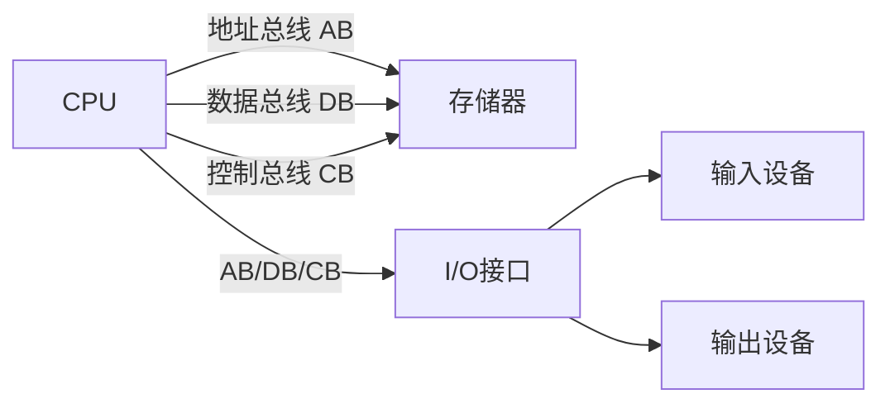
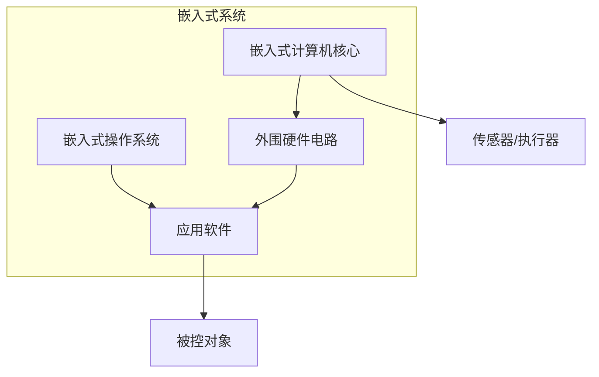
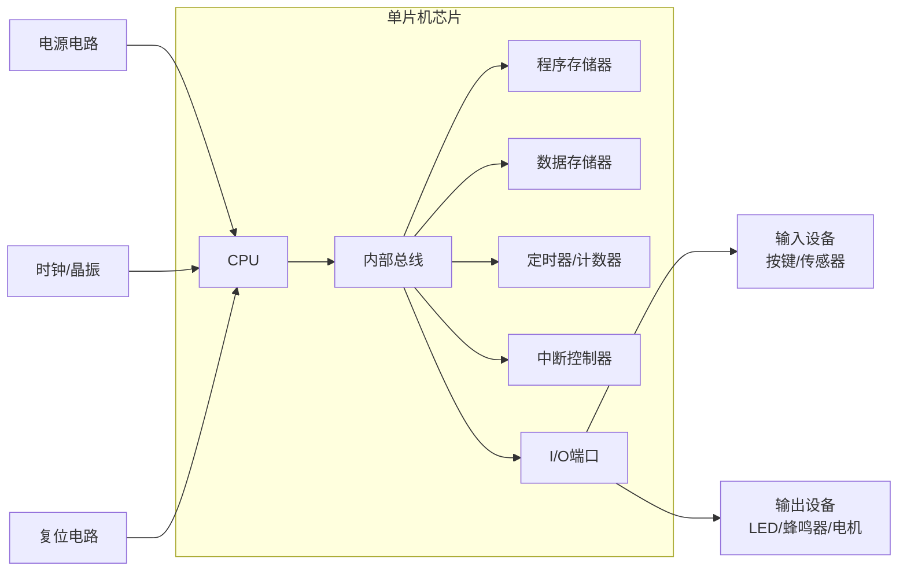
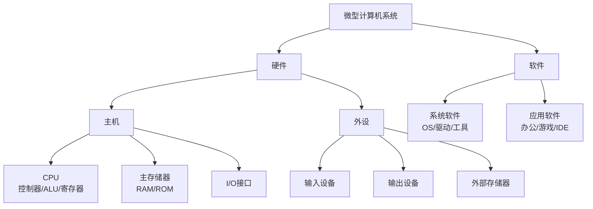

## 计算机技术的发展脉络

### 电子器件驱动下的四代演进
自1945年首台电子管计算机诞生以来，计算机技术经历了以电子器件变革为核心的四次重大代际跃迁。第一代电子管计算机（1945–1956）采用真空电子管作为逻辑开关元件，体积庞大、功耗极高且可靠性有限，主要用于科学计算与军事弹道轨迹解算。第二代晶体管计算机（1956–1963）以1947年贝尔实验室发明的晶体管为基础，显著缩小了体积并提升了运算可靠性，同时降低了功耗与发热量。第三代小规模集成电路计算机（1964–1971）将多个晶体管与无源器件集成于单一硅片，进一步提高了集成度与运算速度，使得计算机开始从实验室走向商业应用。第四代大规模及超大规模集成电路计算机（1971年至今）标志着微处理器时代的开启，使得在单一芯片上构建完整计算系统成为可能，为后续微型计算机与嵌入式计算机的分化奠定了物理基础。

图 1-1 展示了计算机发展史上四个典型阶段的代表性设备与核心器件。
![[Pasted image 20260823201409.webp]]

### 微型计算机的代际划分与性能跃迁
在第四代计算机的范畴内，微型计算机依据字长与处理器架构的演进，可细分为六个发展阶段。第一代（1971–1972）以Intel 4004为代表，采用4位或低档8位架构，主要面向简单控制与计算器应用。第二代（1972–1978）的中档8位微处理器显著提升了指令集复杂度与寻址能力，支持更丰富的外围接口。第三代（1978–1981）的16位架构（如Intel 8086）引入了更宽的数据通路，支持更大规模的内存寻址与多任务处理。第四代（1985–1992）的32位高档微型机实现了真正的多用户操作系统支持，并引入了内存管理单元（MMU）。第五代（1993–2005）的奔腾（Pentium）系列引入了超标量流水线与分支预测技术，显著提升了指令级并行度。第六代（2005年至今）的酷睿（Core）系列通过多核并行架构与动态频率调节，持续推动通用计算性能的提升，同时有效控制功耗。

![[Pasted image 20260823203707.webp]]

### 摩尔定律的量化验证
1965年，Intel联合创始人戈登·摩尔提出摩尔定律，预言集成电路的集成度约每18至24个月翻一番。该定律在随后半个多世纪中得到了显著验证。以Intel处理器为例，1971年的4004处理器集成约0.25万个晶体管，主频0.1 MHz；至2023年的Core i9-14900K，晶体管数量达到约70亿个，主频提升至6000 MHz。在52年的时间跨度内，晶体管数量增长约280万倍。从数学角度验证，若按每24个月翻倍计算，52年共经历26个翻倍周期，理论增长倍数为 $2^{26} \approx 6.71 \times 10^{7}$（约6710万倍）；若按每18个月翻倍计算，共约34.7个周期，理论增长倍数为 $2^{34.7} \approx 1.38 \times 10^{10}$（约138亿倍）。实际增长约280万倍，介于两者之间，表明摩尔定律在统计意义上基本成立，但近年来因物理极限与功耗约束，增长速率已呈现放缓趋势。

![[Pasted image 20260823203803.webp]]

> [!NOTE]
> 摩尔定律并非物理定律，而是对半导体产业发展趋势的观测与预测。随着制程节点逼近原子尺度，量子隧穿效应与漏电流问题日益显著，单纯依靠缩小晶体管尺寸提升性能的模式面临根本性挑战。

## 微型计算机与嵌入式计算机的体系辨析

### 体系结构的共性基础
无论是通用微型计算机还是嵌入式计算机，其体系结构均遵循冯·诺依曼存储程序原理，由中央处理器（CPU）、[[3.单片机的存储器-SFR|存储器]]与[[4.输入输出接口-复位及时钟电路-低耗电模式|输入/输出接口]]三大核心部件构成，并通过地址总线（Address Bus, AB）、数据总线（Data Bus, DB）与控制总线（Control Bus, CB）实现互联。地址总线负责传输内存或I/O端口的地址信息，其位宽决定了系统的最大寻址空间。若地址总线宽度为 $n$ 位，则可寻址空间为 $2^n$ 个存储单元，例如16位地址总线对应 $2^{16} = 65536$ 字节，即64 KB寻址空间。数据总线承担各功能部件间的并行数据传输，其位宽直接对应CPU的字长，32位数据总线意味着CPU单次可并行传输4字节数据。控制总线则传递读写控制、中断请求与总线仲裁等时序信号，协调系统各模块的同步操作。

![[Pasted image 20260823203901.webp]]

### 关键差异的对比分析
尽管体系结构同源，微型计算机与嵌入式计算机在资源组织、性能取向与应用场景上存在本质差异。通用微型计算机面向数据处理与人机交互，强调运算精度、存储容量与外设的标准化；嵌入式计算机则面向特定测控任务，强调实时响应、低功耗与硬件可裁剪性。

表 1-1 微型计算机与嵌入式计算机的核心差异

| 对比维度 | 微型计算机 | 嵌入式计算机 |
|:---|:---|:---|
| I/O接口 | 标准化外设（键盘、鼠标、显示器） | 非标准外设，种类繁杂，需定制化驱动 |
| CPU取向 | 面向复杂数据处理，高运算速度与精度 | 面向实时控制，数据类型简单，运算精度适中 |
| 存储器架构 | 大容量、高速度，ROM与RAM统一编址 | 结构精简，芯片直接挂接总线，ROM与RAM独立编址 |
| 系统形态 | 底板+外设的完整设备 | 单芯片即构成完整计算机系统 |
| 功耗与成本 | 较高功耗，成本随配置浮动 | 极低功耗，成本高度可控 |

嵌入式计算机采用ROM与RAM独立编址的哈佛架构变体，使得程序存储与数据访问可并行进行，在确定性实时控制场景中具有显著的时序优势。与之相对，通用微型计算机多采用冯·诺依曼架构，程序与数据共享同一存储空间与总线，灵活性更高但可能出现总线竞争。

> [!TIP]
> 哈佛架构的核心优势在于程序流与数据流分离，CPU可在同一时钟周期内取指令与读写数据，避免了冯·诺依曼架构中的访存瓶颈，这对中断响应时间敏感的工业控制至关重要。

## 嵌入式系统的技术范畴与核心形态

### 嵌入式系统的定义与组成
根据国际电气电子工程师协会（IEEE）及产业界的共识，嵌入式系统是以应用为中心、以计算机技术为基础，软硬件可裁剪，适用于对功能、可靠性、成本、体积、功耗有严格要求的专用计算机系统。其典型组成包括四部分：嵌入式计算机核心、外围硬件电路、嵌入式操作系统以及应用软件。与通用计算机追求"万能计算"不同，嵌入式系统针对特定应用进行深度优化，通常在资源受限的条件下实现高可靠性与确定性响应。所谓软硬件可裁剪，即根据应用需求移除冗余外设、精简操作系统内核或裁减不必要的软件模块，从而将系统成本与功耗降至最低。

### 四类嵌入式计算平台的特征对比
嵌入式计算核心依据处理机制与应用定位，可分为四大技术形态。

单片机（Single Chip Microcomputer, SCM / Microcontroller Unit, MCU）将CPU、ROM/EPROM、RAM、定时器/计数器、多种I/O接口及总线控制逻辑集成于单一芯片，是目前嵌入式工业的主流形态。其最大优势在于单片化带来的成本下降、功耗降低与可靠性提升，典型应用于智能电气仪表、电机控制与工业PLC。

数字信号处理器（Digital Signal Processor, DSP）专为高速数字信号处理运算优化，如快速傅里叶变换（FFT）、数字滤波与频谱分析。相较于单片机，DSP具备多总线结构与硬件乘法累加单元（MAC），可处理更高复杂度的算法与更大的数据流量，适用于音频处理、电机矢量控制与通信调制解调。

嵌入式微处理器（Embedded MicroProcessor Unit, EMPU / EMP）以通用CPU为基础，针对嵌入式场景在工作温度、抗电磁干扰与可靠性方面进行增强。ARM系列是其典型代表，采用精简指令集计算机（RISC）架构，主打低功耗与可定制性，广泛应用于智能手机、车载娱乐系统与边缘计算网关。

现场可编程门阵列（Field-Programmable Gate Array, FPGA）由可编程逻辑单元、可编程互连资源与可编程I/O单元构成，支持硬件级并行处理与功能重构。其纳秒级超低延迟与大规模并行处理能力，使其成为5G/6G基站、雷达信号处理与人工智能推理加速的核心器件。

表 1-2 四类嵌入式计算平台综合对比

| 特性 | 单片机 | DSP | EMP | FPGA |
|:---|:---|:---|:---|:---|
| 处理方式 | 串行处理 | 单指令多数据（SIMD） | 多线程/多核并行 | 大规模硬件并行 |
| 实时性 | 良好 | 极高 | 较好 | 纳秒级超低延迟 |
| 成本 | 极低 | 中低到中高 | 中高 | 较高 |
| 开发难度 | 低（C语言） | 中（需专用指令集） | 中高（Linux与多核编程） | 高（硬件描述语言） |
| 典型应用 | 智能家居、工业PLC、电机控制 | 音频/图像处理、通信设备 | 视频监控、车载系统、边缘网关 | 5G基站、雷达、AI加速 |

> [!IMPORTANT]
> 在实际工程选型中，单片机与DSP并非互斥关系。对于同时需要复杂控制逻辑与高速信号处理的场景（如光伏并网逆变器），常采用"单片机+DSP"的双核架构，由单片机负责系统管理与外设控制，DSP专注算法运算。

## 单片机的技术原理与发展谱系

### 单片机系统的基本架构
单片机系统是以单片机为核心，配合外围硬件电路与控制软件，可独立完成数据采集、逻辑运算及设备自动控制的最小嵌入式系统。其内部通过内部总线连接CPU、程序存储器（Flash/ROM）、数据存储器（RAM）、定时器/计数器、中断控制器与I/O端口控制单元。外部则依赖电源电路、时钟/晶振电路与复位电路构成最小工作系统。其中，时钟电路为CPU提供工作时序基准，通常采用石英晶体振荡器配合片内反相器构成皮尔斯振荡电路，典型频率为12 MHz或16 MHz；复位电路则在系统上电或异常时强制PC指针返回初始状态，确保程序从已知状态开始执行。

![[Pasted image 20260823203955.webp]]

### 数据总线位宽的演进逻辑
单片机的性能演进直接体现为数据总线位宽的增长。数据总线位宽决定了CPU单次并行传输的数据量，进而影响运算效率与寻址能力。1971年，Intel 4004采用4位架构，仅能处理BCD码或简单逻辑，应用于鼠标、玩具与遥控器。1976年的Intel MCS-48系列升级至8位，成为自动化装置与智能仪器的主流平台，其无符号整数表示范围为0至255。1983年的Intel MCS-96系列引入16位架构，无符号整数范围扩展至0至65535，支持更复杂的工业控制算法与更宽的地址寻址。2007年，STM32F1系列将32位ARM Cortex-M3内核引入通用单片机领域，无符号整数范围达到0至4294967295，使智能手机与工业自动化设备获得接近微处理器的运算能力。2022年的STM32MP2系列进一步探索64位架构，面向智能机器人与语音图像通信等高性能边缘计算场景。128位单片机目前尚无商业化产品，表明在绝大多数嵌入式控制场景中，64位数据通路已能满足实时性与精度的双重需求。

![[Pasted image 20260823204039.webp]]

### 主流单片机系列的定位差异
当前市场主流单片机可分为两大谱系。经典入门系列以8位51内核单片机为代表，包括国产STC系列（STC89C52RC、STC8等）与Atmel AT89C51/52。其核心特征为架构简单、寄存器数量少、支持直接寄存器操作，单颗芯片成本可低至2–5元人民币，是所有进阶单片机学习的基础平台。51内核采用CISC指令集，标准架构下每机器周期包含12个时钟周期，指令执行效率相对较低，但开发门槛低，易于理解计算机底层工作原理。

32位通用单片机以STM32系列为核心代表（如STM32F103C8T6），基于ARM Cortex-M内核，具备行业最高的通用度与最完善的生态系统。其子系列功能划分明确：F103系列作为进阶入门首选，资料完备，外设丰富；F4系列面向高性能数字信号控制，主频可达180 MHz；L系列专注超低功耗物联网终端，待机电流可低至微安级；H7系列则满足超高性能实时控制需求，主频高达480 MHz。相较于51内核，STM32需掌握HAL库与实时操作系统（RTOS）等抽象层技术，开发门槛显著提升，但可实现几乎所有中高端嵌入式控制需求。

> [!WARNING]
> 51内核单片机采用经典的CISC架构与12时钟周期/机器周期的时序模型，而STM32基于ARM Cortex-M的RISC架构，多数指令为单周期执行。在迁移项目时，不能简单依据主频数值对比性能，需结合具体指令周期与外设效率进行综合评估。

## 微型计算机系统的完整构成

### 硬件子系统的层次结构
微型计算机系统的硬件由主机与外设两部分组成。主机以微处理器为核心，通过系统总线连接主存储器与I/O接口电路。CPU内部包含控制器、算术逻辑单元（ALU）与寄存器组，分别负责指令译码与流程控制、数值运算与逻辑判断、以及高速数据暂存。主存储器分为随机存取存储器（RAM）与只读存储器（ROM），前者用于运行时数据与程序的临时存储，具有易失性；后者固化启动程序与固件，具有非易失性。I/O接口电路提供并行接口、串行接口、USB、SATA与HDMI等多种外设连接标准，承担电平转换、数据缓冲与通信协议转换功能。外设则包括输入设备（键盘、鼠标、扫描仪）、输出设备（显示器、打印机、扬声器）与外部存储器（硬盘、固态硬盘、U盘）。

![[Pasted image 20260823204103.webp]]

### 软件子系统的功能划分
软件系统分为系统软件与应用软件两层。系统软件包括操作系统、驱动程序与工具程序，负责硬件资源管理、任务调度与开发环境支持。操作系统通过进程管理与内存分配，实现多任务并发执行；驱动程序作为硬件与操作系统之间的抽象层，屏蔽了不同厂商外设的电气差异。应用软件则面向特定业务需求，涵盖办公软件、浏览器、游戏与集成开发环境（IDE）等。在嵌入式单片机系统中，软件通常以固件形式存在，不包含通用操作系统，或仅运行轻量级的实时内核，这与通用微型计算机的复杂软件栈形成鲜明对比。

> [!CAUTION]
> 在嵌入式系统设计中，软硬件协同优化是关键。通用微型计算机可通过升级硬件（如增加内存、更换CPU）显著提升性能，而嵌入式单片机系统受限于芯片引脚与片内资源，往往需要通过优化算法、精简代码与合理配置外设来弥补硬件约束。

## 相关笔记

- [[2.单片机的结构]]
- [[3.单片机的存储器-SFR]]
- [[4.输入输出接口-复位及时钟电路-低耗电模式]]
- [[10.AT89S51单片机的指令系统]]