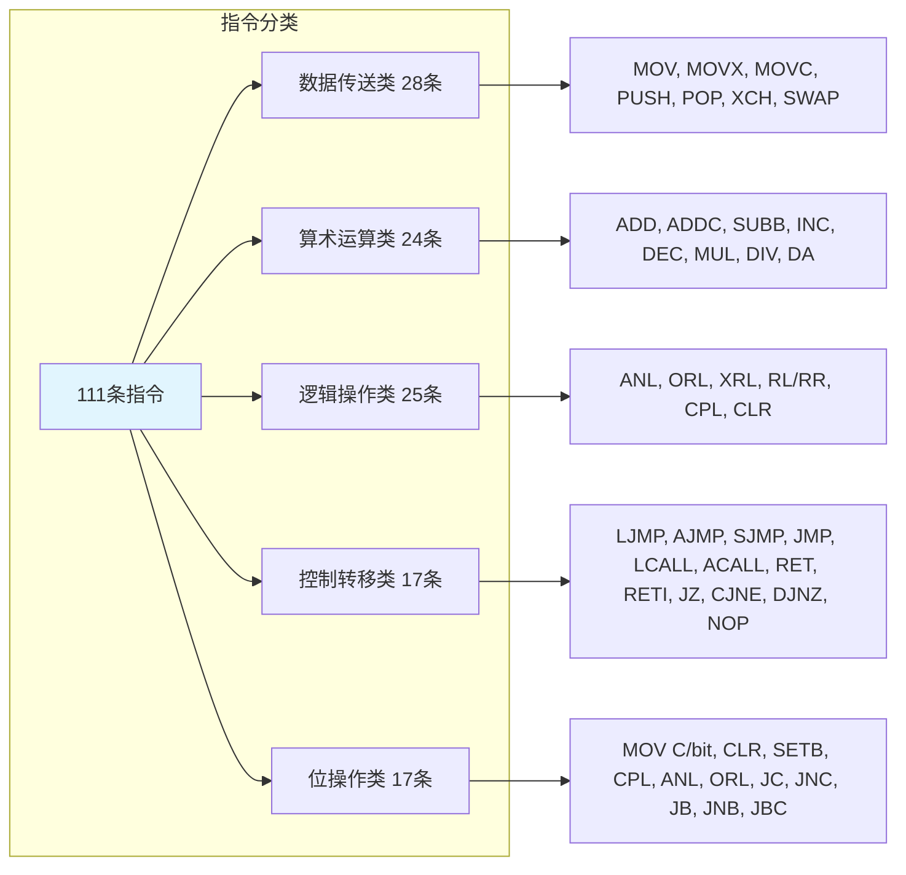
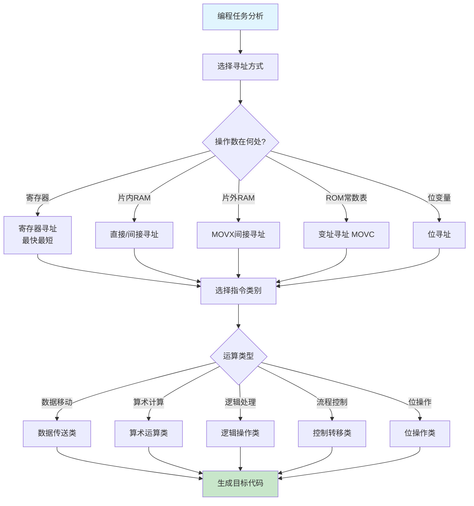

## 1. 指令系统概述

指令是CPU按照人们的意图完成某种操作的命令，通常以英文名称或其缩写形式作为助记符。汇编语言指令是用助记符、符号地址、标号等表示的书写程序的语言，是理解单片机工作原理和进行底层程序设计的基础。

AT89S51单片机采用MCS-51指令系统，属于**复杂指令集计算机（CISC）** 架构，共包含**111条基本指令**。这些指令按字节长度可分为三类：
- 单字节指令49条
- 双字节指令45条
- 三字节指令17条

按执行时间划分：
- 1个机器周期（12个时钟周期）指令64条
- 2个机器周期指令45条
- 4个机器周期指令2条（乘法和除法）

AT89S51的一大特色是集成了一个**位处理机**，拥有一套独立的位变量指令子集，使其在布尔处理和控制逻辑方面具有独特优势。

### 1.1 机器语言、汇编语言与高级语言

- **机器语言**：用二进制代码0和1编写的程序，是CPU唯一能直接识别和执行的指令形式。机器语言程序通常称为**目标程序**。例如，`74H 44H`是`MOV A, #44H`对应的机器码。
- **汇编语言**：用助记符、标号和符号地址表示的指令，与机器语言一一对应。汇编语言程序（源程序）需要通过汇编器转换为目标码才能运行。
- **高级语言**：接近自然语言和数学表达式的编程语言（如C语言），编写的源程序需经编译、链接后生成目标码。

汇编语言的特点：能直接访问寄存器、存储器和外设端口，执行效率高，占用存储空间小，运行速度快；但缺乏通用性，开发周期长，程序不易移植。

### 1.2 指令格式

指令通常由**操作码**和**操作数**两部分组成：
- 操作码：规定指令执行的操作类型（如MOV、ADD、SUB等）。
- 操作数：指定操作的对象，可以是一个具体数据、寄存器地址或存储器地址。

指令格式示例：
```assembly
MOV A, #00H   ; 将立即数0送入累加器A，实现累加器清零
START: MOV A, #01H   ; 标号START表示该指令的起始地址
SJMP START   ; 无条件跳转到START处，形成死循环
```

分号（;）后的内容为注释，标号后跟冒号（:）表示地址符号。汇编语言中的标号本质上是一个符号地址，在汇编时会被替换为具体的程序存储器地址。汇编程序允许使用任意长度的字符串作为标号，但建议标号命名应具有语义清晰性，便于代码的阅读和维护。

### 1.3 指令语句中的符号约定

在理解指令系统之前，需要熟悉以下常用符号约定（这些符号在后续指令介绍中反复出现）：

**表6-1 指令描述中的符号约定**

| 符号 | 含义 |
| :---: | :--- |
| Rn | 当前工作寄存器组中的R0～R7（n=0～7） |
| Ri | 当前工作寄存器组中作为间接寻址寄存器的R0或R1（i=0, 1） |
| direct | 8位内部RAM单元地址或SFR地址（00H～FFH） |
| #data | 8位立即数（00H～FFH） |
| #data16 | 16位立即数（0000H～FFFFH） |
| rel | 8位带符号偏移量（-128～+127），用于相对转移指令 |
| DPTR | 16位数据指针，用于访问片外存储器（64KB寻址） |
| bit | 内部RAM或SFR中的直接寻址位（位地址） |
| C | 进位标志位Cy，即位处理机的位累加器 |
| addr11 | 11位目的地址，用于绝对转移/调用（2KB页面内） |
| addr16 | 16位目的地址，用于长转移/调用（64KB全空间） |
| @ | 间接寻址寄存器前缀，如@Ri、@A+DPTR |
| (x) | 表示x地址单元或寄存器中的内容 |
| ((x)) | 表示以x单元或寄存器中的内容为地址所寻址单元的内容 |
| ← | 箭头右边的内容被箭头左边的内容取代 |
| ∧ | 逻辑与运算（AND） |
| ∨ | 逻辑或运算（OR） |
| ⊕ | 逻辑异或运算（XOR） |
| /bit | 表示对bit先取反后再参与运算 |

> [!IMPORTANT] 寄存器的符号使用
> 在指令格式描述中，Rn和Ri是两类不同的寄存器符号。Rn泛指R0～R7中的任意一个，可用于寄存器寻址；Ri特指R0或R1，用于寄存器间接寻址。两者不可混用。例如，`MOV A, R2`合法，但`MOV A, @R2`不合法（间接寻址只能用R0或R1）。

## 2. 寻址方式

寻址方式是指令中说明操作数所在地址的方法。寻址方式越多，单片机的功能就越强，编程也越灵活。AT89S51共支持**7种寻址方式**，分别适用于不同的存储器空间和操作数类型。

**表6-2 七种寻址方式对比总结**

| 寻址方式 | 访问的存储器空间 | 关键语法特征 | 典型指令示例 |
| :--- | :--- | :--- | :--- |
| 立即寻址 | 程序存储器ROM | 操作数前有#前缀 | `MOV A, #30H` |
| 直接寻址 | 片内RAM低128B、SFR | 直接写出地址 | `MOV A, 45H` |
| 寄存器寻址 | R0～R7、A、B、DPTR、Cy | 直接写寄存器名 | `MOV A, R2` |
| 寄存器间接寻址 | 片内RAM、片外RAM | 有@前缀 | `MOV A, @R0` |
| 变址寻址 | 程序存储器ROM（查表） | @A+PC/DPTR | `MOVC A, @A+DPTR` |
| 相对寻址 | 程序存储器ROM（转移） | 偏移量rel | `SJMP 20H` |
| 位寻址 | 位寻址区、可位寻址SFR | 位地址或位名 | `MOV C, 20H` |

以下逐一分析每种寻址方式的技术细节。

### 2.1 立即寻址

操作数直接包含在指令字节中，紧跟在操作码后面。立即数以“#”为前缀，表示后续的数值是操作数本身而非地址。若立即数以字母开头（如A0H），前应冠“0”以示区分（写作`#0A0H`），避免汇编器将A误认为累加器符号。

- **特点**：操作数存放于程序存储器（ROM）中，与指令代码一起被读取。寻址速度快（无需额外访存），但占用程序存储空间。对于需要频繁使用的常数，用立即寻址最为高效。
- **适用范围**：向寄存器或存储器单元赋初始值，参与运算的常数。
- **示例**：`MOV A, #44H`  —— 将立即数44H送入累加器A。机器码为74H 44H，共2字节。

### 2.2 直接寻址

指令中直接给出操作数所在的存储器地址。直接地址可以是8位内部RAM地址（00H～7FH）或特殊功能寄存器（SFR）地址（80H～FFH）。SFR通常可用其名称代替地址（如P1、TCON等），提高程序可读性。

- **适用范围**：片内RAM低128B（00H～7FH）、所有SFR（80H～FFH）。
- **特点**：简洁直接，但指令字节数比寄存器寻址多1字节。
- **示例**：`MOV A, 45H`  —— 将片内RAM 45H单元的内容送入累加器A。
- **混淆注意**：直接地址与位地址在数值上可能相同（如20H既是字节地址也是位地址），编译器通过**操作码**区分两者。例如，`MOV A, 20H`访问字节地址20H；`MOV C, 20H`访问位地址20H（对应24H字节的位0）。

### 2.3 寄存器寻址

操作数存放在工作寄存器R0～R7、累加器A、寄存器B、数据指针DPTR或进位标志Cy中。通过指定寄存器名称直接访问其内容。

- **特点**：执行速度最快，指令代码最短（单字节）。工作寄存器组的选择由PSW的RS1/RS0控制，当前选中的寄存器组决定了R0～R7的实际物理地址。
- **适用范围**：临时变量频繁操作、循环计数器、地址指针等。
- **示例**：`MOV A, R2`  —— 将当前工作寄存器组中R2的内容送入累加器A。
- **特别说明**：累加器A在寄存器寻址中写作`A`，在直接寻址中写作`ACC`。如`INC A`（寄存器寻址）和`INC ACC`（直接寻址）在功能上相同，但前者代码更短。

### 2.4 寄存器间接寻址

操作数的地址存放在某个寄存器中，通过该寄存器的内容间接访问存储器单元。寄存器间接寻址用“@”前缀表示。

- **适用范围**：
  - 片内RAM（使用@R0/@R1）
  - 片外RAM低256字节（使用@R0/@R1）
  - 片外RAM全部64KB（使用@DPTR）
- **特点**：灵活性高，适合循环访问数据块（用Ri递增实现地址自增）。但在片内RAM间接寻址中仅限R0和R1。
- **示例**：`MOV A, @R0`  —— 将R0内容所指向的片内RAM单元内容送入A。
- **注意**：寄存器间接寻址不可用于访问SFR。SFR只能通过直接寻址访问。

### 2.5 变址寻址

以基址寄存器（DPTR或PC）的内容与累加器A中的无符号数相加，形成16位地址，访问程序存储器（ROM）中的数据表格。主要用于查表操作，寻址范围可达64KB。

- **仅有3条变址寻址指令**：
  - `MOVC A, @A+PC`   —— 以PC为基址，偏移量由A提供（PC为当前指令下一条地址）
  - `MOVC A, @A+DPTR` —— 以DPTR为基址，偏移量由A提供（最常用查表指令）
  - `JMP @A+DPTR`     —— 散转指令，实现多分支跳转
- **示例**：若(DPTR)=2010H, (A)=30H，执行`MOVC A, @A+DPTR`后，将程序存储器2040H单元的内容送入A。执行该指令时，PSEN信号有效。
- **技术要点**：`MOVC A, @A+PC`指令长度为1字节，偏移量A的取值范围为0～255。该指令基址PC的变化需要注意——PC已指向下一条指令，因此有效地址范围为（当前PC+1）～（当前PC+256）。

### 2.6 相对寻址

以当前程序计数器PC值（即下一条指令的首地址）为基准，加上一个带符号的8位偏移量rel（-128～+127），得到转移目的地址。相对寻址仅用于相对转移指令（如SJMP、JC、JZ等），用于控制程序流向。

- **公式**：目的地址 = 当前PC值 + rel = (指令存储地址 + 指令字节数) + rel
- **偏移量rel**：为8位带符号补码数，正数（00H～7FH）表示向地址增大的方向转移，负数（80H～FFH）表示向地址减小的方向转移。
- **示例**：`SJMP 20H`  —— 指令机器码为80H 20H，若该指令位于1000H，则下一条PC为1002H，目的地址=1002H+20H=1022H。
- **程序跳转的“相对”特性**：相对转移指令是无条件的，转移范围较小但具有代码位置无关性，修改程序地址时无需改动指令本身（仅rel值随地址变化）。
- **`SJMP $`**：`$`符号表示该条指令自身的地址，因此`SJMP $`等效于原地跳转（死循环）。常用于程序调试或等待中断状态。

### 2.7 位寻址

对片内RAM位寻址区（20H～2FH，共128位）和可位寻址的SFR（地址末位为0或8的SFR）中的位进行单独访问。位地址与字节地址形式相同，主要由操作码区分。

- **位地址范围**：位寻址区00H～7FH对应20H～2FH字节的每一位；SFR中的位地址在80H～FFH范围内。可位寻址的SFR包括P0（80H）、TCON（88H）、P1（90H）、SCON（98H）、P2（A0H）、IE（A8H）、P3（B0H）、IP（B8H）、PSW（D0H）、ACC（E0H）、B（F0H）等。
- **示例**：`MOV C, 20H`  —— 将位地址20H（即24H字节的位0）内容送入进位标志C。
- **示例**：`SETB 3DH`  —— 将位地址3DH（即27H.5）置1。
- **可位寻址SFR的判断规则**：SFR地址的十六进制表示若以0或8结尾，则可进行位寻址。例如，90H（P1）末位为0，可位寻址；而99H（SBUF）末位为9，不可位寻址。

> [!NOTE] 位寻址的特殊性
> 位寻址是AT89S51位处理机的重要特征。通过位操作指令，可直接对单个二进制位进行置位、清零、取反和条件判断，在控制开关量、标志位和状态检测方面极为高效。位寻址的存储器映射是“位的集合”，每个位地址（00H～7FH）与一个特定的物理位位置一一对应，这种设计使位操作指令无需经过字节读取-位处理-字节回写的复杂步骤。

### 2.8 寻址方式综合对比与选型原则

**表6-3 寻址方式选型参考**

| 应用场景 | 推荐寻址方式 | 理由 |
| :--- | :--- | :--- |
| 常数赋值 | 立即寻址 | 直接读取常数，速度快 |
| 单字节变量频繁操作 | 寄存器寻址 | 指令最短、执行最快 |
| 数组/缓冲区访问 | 寄存器间接寻址 | 地址可动态变化，适合循环 |
| 访问SFR | 直接寻址 | SFR仅支持直接寻址 |
| 访问程序存储器常数表 | 变址寻址 | 专为查表设计 |
| 短距离程序跳转 | 相对寻址 | 代码位置无关，节省字节 |
| 位状态控制与判断 | 位寻址 | 直接对单bit操作，效率极高 |

## 3. 指令系统分类

111条指令按功能分为五大类：数据传送类（28条）、算术运算类（24条）、逻辑操作类（25条）、控制转移类（17条）和位操作类（17条）。以下分类介绍各类指令的核心功能。



### 3.1 数据传送类指令

数据传送类指令最常用，助记符主要为“MOV”，格式为：`MOV <目的操作数>, <源操作数>`。执行后源操作数内容不变，目的操作数内容更新，属于“复制”操作。该类指令不影响Cy、Ac和OV标志，但会影响奇偶标志P（因为累加器A内容变化）。

#### 3.1.1 内部RAM数据传送（15条）

主要形式及使用说明：

**（1）以累加器A为目的操作数（4条）**
- `MOV A, Rn` —— A ← Rn（寄存器寻址）
- `MOV A, @Ri` —— A ← (Ri)（寄存器间接寻址）
- `MOV A, #data` —— A ← #data（立即寻址）
- `MOV A, direct` —— A ← direct（直接寻址）

**（2）以Rn为目的操作数（3条）**
- `MOV Rn, A` —— Rn ← A
- `MOV Rn, direct` —— Rn ← direct
- `MOV Rn, #data` —— Rn ← #data

**（3）以direct为目的操作数（5条）**
- `MOV direct, A` —— direct ← A
- `MOV direct, Rn` —— direct ← Rn
- `MOV direct, direct` —— direct ← direct（片内RAM间直接传送）
- `MOV direct, @Ri` —— direct ← (Ri)
- `MOV direct, #data` —— direct ← #data

**（4）以@Ri为目的操作数（3条）**
- `MOV @Ri, A` —— (Ri) ← A
- `MOV @Ri, direct` —— (Ri) ← direct
- `MOV @Ri, #data` —— (Ri) ← #data

**（5）16位数据指针传送（1条）**
- `MOV DPTR, #data16` —— DPTR ← #data16，将16位立即数送入DPTR。AT89S51具有DPTR0和DPTR1两个数据指针，通过AUXR1寄存器的DPS位选择当前使用的指针。

> [!EXAMPLE] 内部RAM数据传送综合示例
> 已知片内RAM 44H单元内容为07H，执行以下程序后21H单元的结果如何？
> ```assembly
> MOV R0, #44H    ; R0 = 44H（立即寻址）
> MOV A, @R0      ; A = (44H) = 07H（寄存器间接寻址）
> MOV 21H, A      ; (21H) = A = 07H（直接寻址）
> ```
> 结果：21H单元内容为07H。

#### 3.1.2 外部RAM数据传送（4条）

使用`MOVX`指令访问片外RAM或扩展I/O口，执行时RD（P3.7）或WR（P3.6）信号有效。`MOVX`是“Move External”的缩写，明确指示操作对象在片外。

- `MOVX A, @DPTR` —— 读外部RAM 64KB空间（DPTR提供完整16位地址）
- `MOVX A, @Ri` —— 读外部RAM低256字节（0～FFH），地址由Ri提供，高8位为00H
- `MOVX @DPTR, A` —— 写外部RAM 64KB空间
- `MOVX @Ri, A` —— 写外部RAM低256字节

**技术要点**：采用@Ri方式访问片外RAM时，8位地址由P0口输出并锁存，随后P0口复用为8位数据口。采用@DPTR方式时，高8位地址由P2口输出，低8位地址由P0口输出（分时复用），可访问整个64KB空间。

#### 3.1.3 程序存储器查表指令（2条）

使用`MOVC`指令，访问程序存储器（ROM），执行时PSEN信号有效。`MOVC`是“Move Code”的缩写。

- `MOVC A, @A+PC` —— 以PC为基址查表。PC的当前值是指令所在地址+1。
- `MOVC A, @A+DPTR` —— 以DPTR为基址查表。DPTR需预先设置表格基地址，A中存放偏移量。

**技术要点**：`MOVC A, @A+PC`指令自身占用1字节，因此基址为当前PC+1。若A=00H，则读取`MOVC`指令后一个字节的内容（常用于在指令后直接跟表格数据）。`MOVC A, @A+DPTR`更为常用，因为DPTR可自由设置，表格可放在程序存储器的任意位置。

#### 3.1.4 堆栈操作（2条）

- `PUSH direct` —— 先SP加1，再将direct内容压入堆栈。SP总是指向栈顶已存储数据的位置。
- `POP direct` —— 将栈顶内容弹出至direct，然后SP减1。

**堆栈操作示例**：
```assembly
; 假设(SP)=60H, (A)=30H, (B)=70H
PUSH Acc   ; SP=61H, (61H)=30H
PUSH B     ; SP=62H, (62H)=70H
; 此时(SP)=62H

POP DPH    ; DPH=(62H)=70H, SP=61H
POP DPL    ; DPL=(61H)=30H, SP=60H
; 结果(DPTR)=7030H, SP恢复为60H
```

> [!WARNING] 堆栈操作注意事项
> 堆栈是向上生长的（进栈时SP先加1后写入），复位后SP初始为07H。建议在程序初始化时将SP重置为60H或更大的值（如`MOV SP, #60H`），以避免堆栈与工作寄存器区（00H～1FH）发生冲突。

#### 3.1.5 数据交换指令

- `XCH A, Rn` —— A与Rn内容互换（n=0～7）
- `XCH A, @Ri` —— A与间接寻址单元内容互换（i=0,1）
- `XCH A, direct` —— A与直接地址单元内容互换
- `XCHD A, @Ri` —— A的低4位与间接寻址单元低4位互换，高4位不变
- `SWAP A` —— A的高4位与低4位互换（等价于循环左移4位）

### 3.2 算术运算类指令

该类指令执行加、减、乘、除、增1、减1等运算，会影响Cy、Ac、OV和P标志（乘除对Cy、OV有特定影响）。

#### 3.2.1 加法指令

- `ADD A, Rn/@Ri/direct/#data` —— 不带进位的加法，A = A + 源操作数
- `ADDC A, Rn/@Ri/direct/#data` —— 带进位加法，A = A + 源操作数 + Cy

**标志影响规律**：
- Cy = 位7是否产生进位
- Ac = 位3是否产生进位（用于BCD码十进制调整）
- OV = 位6进位状态 ⊕ 位7进位状态（用于有符号数溢出检测）

> [!EXAMPLE] 加法标志分析示例
> 若(A)=85H, (R0)=20H, (20H)=AFH，执行`ADD A, @R0`：
> 85H + AFH = 134H → 结果34H，Cy=1，Ac=1（位3进位），OV=1（位7有进位，位6无进位，异或为1），P=1（34H含3个1）。

**溢出检测判断规则**：
- OV=0：运算结果正确（在-128～+127范围内）
- OV=1：运算结果溢出（超出-128～+127范围）
- OV仅对有符号数运算有意义，无符号数运算应检查Cy标志。

#### 3.2.2 带借位减法指令

- `SUBB A, Rn/@Ri/direct/#data` —— 减法，A = A - 源操作数 - Cy
- 标志影响：位7借位→Cy=1，位3借位→Ac=1，OV=位6借位⊕位7借位。
- **注意**：执行减法前若Cy非0，需要先执行`CLR C`清零进位标志，否则减法结果会多减一个1。

> [!EXAMPLE] 减法示例
> 若(A)=C9H, (R2)=54H, Cy=1，执行`SUBB A, R2`：
> C9H - 54H - 1 = 74H，Cy=0，Ac=0，OV=1（位6向位7借位，位7无借位，异或为1）。

#### 3.2.3 乘法与除法

- `MUL AB` —— A × B → BA（积低字节在A，高字节在B），若积>255则OV=1，Cy清0。该指令执行需4个机器周期。
- `DIV AB` —— A ÷ B → A（商），余数→B，Cy和OV清0；若B=0（除数为0），则OV=1，A、B内容不定。

#### 3.2.4 增1和减1

- `INC A/Rn/@Ri/direct/DPTR` —— 变量加1，不影响标志位（P标志除外）。`INC DPTR`是唯一的16位增1指令，当DPL从FFH溢出时，自动进位至DPH。
- `DEC A/Rn/@Ri/direct` —— 变量减1，不影响标志位（P标志除外）。当变量从00H减1时结果为FFH（无符号数下溢）。
- `DA A` —— 十进制（BCD）加法调整，用于BCD码加法后的修正。该指令根据AC和Cy标志对A进行加06H或60H的修正操作，使A中结果保持为正确的BCD码。

#### 3.2.5 算术运算指令标志影响速查

**表6-4 算术运算指令对标志位的影响**

| 指令类型 | Cy | Ac | OV | P |
| :--- | :---: | :---: | :---: | :---: |
| ADD | 有影响 | 有影响 | 有影响 | 有影响 |
| ADDC | 有影响 | 有影响 | 有影响 | 有影响 |
| SUBB | 有影响 | 有影响 | 有影响 | 有影响 |
| MUL | 清0 | — | 积>255则置1 | 有影响 |
| DIV | 清0 | — | 除数=0则置1 | 有影响 |
| INC | 不影响 | 不影响 | 不影响 | 有影响 |
| DEC | 不影响 | 不影响 | 不影响 | 有影响 |
| DA | 有影响 | 有影响 | 不影响 | 有影响 |

### 3.3 逻辑操作类指令

逻辑操作包括与（ANL）、或（ORL）、异或（XRL）、移位、求反、清0等。该类指令不影响Cy、Ac和OV标志，但会影响P标志（A内容变化时）。

#### 3.3.1 逻辑与（ANL）

- `ANL A, Rn/@Ri/direct/#data` —— A = A ∧ 源操作数
- `ANL direct, A/#data` —— direct = direct ∧ A/立即数

**应用技巧**：逻辑与常用于**屏蔽**（清零）字节中的某些位。要保留的位与“1”，要清除的位与“0”。例如：`ANL A, #0FH` 屏蔽A的高4位，保留低4位。

#### 3.3.2 逻辑或（ORL）

- `ORL A, Rn/@Ri/direct/#data` —— A = A ∨ 源操作数
- `ORL direct, A/#data` —— direct = direct ∨ A/立即数

**应用技巧**：逻辑或常用于**置位**字节中的某些位。要保留的位或“0”，要置1的位或“1”。例如：`ORL P1, #0F0H` 将P1口高4位置1，低4位保持不变。

#### 3.3.3 逻辑异或（XRL）

- `XRL A, Rn/@Ri/direct/#data` —— A = A ⊕ 源操作数
- `XRL direct, A/#data` —— direct = direct ⊕ A/立即数

**应用技巧**：逻辑异或常用于**取反**字节中的某些位。要保留的位异或“0”，要求反的位异或“1”。例如：`XRL P1, #0FFH` 将P1口全部位取反。

#### 3.3.4 循环移位与累加器操作

- `RL A` —— 不带进位的循环左移（A7进入A0）
- `RLC A` —— 带进位的循环左移（A7进入Cy，Cy进入A0）
- `RR A` —— 不带进位的循环右移（A0进入A7）
- `RRC A` —— 带进位的循环右移（A0进入Cy，Cy进入A7）
- `SWAP A` —— 高低半字节互换（A3～A0与A7～A4交换）
- `CPL A` —— 累加器按位取反（1变0，0变1）
- `CLR A` —— 累加器清零

**移位操作的算术意义**：
- 左移1位（`RL A`或`RLC A`）相当于无符号数乘以2。
- 右移1位（`RR A`或`RRC A`）相当于无符号数除以2。

> [!EXAMPLE] 逻辑指令综合示例——数据组合
> 实现将累加器A的低4位送入P1口的低4位，P1高4位保持不变：
> ```assembly
> ANL A, #0FH    ; 屏蔽A的高4位
> ANL P1, #0F0H  ; 清零P1低4位
> ORL P1, A      ; 组合送入
> ```
> 逻辑运算的屏蔽和组合功能在此得到充分体现。

> [!EXAMPLE] 逻辑指令综合示例——乘法6运算
> 利用移位和加法实现累加器A的内容乘以6（无需MUL指令）：
> ```assembly
> RL A           ; A = A × 2
> MOV R0, A      ; 保存(A×2)
> RL A           ; A = A × 4（此时A为原值×4）
> ADD A, R0      ; A = (A×4) + (A×2) = A×6
> ```
> 此例展示了移位指令和加法指令的组合应用技巧。

### 3.4 控制转移类指令

控制转移指令用于改变程序执行顺序，包括无条件转移、条件转移、子程序调用与返回、中断返回等。主要操作对象是PC。

#### 3.4.1 无条件转移

- `LJMP addr16` —— 长转移，目标地址16位，可访问64KB任意地址。指令3字节，第2字节为高8位地址，第3字节为低8位地址。无转移范围限制。
- `AJMP addr11` —— 绝对转移，目标地址11位，在当前2KB页面内转移。指令2字节，第1字节高3位存放A10～A8，低5位为操作码00001B。页面边界由PC的高5位决定。
- `SJMP rel` —— 短相对转移，偏移量-128～+127。指令2字节，转移范围以当前PC为中心，前后各约127字节，无需修改高位地址。
- `JMP @A+DPTR` —— 散转指令，目的地址 = DPTR + A（16位）。用于多分支选择，将A作为偏移量查表跳转。典型应用场景：根据A中的索引值（0,1,2,...）跳转到不同的处理程序入口。

#### 3.4.2 条件转移

- `JZ rel` —— 若A=0则转移（Jump if Zero）
- `JNZ rel` —— 若A≠0则转移（Jump if Not Zero）
- `CJNE A, direct/#data, rel` —— 比较A与直接地址/立即数，不相等则转移
- `CJNE Rn, #data, rel` —— 比较Rn与立即数，不相等则转移
- `CJNE @Ri, #data, rel` —— 比较间接地址内容与立即数，不相等则转移
- `DJNZ Rn/direct, rel` —— 减1后非0转移，常用于循环控制

> [!EXAMPLE] CJNE等待示例
> 等待P1口输入值变为01H：
> ```assembly
> MOV A, #01H
> WAIT: CJNE A, P1, WAIT   ; 若(P1)≠01H则继续等待
> ; 执行到这里时P1口已为01H
> ```

> [!EXAMPLE] DJNZ循环示例
> 从P1.7引脚输出5个方波：
> ```assembly
> MOV R2, #10
> LOOP: CPL P1.7
>       DJNZ R2, LOOP
> ```

#### 3.4.3 子程序调用与返回

- `LCALL addr16` —— 长调用，16位地址，可调用64KB内任一子程序。执行时先将当前PC+3（断点地址）压栈，然后装入目标地址。
- `ACALL addr11` —— 绝对调用，2KB页面内子程序调用，指令格式与AJMP类似。
- `RET` —— 子程序返回，从堆栈弹出断点地址（先弹出高8位，再低8位）。
- `RETI` —— 中断返回，功能与RET相同，额外清除中断响应时被置1的内部中断优先级状态，确保同级中断可再次被响应。

> [!WARNING] RET与RETI的区别
> RET和RETI在恢复PC方面功能相同，但RETI还负责清除中断硬件状态标志。**不可用RET代替RETI**，否则当前中断的优先级状态无法清除，会导致该中断及同级中断后续无法再次触发。

#### 3.4.4 空操作

`NOP` —— 不执行任何操作，消耗1个机器周期时间，仅执行PC+1。常用于精确定时或等待（如产生短暂延时、插入总线时序等待状态）。

### 3.5 位操作类指令

AT89S51的位处理机支持17条位操作指令，直接对位累加器Cy和可寻址位进行操作。

#### 3.5.1 位传送指令

- `MOV C, bit` —— bit → Cy（将指定位的值复制到进位标志）
- `MOV bit, C` —— Cy → bit（将进位标志的值复制到指定位）

**使用限制**：两个操作数中必须有一个是Cy，另一个必须是直接寻址位。例如：`MOV C, 20H`将位地址20H（24H.0）的值送入Cy；`MOV P1.0, C`将Cy输出到P1.0引脚。

#### 3.5.2 位清0/置1/取反

- `CLR C` 和 `CLR bit` —— 指定位清0
- `SETB C` 和 `SETB bit` —— 指定位置1
- `CPL C` 和 `CPL bit` —— 指定位取反（1→0，0→1）

> [!EXAMPLE] 位操作示例
> ```assembly
> CLR C           ; Cy清0
> CLR 27H         ; (24H).7位清0（27H是位地址）
> CPL 08H         ; (21H).0位取反
> SETB P1.7       ; P1.7引脚输出高电平
> ```

#### 3.5.3 位逻辑运算指令

- `ANL C, bit` —— Cy = Cy ∧ bit（bit内容与Cy相与）
- `ANL C, /bit` —— Cy = Cy ∧ (¬bit)（先对bit取反再与Cy相与）
- `ORL C, bit` —— Cy = Cy ∨ bit（bit内容与Cy相或）
- `ORL C, /bit` —— Cy = Cy ∨ (¬bit)（先对bit取反再与Cy相或）

这些指令实现位级别的布尔运算，适合复杂逻辑条件的组合判断。

#### 3.5.4 位条件转移指令

- `JC rel` —— 若Cy=1则转移（Jump if Carry）
- `JNC rel` —— 若Cy=0则转移（Jump if Not Carry）
- `JB bit, rel` —— 若指定位=1则转移（Jump if Bit set）
- `JNB bit, rel` —— 若指定位=0则转移（Jump if Bit Not set）
- `JBC bit, rel` —— 若指定位=1则转移并将该位清0（Jump if Bit set and Clear）

> [!NOTE] 位指令的灵活运用
> 位操作指令在逻辑控制和实时检测中极为高效。例如，`JB P3.2, WAIT`可直接检测P3.2引脚电平状态，无需先将整个P3口读入累加器再位操作。`JBC`指令将测试和清除合并为一步，特别适用于软件标志的一次性检测后清零。

## 4. 汇编语言程序设计实用技巧

### 4.1 常见指令优化原则

**（1）寄存器优先原则**
能用寄存器寻址的尽量用寄存器寻址，避免使用直接寻址和立即寻址，因为寄存器寻址指令代码最短、执行最快。例如：
- `MOV A, R0`（1字节，1周期）优于`MOV A, 00H`（2字节，1周期）

**（2）累加器使用最小化**
由于累加器A是数据传送的“中转站”，频繁使用容易形成瓶颈。尽量使用寄存器间传送指令（如`MOV R1, R0`在部分指令中不可用，但可通过直接寻址间接实现），在可能的情况下减少对A的依赖。

**（3）立即数范围的充分利用**
相对转移指令`SJMP`的偏移量为-128～+127，设计程序时尽量将相关的条件分支安排在以当前PC为中心的±127字节范围内，使用短转移指令可节省程序存储空间。

**（4）自减循环的高效实现**
`DJNZ`指令将减1和条件判断合并为单条指令，比分别执行`DEC`和`JNZ`更高效。在编写延时循环时，应优先使用嵌套的`DJNZ`循环。

### 4.2 常见编程误区与注意事项

**（1）位地址与字节地址的混淆**
位地址与字节地址数值可能相同（如位地址20H对应字节24H.0，而字节地址20H是内存单元20H）。汇编器根据操作码区分两者，程序员需明确每个地址在指令中的角色。

**（2）堆栈操作SP初始值**
复位后SP=07H，建议在程序初始化时将SP设为60H或更大的值，避免堆栈区与工作寄存器区（00H～1FH）冲突，特别是在使用中断嵌套时更需留足堆栈空间。

**（3）指令可重入性**
中断服务程序应使用可重入代码（不依赖全局变量、不使用静态变量）。若使用寄存器，应考虑是否会影响主程序状态。建议在中断服务程序中对用到的寄存器进行PUSH保存和POP恢复。

**（4）相对转移的最大偏移**
`SJMP`、`JC`、`JNC`等相对转移指令的范围为当前PC±127字节。超过此范围的转移必须使用`LJMP`或`AJMP`。在汇编时，如果rel值超出允许范围，汇编器会报告错误。

## 5. 本章小结

本章系统介绍了AT89S51单片机的指令系统，涵盖以下核心内容：
- 指令系统概述（111条指令、分类、字节长度和执行时间）。
- 7种寻址方式及其适用范围和典型指令，通过对比表格和选型原则加深理解。
- 五大类指令的功能、典型指令格式、标志影响和应用要点。
- 通过具体示例（加法运算、逻辑组合、延时循环、位操作等）展示了指令在实际编程中的应用。
- 汇编语言程序设计的实用技巧和常见误区。

熟练掌握指令系统和寻址方式是编写高效汇编程序的基础，也是理解C51编译器生成代码行为的必要前提。后续章节将在指令系统基础上，进一步探讨汇编语言程序设计的结构化方法和典型应用。



## 相关笔记

- [[2.单片机的结构]]
- [[3.单片机的存储器-SFR]]
- [[11.汇编程序设计及C51]]
- [[5.中断系统1]]
- [[7.定时计数器1]]
- [[单片机寄存器与寻址]]

> 本章内容基于Intel MCS-51指令集标准文档编写，具体指令编码和时序以Atmel AT89S51数据手册为准。