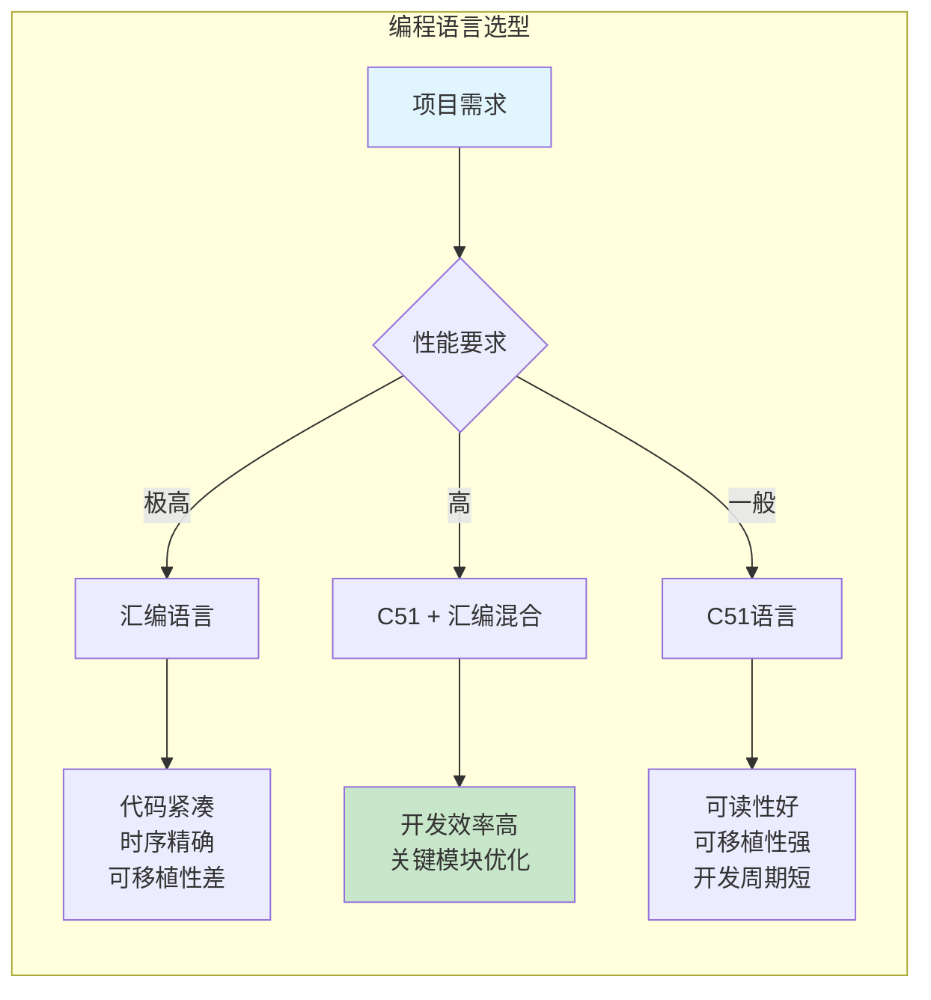

## 1. 单片机编程语言概述

### 1.1 汇编语言的特点与应用场景

汇编语言是用英文字符（助记符）来代替机器语言的编程语言。用汇编语言编写的程序称为汇编语言源程序，需要通过汇编程序转换为机器语言目标程序才能在单片机上执行。

**汇编语言的主要优点**：
- **执行效率高**：汇编指令与机器指令一一对应，无额外编译开销。
- **占用存储空间小**：程序员可精确控制每条指令的生成，无冗余代码。
- **运行速度快**：可直接操作硬件资源，无运行时类型检查等额外开销。
- **能编写出最优化的程序**：适合对时序和资源有严格要求的场合。

**汇编语言的主要缺点**：
- 可读性差，程序逻辑不易理解。
- 严重依赖具体硬件，是面向“硬件”的语言。
- 通用性差，为一种单片机编写的程序难以移植到其他平台。

### 1.2 高级语言的特点

高级语言（如C语言）不受具体硬件限制，具有通用性强、直观易懂、可读性好等优点。目前大多数51单片机用户使用C51语言进行程序设计，C51已被公认为高效简洁且贴近51单片机硬件的高级编程语言。

尽管C51已成为主流，但在对程序空间和时间要求极高的场合（如高速数据采集、精确时序控制），汇编语言仍不可或缺。在实际工程中，常采用C语言与汇编语言**混合编程**的方式，兼顾开发效率和执行性能。掌握汇编语言程序设计是学习和掌握单片机程序设计的基本功之一。

### 1.3 程序设计流程图

流程图是程序设计的辅助工具，使用标准符号描述程序的逻辑结构。常用符号包括：起止框（圆角矩形）、处理框（矩形）、判断框（菱形）、流程线（箭头）、输入/输出框（平行四边形）和连接符（圆圈）等。在编写复杂程序前，应先绘制流程图，明确程序的逻辑结构。

## 2. 汇编语言语句与格式

### 2.1 两种基本语句

**（1）指令语句**
指令语句对应一条可执行的机器指令，汇编时产生对应的机器代码。已在第6章指令系统中详细介绍。

**（2）伪指令语句**
伪指令是控制汇编过程的命令，**不产生机器代码**，仅在汇编阶段指导汇编程序完成地址分配、符号定义、数据存储等工作。伪指令在汇编后“消失”，故称“伪”。

### 2.2 汇编语言源程序格式

汇编语言源程序通常采用**四分段格式**书写：

```
标号字段  操作码字段  操作数字段  注释字段
```

- **标号字段**：符号地址，以字母开头，后跟冒号（:），代表该指令在程序存储器中的地址。
- **操作码字段**：指令助记符，如MOV、ADD、DJNZ等。
- **操作数字段**：操作数或操作数地址，多个操作数间用逗号分隔。
- **注释字段**：以分号（;）开头，用于程序说明，不参与汇编。

**示例**：
```assembly
START:   MOV     A, #00H    ; 累加器A清零
         MOV     R1, #10    ; 循环计数器R1置10
LOOP:    ADD     A, R2      ; A = A + R2
         DJNZ    R1, LOOP   ; R1减1，非0则跳转至LOOP
HERE:    SJMP    HERE       ; 原地循环
```

## 3. 常用伪指令详解

### 3.1 ORG —— 汇编起始地址命令

`ORG`用于规定程序或数据在程序存储器（ROM）中的起始地址。若未使用ORG，汇编默认从0000H地址开始安排。

**格式**：`ORG <16位地址>`

**示例**：
```assembly
ORG 2000H          ; 以下程序从2000H开始存放
START: MOV A, #00H
```
标号START代表的地址为2000H。

### 3.2 END —— 汇编终止命令

`END`是源程序结束标志，终止汇编工作。**整个源程序只能有一条END命令**，且必须位于程序末尾。若END出现在程序中间，其后的代码将不被汇编。

### 3.3 EQU —— 标号赋值命令

`EQU`用于给标号或符号赋予一个常数值或地址值，赋值后在整个程序中有效。该命令使程序具备更好的可维护性——修改一个EQU定义即可更新所有引用处。

**格式**：`<符号名> EQU <数值或汇编符号>`

**示例**：
```assembly
CYCLE EQU 200      ; CYCLE代表数值200
DELAY: MOV R7, #CYCLE   ; R7 ← 200
```

### 3.4 DB —— 定义字节命令

`DB`用于从指定地址开始，在程序存储器中定义连续的字节数据，常用于建立常数表格（如数码管段码表、ASCII码表等）。

**格式**：`DB <8位数据表>`

**示例**：
```assembly
ORG 2000H
DB 30H, 40H, 24, 'C', 'B'
```
汇编结果：
- (2000H) = 30H
- (2001H) = 40H
- (2002H) = 18H（十进制24 → 十八进制12H？注：24的十六进制为18H）
- (2003H) = 43H（字符'C'的ASCII码）
- (2004H) = 42H（字符'B'的ASCII码）

> 在DB定义中，十进制数会自动转换为十六进制存储；字符常量用单引号括起，存储其ASCII码值。

### 3.5 DW —— 定义字命令

`DW`用于定义16位数据表，每个数据占用2个字节（高字节在前，低字节在后）。

**格式**：`DW <16位数据表>`

**示例**：
```assembly
ORG 2200H
DW 1246H, 7BH, 10
```
汇编结果：
- (2200H) = 12H, (2201H) = 46H
- (2202H) = 00H, (2203H) = 7BH
- (2204H) = 00H, (2205H) = 0AH

### 3.6 DS —— 定义存储空间命令

`DS`用于在指定地址开始预留若干字节的存储空间，常用于预留缓冲区或堆栈区。

**格式**：`DS <表达式>`（表达式通常为常数）

**示例**：
```assembly
ORG 500H
DS 10H          ; 预留16字节空间（500H～50FH）
DB 4BH, 5AH     ; (510H)=4BH, (511H)=5AH
```
注：DS预留的空间不被初始化，其内容在汇编时不确定。

### 3.7 BIT —— 定义位地址命令

`BIT`用于将位地址或位名称赋予一个符号名，便于位操作的编程。

**格式**：`<符号名> BIT <位地址>`

**示例**：
```assembly
ABC BIT P1.0        ; ABC代表P1.0的位地址
Q4  BIT P2.2        ; Q4代表P2.2的位地址
```

**表7-1 常用伪指令汇总**

| 伪指令 | 格式 | 功能说明 |
| :--- | :--- | :--- |
| ORG | `ORG <addr16>` | 定义程序或数据在ROM中的起始地址 |
| END | `END` | 结束汇编 |
| DB | `DB <8位数据表>` | 在ROM中定义字节数据 |
| DW | `DW <16位数据表>` | 在ROM中定义字数据 |
| DS | `DS <表达式>` | 预留指定字节数的存储空间 |
| EQU | `<符号> EQU <数值>` | 将数值赋给符号 |
| BIT | `<符号> BIT <位地址>` | 将位地址赋给符号 |
| DATA | `<符号> DATA <表达式>` | 将内部RAM地址赋给符号 |

## 4. 汇编语言程序设计基础

### 4.1 顺序程序设计

顺序程序是程序中最简单的结构，指令按地址顺序依次执行，无分支和循环。

**示例**：将R5中的两个BCD码拆开并转换为ASCII码，存入61H、62H单元。

**设计思路**：
- 使用`DIV AB`指令，以10H为除数，将R5的内容除以16（10H），实现右移4位的效果。
- 高4位BCD码进入A的低4位，低4位BCD码进入B的低4位。
- 分别将A和B的低4位与30H相或（ORL），得到对应的ASCII码。

```assembly
ORG 0000H
LJMP MAIN
ORG 30H
MAIN: MOV A, R5
      MOV B, #10H
      DIV AB          ; A = 高4位BCD, B = 低4位BCD
      ORL B, #30H     ; 低4位转为ASCII
      MOV 62H, B
      ORL A, #30H     ; 高4位转为ASCII
      MOV 61H, A
      SJMP $
      END
```

### 4.2 循环程序设计

循环程序包含三个基本组成部分：
1. **循环初态**：设置循环变量的初始值。
2. **循环体**：重复执行的程序段。
3. **循环控制**：控制循环的结束条件。

**示例**：设计一个软件延时子程序，延时20ms（12MHz晶振，机器周期1μs）。

```assembly
; 参数：R0 = 毫秒数（20），R1 = 每毫秒循环次数
DLY20: MOV R0, #20         ; 毫秒计数器
DL2:   MOV R1, #250        ; 每毫秒250次循环（接近1ms）
DL1:   NOP
       NOP
       DJNZ R1, DL1        ; 内层循环结束
       DJNZ R0, DL2        ; 外层循环结束
       RET
```

**延时计算**（12MHz晶振）：
- 内层循环（DL1）：NOP(1) + NOP(1) + DJNZ(2) = 4个机器周期/次
- 内层总延时：4 × 250 = 1000μs
- 外层循环：MOV R1(1) + [内层(1000)] + DJNZ R0(2) = 1003μs
- 总延时：1003 × 20 + 初始化(2) ≈ 20062μs ≈ 20ms

### 4.3 分支程序设计

分支程序通过条件转移指令根据运算结果改变程序执行流向。

**示例**：比较片内RAM 40H、50H中的两个无符号数大小：
- 若(40H)较小，将40H位置1（即字节40H的位0）。
- 若(50H)较小，将50H位置1。
- 若相等，将20H位置1。

```assembly
ORG 50H
      MOV A, 40H
      CJNE A, 50H, L1   ; 两数不等则转L1
      SETB 20H          ; 相等，置位20H
      RET
L1:   JC L2             ; 若Cy=1，则(40H)较小
      SETB 50H          ; (50H)较小
      RET
L2:   SETB 40H          ; (40H)较小
      RET
```

### 4.4 散转程序设计

散转程序（多分支跳转）根据输入值选择不同的执行路径，常用`JMP @A+DPTR`指令实现。

**方法一：转移指令表**
通过在DPTR指向的地址表中存放跳转地址，A作为偏移量选择目标分支。

**方法二：查表转换**
通过查表将输入值直接转换为目标数据。

**示例**：将一位十六进制数转换为ASCII码（0～9 → 30H～39H，A～F → 41H～46H）。

```assembly
ORG 0000H
      MOV R0, #0BH      ; 设(R0)=0BH
      MOV A, R0
      ANL A, #0FH       ; 屏蔽高4位
      MOV DPTR, #TAB    ; 表格首地址
      MOVC A, @A+DPTR   ; 查表
      MOV R0, A
      SJMP $
TAB:  DB 30H,31H,32H,33H,34H,35H,36H,37H,38H,39H
      DB 41H,42H,43H,44H,45H,46H
      END
```
结果：0BH → 42H（字符'B'的ASCII码）。

### 4.5 子程序设计

子程序是在主程序中多次调用的功能模块，其设计需注意以下要点：

1. **子程序命名**：为每个子程序赋予有意义的名称，代表其入口地址。
2. **参数传递**：规定进入子程序时的入口条件和返回时的出口条件。
3. **现场保护**：在子程序开始时PUSH可能被修改的寄存器，在返回前POP恢复。

**示例**：流水灯控制程序（P2口外接8个LED，低电平驱动）。

```assembly
ORG 30H
CYC1 EQU 200
CYC2 EQU 125

START: MOV A, #0FEH     ; 初始编码：1111 1110B，LED1亮
       MOV P2, A
       MOV R2, #7
DOWN:  RL A             ; 左移（流水方向向下）
       ACALL DEL50
       MOV P2, A
       DJNZ R2, DOWN
       MOV R2, #7
UP:    RR A             ; 右移（流水方向向上）
       ACALL DEL50
       MOV P2, A
       DJNZ R2, UP
       SJMP START

DEL50: MOV R7, #CYC1    ; 延时约50ms
DEL1:  MOV R6, #CYC2
       DJNZ R6, $
       DJNZ R7, DEL1
       RET
       END
```

> [!NOTE] 伪指令在工程开发中的价值
> 使用EQU定义常量（如CYC1 EQU 200），可使程序更易读、易维护。当需要调整延时参数时，只需修改EQU定义，无需在程序代码中逐个查找修改。

## 5. C51语言基础

### 5.1 C51与标准C的主要区别

C51是在标准C（ANSI C）基础上针对51单片机硬件特点进行的扩展，两者在数据运算、程序控制语句和函数使用上基本一致，但在以下方面存在显著差异：

1. **头文件差异**：C51使用`<reg51.h>`或`<reg52.h>`等特定头文件，定义各型号单片机的特殊功能寄存器。
2. **扩展数据类型**：C51增加了bit、sfr、sfr16、sbit四种数据类型，支持位操作和SFR访问。
3. **存储类型扩展**：C51支持data、idata、pdata、xdata、code等存储类型，对应不同的存储器空间。
4. **中断函数支持**：C51使用`interrupt`关键字定义中断服务函数，标准C不支持。
5. **库函数差异**：部分标准C库函数（如图形函数、文件操作函数）不适用于嵌入式系统，被C51排除。

> [!TIP] 学习C51的前提
> 如果读者已掌握标准C语言，只需关注C51的扩展特性（数据类型、中断函数、存储类型），即可快速上手单片机C语言程序设计。

### 5.2 C51的数据类型

**表7-2 C51支持的数据类型**

| 数据类型 | 位数 | 字节数 | 取值范围 |
| :--- | :---: | :---: | :--- |
| signed char | 8 | 1 | -128～+127 |
| unsigned char | 8 | 1 | 0～255 |
| signed int | 16 | 2 | -32768～+32767 |
| unsigned int | 16 | 2 | 0～65535 |
| signed long | 32 | 4 | -2147483648～+2147483647 |
| unsigned long | 32 | 4 | 0～4294967295 |
| float | 32 | 4 | ±3.402823E+38 |
| double | 64 | 8 | ±1.175494E-308 |
| bit | 1 | — | 0或1 |
| sfr | 8 | 1 | 0～255 |
| sfr16 | 16 | 2 | 0～65535 |
| sbit | 1 | — | 可位寻址SFR的位绝对地址 |
| *（指针） | 24 | 3 | 对象地址 |

### 5.3 C51的扩展数据类型详解

**（1）bit —— 位变量**
`bit`用于定义普通位变量，值只能为0或1。该类型变量存储在片内RAM的位寻址区（20H～2FH）。

**示例**：
```c
bit flag;    // 定义位变量flag
flag = 1;    // 置1
if (flag) { /* flag为真时执行 */ }
```

**（2）sfr —— 特殊功能寄存器**
`sfr`用于定义8位特殊功能寄存器（地址在80H～FFH之间）。定义后可直接使用寄存器名称进行读写。

**示例**：
```c
sfr P1 = 0x90;     // 定义P1口寄存器地址为0x90
P1 = 0xFF;         // P1口全部输出高电平
```

**（3）sfr16 —— 16位特殊功能寄存器**
`sfr16`用于定义16位特殊功能寄存器，占用两个字节。

**示例**：
```c
sfr16 DPTR = 0x82;   // DPTR低8位地址为82H（DPL），高8位为83H（DPH）
DPTR = 0x1234;       // DPTR = 1234H
```

**（4）sbit —— 特殊功能寄存器位**
`sbit`用于定义特殊功能寄存器中的可寻址位。

**示例**：
```c
sfr PSW = 0xD0;            // 定义PSW寄存器地址
sbit OV = PSW ^ 2;         // OV位为PSW.2，等价于位地址0xD2
```

使用`^`符号表示位在寄存器中的位置，取值必须为0～7。

**简化方式**：通过包含`<reg51.h>`头文件，可直接使用P1、PSW、EA、ET0等预定义符号，无需手动定义。

### 5.4 C51程序结构

C51源程序由一个或多个函数构成，其中**必须包含且只能有一个`main()`主函数**。程序从`main()`开始执行，不论其位于源文件的什么位置。其他函数相当于子程序，由主程序或其他函数调用。

**基本结构**：
```c
#include <reg51.h>      // 头文件

// 函数声明
void Delay(unsigned int i);

// 主函数
void main(void)
{
    // 初始化代码
    while(1)             // 无限循环（嵌入式系统典型结构）
    {
        // 主循环任务
    }
}

// 其他函数定义
void Delay(unsigned int i)
{
    // 延时实现
}
```

> [!NOTE] 嵌入式系统的无限循环
> 在通用计算机软件中，`while(1)`无限循环通常是不允许的。但在嵌入式系统中，由于程序需要持续运行，无限循环是**最典型的主程序结构**。所有周期性任务、事件响应都在这个循环中完成或通过中断触发。

### 5.5 C51的运算符

C51的运算符与标准C基本相同，包括：

**算术运算符**：`+` `-` `*` `/` `%` `++` `--`
- 注意：`/`取商，`%`取余数（如 5/3 = 1，5%3 = 2）
- `++i`先加1后使用，`i++`先使用后加1

**逻辑运算符**：`&&`（逻辑与）、`||`（逻辑或）、`!`（逻辑非）

**关系运算符**：`>` `<` `>=` `<=` `==` `!=`

**位运算符**：`&`（位与）、`|`（位或）、`^`（位异或）、`~`（位取反）、`<<`（左移）、`>>`（右移）

**赋值与指针运算符**：`=`（赋值）、`*`（指向）、`&`（取地址）

### 5.6 C51中断服务函数定义

C51使用`interrupt`关键字将函数定义为中断服务函数，使用`using`关键字指定工作寄存器组。

**格式**：
```c
void 函数名(void) interrupt n [using m]
{
    // 中断服务程序
}
```

**表7-3 AT89S51中断号与中断向量**

| 中断号n | 中断源 | 中断向量（8×n+3） |
| :---: | :--- | :---: |
| 0 | 外部中断0（INT0） | 0003H |
| 1 | 定时器/计数器0 | 000BH |
| 2 | 外部中断1（INT1） | 0013H |
| 3 | 定时器/计数器1 | 001BH |
| 4 | 串行口 | 0023H |
| 5 | 定时器/计数器2（仅52系列） | 002BH |

**中断函数编写规则**：
1. 中断函数没有返回值，应定义为`void`类型。
2. 中断函数不能传递参数。
3. 不能直接调用中断函数（会产生编译错误）。
4. 若中断函数中调用其他函数，被调用函数使用的寄存器区必须与中断函数不同。

**示例**：外部中断0的中断服务函数
```c
void INT0_ISR(void) interrupt 0 using 1
{
    P1 = ~P1;        // 翻转P1口状态
}
```

## 6. C51与汇编语言混合编程

在实际工程中，C51和汇编语言各有优势。C51开发效率高、可移植性好；汇编语言精确控制时序、代码效率最高。两者结合的混合编程策略可在开发效率和执行性能之间取得最佳平衡。

**混合编程的典型场景**：
1. **主程序和逻辑控制**：使用C51编写，提高开发效率。
2. **时序敏感模块**：使用汇编编写精确延时或高速I/O操作，作为单独的子程序供C51调用。
3. **中断服务程序**：使用汇编实现快速响应，或使用C51中断函数配合`using`关键字优化寄存器使用。

**C51调用汇编子程序的要点**：
- 汇编子程序需要遵守C51的寄存器使用约定（参数传递规则）。
- 使用`PUBLIC`声明可被外部调用的汇编函数。
- 在C51中使用`extern`声明外部函数原型。

## 7. 本章小结

本章涵盖了单片机程序设计的两个重要方面：

**汇编语言程序设计**：
- 汇编语言的优缺点及适用场景。
- 指令语句与伪指令的区别，常用伪指令（ORG、END、EQU、DB、DW、DS、BIT）的格式与用法。
- 四种基本程序结构：顺序、循环、分支、子程序的设计方法。
- 通过实际示例展示了延时程序、查表转换、流水灯控制的汇编实现。

**C51语言程序设计**：
- C51与标准C的主要区别及扩展特性。
- 扩展数据类型（bit、sfr、sfr16、sbit）的定义与使用。
- 中断服务函数的定义规则和中断号对应关系。
- C51程序的基本结构及与汇编语言的对比。

掌握汇编语言是深入理解单片机工作原理的基础，而C51则是提高开发效率的有力工具。在实际工程中，应根据具体需求选择合适的编程语言或采用混合编程策略。



## 相关笔记

- [[10.AT89S51单片机的指令系统]]
- [[5.中断系统1]]
- [[7.定时计数器1]]
- [[3.单片机的存储器-SFR]]
- [[单片机51课程实验代码]]

> 本章内容基于Intel MCS-51指令集标准和Keil C51编译器参考手册编写，具体伪指令格式以目标汇编器为准，C51语法以Keil编译器为准。