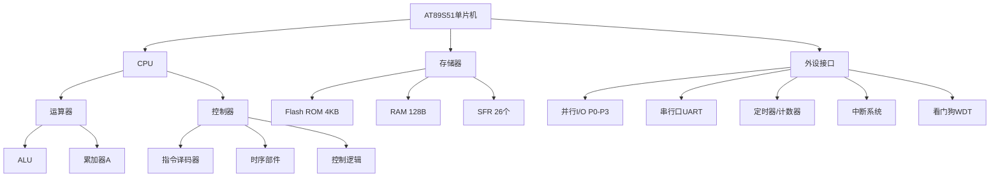
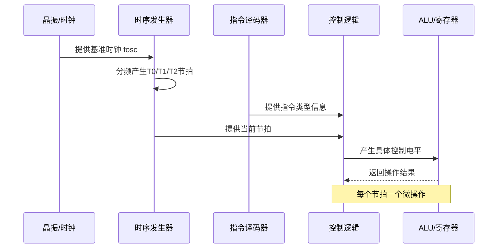
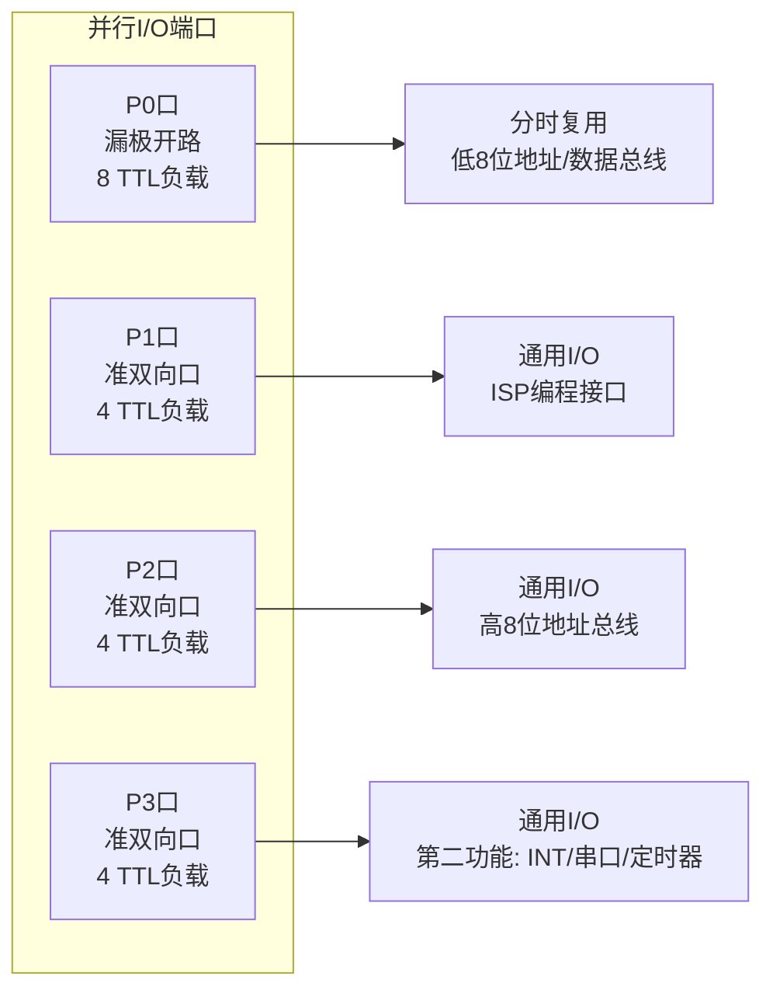

## 1. AT89S51单片机概述与型号识别

AT89S51是Atmel公司生产的标准8051架构单片机，与STC系列单片机在引脚上完全兼容，可以直接替换使用。标准8051架构的汇编代码与C51代码在STC单片机上也具备直接的烧录兼容性，无需修改源代码即可运行，这为工程师提供了极大的设计灵活性。两者的主要差异在于程序烧录方式：STC系列采用串口一键下载方案，无需专用下载器，显著降低了开发门槛；而AT89S51则需要使用专用编程器进行程序烧录。此外，采用1T架构的STC型号，其机器周期与时钟周期的对应关系不同于AT89S51的标准12T架构，因此在使用延时函数和定时器初值计算时，需要根据实际主频和机器周期进行相应调整。**本课程以AT89S51/52为学习对象**，后续讨论均基于该型号展开。
![[Pasted image 20260823205219.webp]]
### 1.1 AT89系列型号命名规则

AT89系列单片机的完整型号包含前缀、型号主体和后缀三部分，各部分承载不同的技术信息，共同构成芯片的完整技术规格描述。

**（1）前缀**

前缀由字母“AT”组成，表示该器件为ATMEL公司产品。ATMEL在2016年被Microchip收购，但“AT”前缀作为经典标识在行业内仍然广泛使用，代表该芯片属于Atmel原厂设计的8051内核产品线。

**（2）型号主体**

型号主体由“89C××××”“89LV××××”或“89S××××”等格式组成，各部分含义如下：

- **8**：表示单片机（Microcontroller）类别；
- **9**：表示内部含有Flash存储器，支持电擦除和在线编程；
- **C**：表示CMOS工艺产品，功耗较低；
- **LV**：表示低电压版本，可在2.5V电源电压下正常工作，适用于电池供电的便携设备；无LV标识的标准产品工作电压为5V；
- **S**：表示支持串行下载方式的Flash存储器，可通过SPI接口进行在系统编程（ISP）；
- 后四位数字（如51、52、2051、8052等）表示器件的具体型号，不同数字对应不同的存储器容量和功能配置。

**（3）后缀参数**

型号主体与后缀之间用“—”号分隔，后缀由四个参数组成，依次表示速度等级、封装形式、温度范围和处理工艺。

- **第1个参数（速度）**：x=12表示最高工作频率为12MHz；x=16表示16MHz；x=20表示20MHz；x=24表示24MHz。最高工作频率决定了指令执行速度的上限。
- **第2个参数（封装）**：x=P表示塑料双列直插DIP封装，适合实验板焊接和插座安装；x=D表示陶瓷封装；x=Q表示PQFP封装；x=J表示PLCC封装；x=A表示TQFP封装；x=S表示SOIC表贴封装；x=W表示裸芯片。
- **第3个参数（温度范围）**：x=C表示商业级（0～+70℃）；x=I表示工业级（-40～+85℃）；x=A表示汽车级（-40～+125℃）；x=M表示军用级（-55～+150℃）。
- **第4个参数（工艺标准）**：x为空表示标准处理工艺；x=/883表示按照MIL-STD-883军用标准进行生产和测试，具备更高的可靠性和更严格的质量保证。

> **型号示例解读**：AT89C51-12PI表示Atmel公司生产的Flash型CMOS 51单片机，最高工作频率12MHz，塑料DIP封装，工业级温度范围（-40～+85℃），标准工艺生产。

## 2. 标准51单片机的功能组成

标准8051单片机将计算机的核心功能部件高度集成于单一芯片内部，形成一个完整的微型计算机系统。其功能组成可归纳为以下九个主要部分：

**（1）CPU（中央处理器）**

CPU是单片机的核心，包含运算器和控制器两大部分（详见第3.2节）。其功能是从程序存储器中读取指令并对指令进行译码分析，产生相应的微操作控制序列，实现数据运算、数据传送、中断响应和I/O控制等操作。与通用CPU相比，8051的CPU还集成了面向控制的位处理功能，可直接对单bit数据进行操作，这在工业控制领域具有重要实用价值。

**（2）数据存储器（RAM）**

片内集成128B高速RAM（52子系列为256B），以高速静态RAM形式实现，访问速度快、功耗低，用于存放程序运行过程中的临时数据和中间变量。片外最多可扩展64KB RAM，通过P0口和P2口组成16位地址总线进行寻址。

**（3）程序存储器（Flash ROM）**

片内集成4KB Flash存储器（AT89S52为8KB，AT89C55为20KB），用于存放用户程序代码和固定常数表。片外可扩展至64KB。片内Flash支持电擦除和多次编程，具有非易失性，掉电后程序内容不丢失。

**（4）中断系统**

提供5个中断源（52子系列为6个），支持2级中断优先级嵌套。中断源包括外部中断0/1、定时器中断0/1和串行口中断。中断系统使CPU能够及时响应外部事件，提高实时处理能力。

**（5）定时器/计数器**

集成2个16位定时器/计数器（52子系列有3个），支持4种工作方式，可用于精确定时、外部事件计数、串行波特率发生和PWM信号产生等多种应用场景。

**（6）看门狗定时器（WDT）**

片内包含1个看门狗定时器，用于监控程序运行状态。当CPU因电磁干扰、电源波动等原因导致程序陷入死循环或PC指针跑飞时，WDT可产生系统复位信号，使程序恢复正常运行，有效提高系统可靠性。

**（7）串行口**

提供1个全双工异步串行通信接口（UART），支持4种工作方式，可实现单片机与PC、外设或其他单片机之间的数据通信，也可用于扩展并行I/O口或构建多机通信系统。

**（8）并行I/O口**

提供P0、P1、P2、P3四个8位并行I/O端口，共32根I/O引脚。各端口在结构上存在差异：P0为漏极开路双向口，P1/P2/P3为准双向口，内部集成上拉电阻。P3口还提供串行通信、外部中断、定时器输入和外部存储器读写控制等第二功能。

**（9）特殊功能寄存器（SFR）**

共26个特殊功能寄存器（部分型号数量略有差异），用于集中控制CPU对各功能部件的操作。SFR包括累加器A、B寄存器、程序状态字PSW、各I/O口锁存器、定时器初值寄存器、中断控制寄存器、串行口控制寄存器等。CPU通过对SFR进行读写操作，实现对硬件资源的配置和管理。

AT89S51在软硬件上完全兼容AT89C51，可直接替换使用，为产品升级和供应链管理提供了便利。

## 3. CPU结构与工作原理

![[Pasted image 20260823205343.webp]]

![[Pasted image 20260823205356.webp]]
### 3.1 运算器

运算器是CPU中执行算术运算和逻辑运算的功能部件，由以下子模块组成：

- **算术/逻辑单元（ALU）**：执行加、减、乘、除等算术运算以及与、或、异或、移位等逻辑运算，是运算器的核心计算引擎。
- **累加器A（ACC）**：8位寄存器，是ALU最主要的操作数来源和运算结果存放单元，大多数指令的执行都涉及累加器。
- **B寄存器**：8位寄存器，在乘法和除法指令中作为第二操作数寄存器，也可作为通用暂存寄存器使用。
- **暂存器（TMP1/TMP2）**：用于暂存ALU的输入操作数，不可编程访问，由CPU内部控制。
- **程序状态字PSW**：8位标志寄存器，存放运算结果的状态标志，如进位标志CY、辅助进位标志AC、用户标志位F0、工作寄存器组选择位RS1/RS0、溢出标志OV和奇偶校验标志P。
![[Pasted image 20260823205418.webp]]
### 3.2 控制器

![[Pasted image 20260823205433.webp]]

控制器是CPU的指挥中枢，负责协调各部件按序工作。控制器由以下子模块构成：

- **程序计数器PC**：16位计数器，始终指向下一条要执行的指令地址。PC自动递增，实现程序的顺序执行；遇到跳转、调用或中断响应时，PC被更新为目标地址。
- **指令译码器**：对从程序存储器中取出的指令操作码进行译码，识别指令类型和寻址方式，产生相应的控制信号。
- **时序部件**：由时钟电路和脉冲分配器组成。时钟电路产生基准振荡信号，脉冲分配器通过环形计数器将时钟信号转换为按时间顺序排列的节拍脉冲（T0、T1、T2…），为指令执行划分具体的时间片，确保各微操作严格按时序进行。

>[!note] 时序部件
>![[Pasted image 20260823205512.webp]]
>![[Pasted image 20260823205722.webp]]
>![[Pasted image 20260823205736.webp]]

CPU执行指令的过程可类比为烹饪流程：时钟周期是最小时间单位，相当于完成一个微动作；状态周期包含两个时钟周期，相当于一个子步骤；机器周期由12个时钟周期构成，对应一个完整的操作环节；指令周期则由一个或多个机器周期组成，相当于完成整道菜所需的大操作集合。**简单指令为单周期指令，复杂指令为双周期指令**。在12MHz晶振下，1个机器周期 = 12 × (1/12MHz) = 1μs。

### 3.3 指令译码与控制信号产生

![[Pasted image 20260823205444.webp]]
指令译码器识别当前正在执行的指令类型（是数据传送、算术运算、逻辑操作还是程序控制转移），时序部件提供当前所在的时间节拍（T0、T1、T2…），两者共同作为控制逻辑的输入。控制逻辑根据“当前指令”和“当前节拍”的组合，译码产生具体且唯一的控制电平信号，这些控制信号直接连接到CPU内部各寄存器的使能端、ALU的操作模式选择端和数据通路开关，驱动相应部件在指定时刻执行预定操作。

> [!tip] CPU微操作时序
> 以“LDA #data”指令为例，在取指阶段（T0节拍），控制逻辑产生程序存储器读选通信号和PC递增信号；在执行阶段（T1节拍），产生ALU输入选择信号和累加器写使能信号，将立即数写入累加器A。每个节拍只执行一个确定的微操作，这种严格的时间分割保证了指令执行的正确性和可预测性。

## 4. AT89S51引脚功能详解

AT89S51采用40引脚DIP封装，此外也有44引脚QFP表贴封装形式。40个引脚按功能可分为四类：电源引脚、时钟引脚、控制引脚和并行I/O引脚。

![[Pasted image 20260823205822.webp]]

### 4.1 电源引脚

- **VCC（40脚）**：+5V电源输入引脚，为芯片提供主电源。典型工作电压为5V ± 10%。
- **GND（20脚）**：数字地参考引脚，所有电压测量以GND为基准。

![[Pasted image 20260823205949.webp]]

### 4.2 时钟引脚

![[Pasted image 20260823205959.webp]]

- **XTAL1（19脚）**：反相振荡放大器的输入端，也是外部时钟源信号输入引脚。外接晶振时，该脚接晶振和负载电容的一端；使用外部有源时钟时，该脚直接接入外部时钟信号。
- **XTAL2（18脚）**：反相振荡放大器的输出端。外接晶振时，该脚接晶振和负载电容的另一端；使用外部有源时钟时，本脚悬空。

晶振频率范围通常为0～24MHz（不同型号上限不同），典型配置为12MHz或11.0592MHz（为串行通信提供精确波特率）。

---


### 4.3 控制引脚

**（1）RST（9脚）——复位信号输入**

在该引脚施加持续时间大于**2个机器周期**的高电平信号时，单片机执行复位操作。复位后，PC初始化为0000H，各SFR恢复为默认值（如P0～P3口输出高电平、堆栈指针SP初始化为07H等），程序从0000H地址开始执行。在正常工作状态下，该引脚应保持≤0.5V的低电平。

**（2）EA/VPP（31脚）——外部程序存储器访问控制/编程电压**

该引脚为双功能引脚：
- 第一功能（EA）：外部程序存储器访问允许控制端。当EA = 1（接高电平）时，CPU首先访问片内4KB Flash程序存储器（地址范围0000H～0FFFH），当PC值超出0FFFH时，自动转向访问片外扩展的程序存储器（地址范围1000H～FFFFH）；当EA = 0（接低电平）时，强制CPU只访问片外程序存储器，完全不读取片内4KB空间。对于片内无ROM的衍生型号，EA必须接地。
- 第二功能（VPP）：在Flash编程模式下，该引脚需接入+12V或+5V编程电压（具体电压视型号和编程方式而定）。

**（3）ALE/PROG（30脚）——地址锁存允许/编程脉冲**

- 第一功能（ALE）：在CPU访问外部程序存储器或外部数据存储器时，ALE输出地址锁存信号，用于锁存P0口输出的低8位地址。在单片机正常运行时，ALE端固定输出频率为 $f_{osc}/6$ 的正脉冲序列，可用作外部定时或触发信号。注意：当CPU访问外部RAM时，在执行MOVX指令期间会丢失一个ALE脉冲。在不需要ALE信号的应用中，可将AUXR寄存器的第0位（ALE禁止位）置1来禁止ALE输出，以降低电磁干扰和功耗，但该操作不影响对外部存储器的正常访问。
- 第二功能（PROG）：在片内Flash编程模式下，该引脚作为编程脉冲输入脚，接收编程器提供的编程脉冲信号。

**（4）PSEN（29脚）——外部程序存储器读选通信号**

低电平有效的读选通信号，仅当CPU访问片外程序存储器时，PSEN信号才被激活（输出低电平）。读取片内程序存储器时，PSEN保持高电平。PSEN可直接连接到外部EPROM或Flash存储器的输出使能（OE）引脚，控制外部程序存储器的数据读出。

### 4.4 并行I/O端口

AT89S51提供4个8位并行I/O端口，共32根I/O引脚，各端口的结构和电气特性存在差异。

**（1）P0口（P0.0～P0.7，39～32脚）**

8位漏极开路的双向I/O口。当系统外扩存储器或I/O接口芯片时，P0口分时复用为低8位地址总线和8位数据总线。作为通用I/O口使用时，由于内部无上拉电阻，**必须外接上拉电阻**（通常为10kΩ或4.7kΩ），此时为准双向口。作为通用I/O输入时，需先向端口锁存器写入1，使输出MOS管截止，端口进入高阻输入态。P0口可驱动**8个LS型TTL负载**，驱动能力在四个端口中最强。

![[Pasted image 20260823210225.webp]]

**（2）P1口（P1.0～P1.7，1～8脚）**


8位准双向I/O口，内部集成上拉电阻。作为通用I/O输入时，需先向锁存器写1，使上拉电阻导通，端口被拉至高电平。P1口可驱动**4个LS型TTL负载**。在ISP编程模式下，P1.5/MOSI、P1.6/MISO和P1.7/SCK分别承担串行编程数据输入、数据输出和时钟信号的传输功能。

**（3）P2口（P2.0～P2.7，21～28脚）**

8位准双向I/O口，内部集成上拉电阻。当系统外扩存储器时，P2口输出高8位地址（A8～A15）。作为通用I/O输入时，需先向锁存器写1。P2口可驱动**4个LS型TTL负载**。

![[Pasted image 20260823210257.webp]]

**（4）P3口（P3.0～P3.7，10～17脚）**

8位准双向I/O口，内部集成上拉电阻。P3口除作为通用I/O口使用外，每个引脚还提供独立的第二功能（如表5-1所示），是51单片机实现串行通信、中断响应、定时器计数和外部存储器控制的核心接口。作为通用I/O输入时同样需先写1。P3口可驱动**4个LS型TTL负载**。P3口各引脚的第二功能应**熟记**。

**表5-1 P3口各位的第二功能**

| P3口引脚 | 第二功能名称 | 功能说明 |
| :---: | :---: | :--- |
| P3.0 | RXD | 串行通信接收端（数据输入） |
| P3.1 | TXD | 串行通信发送端（数据输出） |
| P3.2 | INT0 | 外部中断0请求输入端 |
| P3.3 | INT1 | 外部中断1请求输入端 |
| P3.4 | T0 | 定时器/计数器0外部计数脉冲输入端 |
| P3.5 | T1 | 定时器/计数器1外部计数脉冲输入端 |
| P3.6 | WR | 片外数据存储器写选通控制输出（低电平有效） |
| P3.7 | RD | 片外数据存储器读选通控制输出（低电平有效） |

## 5. 单片机最小系统与LED控制示例

### 5.1 最小系统配置

![[Pasted image 20260823210046.webp]]

单片机上电后能够正常运行用户程序的最精简电路称为最小系统，包含以下三个基本单元：

1. **电源电路**：提供稳定的+5V工作电压，通常采用7805三端稳压器或低压差LDO实现。
2. **时钟电路**：提供稳定的时钟节拍，通常由晶振和两个负载电容构成皮尔斯振荡电路（典型参数：12MHz晶振 + 30pF电容）。
3. **复位电路**：提供上电自动复位和手动复位功能。上电时，RC充电电路在RST引脚产生持续时间超过2个机器周期的高电平，完成上电复位。手动复位按键允许用户随时触发复位操作。

> [!important] 复位必要性说明
> 单片机上电瞬间，电源电压从0V缓慢上升至5V，内部各寄存器的初始状态完全随机（可能是任意值）。若不经复位直接运行，程序计数器PC的初值不确定，CPU可能从错误的地址开始取指执行，导致系统功能异常甚至完全失控。复位信号将所有SFR初始化为确定状态，PC置为0000H，确保程序从已知的起始地址开始执行，这是单片机正常工作的前提条件。

![[Pasted image 20260823210110.webp]]

### 5.2 LED闪烁控制示例

基于最小系统可搭建LED灯控制电路，以下为标准C51代码示例：

```c
#include <reg52.h>
void delay(int);
void main() {
    while(1) {          // 死循环：让程序持续运行
        delay(500);     // 延时约500ms
        P3_5 = 0;       // P3.5置低电平，LED点亮（假设共阳极接法）
        delay(500);     // 延时约500ms
        P3_5 = 1;       // P3.5置高电平，LED熄灭
    }
}
void delay(int x) {
    int i, j;
    for(i = 0; i < x; i++)
        for(j = 0; j < 120; j++);
}
```

代码中，`delay(500)`在12MHz晶振下产生约500ms的延时，LED以约1Hz的频率周期性闪烁。调整延时参数可改变闪烁速度，实现流水灯、呼吸灯等更丰富的视觉效果。

## 6. 本章小结

本章围绕AT89S51单片机的硬件结构展开论述，系统介绍了以下核心内容：AT89系列的型号识别方法，标准8051单片机的功能组成（CPU、RAM、ROM、中断、定时器、WDT、串行口、I/O口和SFR），CPU内部运算器和控制器的详细结构与工作原理，各类型引脚的功能定义与电气特性，以及最小系统配置和基本编程模型。掌握上述内容是后续学习51单片机指令系统、汇编语言编程、中断应用和接口扩展的基础。







> [!NOTE] 学习建议
> 本章内容属于单片机硬件基础，建议结合芯片数据手册（Datasheet）对照学习。重点掌握各端口的结构差异与引脚功能分配，特别是P3口第二功能与P0口总线复用方式，这些知识点在后续存储器扩展、I/O接口设计和串行通信实验中具有直接应用。

## 相关笔记

- [[1.单片机概述]]
- [[3.单片机的存储器-SFR]]
- [[10.AT89S51单片机的指令系统]]
- [[4.输入输出接口-复位及时钟电路-低耗电模式]]
- [[5.中断系统1]]
- [[7.定时计数器1]]
- [[9.串行通信接口与多机通信]]

> 本章内容基于Atmel AT89S51数据手册及标准8051架构教材编写，具体参数以厂商官方数据手册为准。