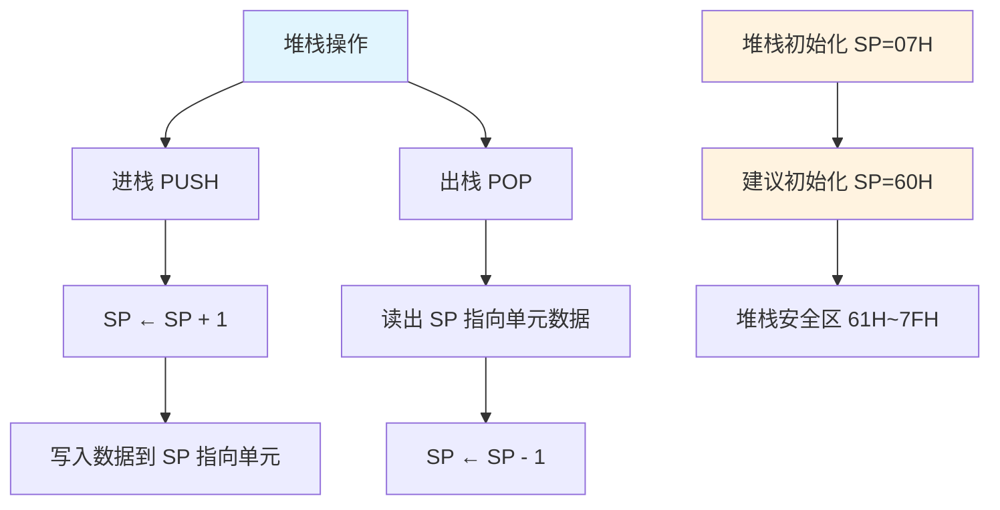
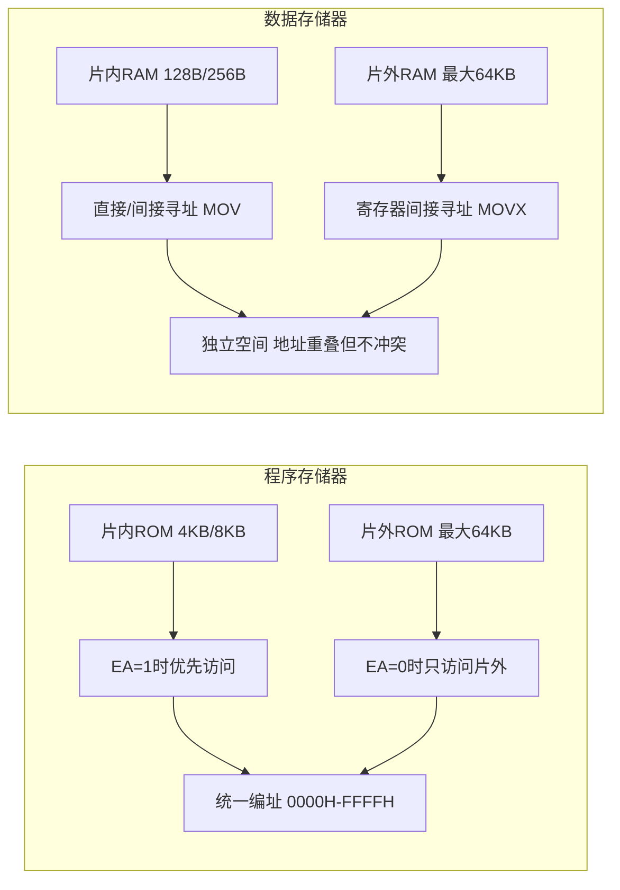

## 1. 存储器结构概述

![[Pasted image 20260823211057.webp]]

80C51系列单片机在物理结构上包含四个独立的存储空间，分别承担程序存储、数据存储和特殊功能控制等不同任务。这四个空间在物理上相互独立，但在逻辑上通过不同的寻址方式和访问指令加以区分。

从逻辑功能角度划分，80C51单片机具有三个独立的存储空间：

- **程序存储器空间**（ROM）：用于存放用户程序代码、常数表格和中断向量表，具有非易失性。
- **片内数据存储器空间**（内部RAM）：用于存放程序运行过程中的临时变量、堆栈和中间运算结果。
- **片外数据存储器空间**（外部RAM）：当片内RAM容量不足时，通过P0口和P2口扩展的外部数据存储空间。

> [!NOTE] 哈佛结构的体现
> 80C51采用改进型哈佛架构，程序存储器和数据存储器在物理上分离，各自拥有独立的地址总线和控制信号（PSEN用于程序存储器读选通，RD/WR用于数据存储器读写），这种分离使得CPU可以同时访问程序指令和数据，在一定程度上提高了指令执行效率。

![[Pasted image 20260823211230.webp]]

### 1.1 存储器基本术语

在深入分析存储器结构之前，有必要明确以下几个基本术语：

- **存储单元**：存放具有独立意义的二进制代码的基本单位，每个存储单元对应一个唯一的地址。一个存储单元通常由8位（1字节）触发器构成。
- **位（bit）**：二进制位的基本单位，简写为b，是计算机中最小数据单元，每个触发器存储1位二进制信息（0或1）。
- **字节（Byte）**：由8个二进制位组成，简写为B，是计算机中数据存储和操作的基本计量单位。
- **字（Word）**：由两个字节（16位）组成，在51单片机中，地址指针DPTR和程序计数器PC均为16位字宽。
- **存储容量**：以字节（B）为基本计量单位，常用换算关系为：
  - 1KB = 1024B
  - 1MB = 1024KB = $1024^2$B
  - 1GB = 1024MB = $1024^3$B
  - 1TB = 1024GB = $1024^4$B

- **存取速度**：指从CPU发出读或写存储器的命令到完成该操作所需的时间。按速度等级划分：低速存储器约100ns，中速存储器60～100ns，高速存储器可达20ns以下。存取速度是影响计算机系统整体性能的关键因素之一。

>[!note] 存储器概述
>![[Pasted image 20260823211219.webp]]
>![[Pasted image 20260823211445.webp]]
>![[Pasted image 20260823211556.webp]]

## 2. 程序存储器（ROM）

程序存储器用于存放用户程序、固定常数表和中断向量入口地址。AT89S51片内集成4KB Flash存储器（AT89S52为8KB），具有电可擦除和多次编程特性，掉电后内容不丢失。

### 2.1 片内与片外程序存储器的统一编址

80C51的程序存储器地址空间为64KB（由16位程序计数器PC寻址，地址范围0000H～FFFFH）。片内和片外的程序存储器在**逻辑上统一编址**，但在物理上如何分配由EA引脚电平决定。

- **EA = 1（访问片内ROM优先）**：当PC值在0000H～0FFFH范围内（片内4KB地址空间）时，CPU自动读取片内Flash中的程序代码。当PC值超出0FFFH（即1000H～FFFFH，共60KB空间）时，CPU自动转向片外扩展的程序存储器读取指令。
- **EA = 0（强制访问片外ROM）**：CPU完全忽略片内4KB Flash，全部程序代码均从片外存储器读取，地址范围为0000H～FFFFH（最大可外扩64KB）。

![[Pasted image 20260823211637.webp]]

### 2.2 程序存储器的特定入口地址

程序存储器的起始地址区域（0000H～002AH）被系统保留用于中断向量入口，如表2-1所示。编程时应在这些固定地址放置跳转指令，将程序控制权转移到对应的中断服务程序主体。

**表2-1 中断向量入口地址**

| 中断源 | 入口地址 | 优先级 |
| :--- | :---: | :---: |
| 外部中断0（INT0） | 0003H | 最高 |
| 定时器/计数器0（T0） | 000BH | |
| 外部中断1（INT1） | 0013H | |
| 定时器/计数器1（T1） | 001BH | |
| 串行口（UART） | 0023H | |
| 定时器/计数器2（T2，52子系列） | 002BH | 最低 |

![[Pasted image 20260823211714.webp]]

> [!WARNING] 中断向量区使用注意事项
> 0000H地址是系统复位后的程序入口，该地址必须存放一条跳转指令（如 `LJMP MAIN`），将程序引导至用户主程序起始地址。各中断向量地址之间间隔8个字节，空间有限，通常只存放一条跳转指令（`LJMP` 或 `AJMP`）跳转至实际中断服务程序所在位置。

## 3. 片内数据存储器（内部RAM）

AT89S51片内集成128B数据RAM（52子系列为256B），地址范围为00H～7FH。这片RAM被划分为三个功能区域：工作寄存器区（00H～1FH）、位寻址区（20H～2FH）和通用RAM区（30H～7FH）。

### 3.1 工作寄存器区（00H～1FH）

>[!note] 工作寄存器组
![[Pasted image 20260823211738.webp]]
![[Pasted image 20260823211747.webp]]
![[Pasted image 20260823211753.webp]]

地址范围00H～1FH，共32个字节，划分为4组工作寄存器组（第0组～第3组），每组包含8个工作寄存器R0～R7。在任一时刻，CPU只能激活其中一组作为当前工作寄存器组，其他三组处于后台待命状态。

当前工作寄存器组的选择由程序状态字PSW中的RS1和RS0两位控制，如表3-1所示。通过修改PSW.4和PSW.3的值，可在程序运行过程中动态切换寄存器组，这在中断服务程序中具有重要价值——主程序使用第0组寄存器时，中断服务程序可切换到第1组，避免了寄存器内容的压栈和恢复操作，提高了中断响应速度。

**表3-1 工作寄存器组选择**

| RS1 | RS0 | 激活寄存器组 | 片内RAM地址范围 |
| :---: | :---: | :---: | :---: |
| 0 | 0 | 第0组 | 00H～07H |
| 0 | 1 | 第1组 | 08H～0FH |
| 1 | 0 | 第2组 | 10H～17H |
| 1 | 1 | 第3组 | 18H～1FH |

### 3.2 位寻址区（20H～2FH）

>[!note] 位寻址区
>![[Pasted image 20260823211848.webp]]
>![[Pasted image 20260823211854.webp]]

地址范围20H～2FH，共16个字节，对应128个可独立寻址的位（bit）。每个字节的每一位都对应一个位地址，位地址范围从00H～7FH。通过位寻址指令（如 `SETB bit`、`CLR bit`、`JB bit, label` 等），可直接对单个二进制位进行置位、清零和条件跳转操作，无需读取整个字节再通过逻辑运算处理。

位寻址区为51单片机的位处理功能提供了硬件支持，在布尔运算和位控逻辑中极为高效，适合处理开关量输入输出和状态标志位。

### 3.3 通用RAM区（30H～7FH）

![[Pasted image 20260823211909.webp]]

地址范围30H～7FH，共80个字节，是片内RAM中容量最大的区域，用于存放用户自定义的变量、数组、运算中间结果、串行通信收发缓存和ADC采样数据等。

该区域最为核心的两个用途是：

1. **堆栈区**：在子程序调用和中断响应时，用于自动保存程序计数器PC的返回地址。用户也可通过PUSH和POP指令手动将累加器A、B寄存器、PSW等关键寄存器的内容入栈保存（现场保护），子程序执行完成后再依次出栈恢复（现场恢复）。堆栈由堆栈指针SP统一管理，SP总是指向栈顶元素。

2. **通用数据缓冲区**：用于存放程序中的全局变量、局部变量、数组元素和临时计算结果。该区域的字节地址不支持位寻址操作。

> [!WARNING] 堆栈区设置注意事项
> 单片机复位后，SP初始值为07H，此时堆栈实际从08H单元开始。但08H～1FH属于工作寄存器区（第1～3组），若直接使用默认堆栈配置，堆栈增长可能覆盖工作寄存器内容，引发难以排查的程序错误。因此，在实际应用中，**应在程序初始化阶段将SP重新设置为较大的值**（如60H或7FH），将堆栈置于通用RAM区的安全位置。

## 4. 片外数据存储器（外部RAM）

![[Pasted image 20260823211925.webp]]

当片内128B RAM容量不足以满足应用需求时，可通过P0口和P2口扩展外部数据存储器，最大扩展容量为64KB。片外RAM的地址范围为0000H～FFFFH。

80C51采用不同的访问指令区分片内RAM和片外RAM：
- 访问片内RAM使用 `MOV` 指令（直接寻址或寄存器间接寻址）。
- 访问片外RAM使用 `MOVX` 指令（寄存器间接寻址，@R0/@R1或@DPTR）。

片内RAM的低128B与片外RAM的低128B地址重叠（均为00H～7FH），但由于使用不同的指令（MOV vs MOVX）和不同的控制信号（内部RAM读/写 vs RD/WR），两者在逻辑上完全独立，不会发生地址冲突。

## 5. 特殊功能寄存器（SFR）

特殊功能寄存器是51单片机实现对各功能部件集中控制的核心机制。SFR离散地映射在片内RAM的高128字节地址空间（80H～FFH）中，AT89S51共定义了26个SFR。这些寄存器用于控制定时器/计数器的工作模式、中断系统的使能与优先级、串行口的通信参数、I/O端口的状态等。

### 5.1 SFR的地址分布与位寻址规则

SFR的地址分布并非连续，而是根据功能模块离散排布（见表5-1）。SFR的访问方式与片内RAM不同：凡地址能够被8整除（即地址末位为0H或8H）的SFR，支持位寻址操作，其每一位都具有独立的位名称和位地址，可直接通过位名称进行设置。例如，PSW寄存器地址为D0H（能被8整除），其位7（CY）可写作 `SETB C` 直接置位进位标志。

![[Pasted image 20260823211951.webp]]

**表5-1 主要特殊功能寄存器地址表**

| 地址 | 符号 | 功能 | 地址 | 符号 | 功能 |
| :---: | :---: | :--- | :---: | :---: | :--- |
| 80H | P0 | P0端口锁存器 | 99H | SBUF | 串行数据缓冲器 |
| 81H | SP | 堆栈指针 | A0H | P2 | P2端口锁存器 |
| 82H | DPL | 数据指针0低8位 | A6H | WDTRST | 看门狗定时器复位 |
| 83H | DPH | 数据指针0高8位 | A8H | IE | 中断允许控制 |
| 84H | DPL1 | 数据指针1低8位 | B0H | P3 | P3端口锁存器 |
| 85H | DPH1 | 数据指针1高8位 | B8H | IP | 中断优先级控制 |
| 86H | PCON | 电源控制寄存器 | C8H | T2CON | 定时器2控制寄存器 |
| 87H | TCON | 定时器控制 | C9H | T2MOD | 定时器2模式控制 |
| 88H | TMOD | 定时器模式控制 | CAH | RCAP2L | 定时器2捕获/重装载低8位 |
| 89H | TL0 | 定时器0低8位 | CBH | RCAP2H | 定时器2捕获/重装载高8位 |
| 8AH | TL1 | 定时器1低8位 | CCH | TL2 | 定时器2低8位 |
| 8BH | TH0 | 定时器0高8位 | CDH | TH2 | 定时器2高8位 |
| 8CH | TH1 | 定时器1高8位 | D0H | PSW | 程序状态字 |
| 98H | SCON | 串行控制寄存器 | E0H | ACC | 累加器 |
| — | — | — | F0H | B | B寄存器 |

![[Pasted image 20260823212016.webp]]

> [!IMPORTANT] 未定义SFR的访问禁忌
> SFR空间中存在未定义的地址单元（如地址8EH、8FH等），这些单元不可作为数据存储器使用，也不能随意写入数值。若程序误读未定义SFR单元，将得到一个不可预知的随机数，可能导致程序逻辑异常。编写程序时应严格遵循器件数据手册中列出的SFR定义。

### 5.2 程序状态字寄存器（PSW）

PSW位于SFR区地址D0H，是CPU状态信息的集中反映，包含7个有效标志位（另有1位保留）。PSW的各位定义如表5-2所示。

**表5-2 程序状态字寄存器PSW**

| 位编号 | 位7 | 位6 | 位5 | 位4 | 位3 | 位2 | 位1 | 位0 |
| :---: | :---: | :---: | :---: | :---: | :---: | :---: | :---: | :---: |
| 位名称 | CY | AC | F0 | RS1 | RS0 | OV | — | P |
| 位地址 | D7H | D6H | D5H | D4H | D3H | D2H | D1H | D0H |

各标志位的功能如下：

**（1）CY（PSW.7）——进位标志位**
在算术运算中，若加法产生进位或减法产生借位，CY置1；否则清0。在位处理操作中，CY作为位累加器（位处理器中的“累加器”），参与位传送、位逻辑与、位逻辑或等布尔运算。例如，`MOV C, P1.0` 将P1.0引脚的电平状态送入CY，`ANL C, /P1.1` 将CY与P1.1取反后的值进行逻辑与运算。

**（2）AC（PSW.6）——辅助进位标志位**
在BCD码（二进制编码的十进制数）加法运算中，当低4位（D3位）向高4位（D4位）产生进位或借位时，AC置1。AC标志主要用于BCD加法调整指令 `DA A` 的判断依据，确保BCD加法运算结果正确。

![[Pasted image 20260823212103.webp]]
![[Pasted image 20260823212118.webp]]

**（3）F0（PSW.5）——用户标志位**
由程序员自主使用的通用状态标志位，可通过指令置1或清0，用于控制程序分支流向。例如，`SETB F0` 置位F0，`JB F0, LABEL` 判断F0状态后跳转。此标志位无硬件自动赋值功能，完全由软件控制，用户应充分利用。

**（4）RS1、RS0（PSW.4、PSW.3）——工作寄存器组选择位**
用于选择当前激活的工作寄存器组，对应关系见前文表3-1。

**（5）OV（PSW.2）——溢出标志位**
在有符号数算术运算中指示结果是否超出8位有符号数的表示范围（-128～+127）。当两个正数相加结果大于+127，或两个负数相加结果小于-128时，OV置1；否则清0。OV由硬件自动设置，常用于有符号数运算的溢出检测。

**（6）PSW.1——保留位**
该位未定义，读操作返回不确定值，写操作无影响。

**（7）P（PSW.0）——奇偶标志位**
指示累加器A中二进制位“1”的个数奇偶性。若A中“1”的个数为奇数，P置1；为偶数，P清0。P标志由硬件在每条影响累加器的指令执行后自动更新。在串行通信中，P常作为奇偶校验位附加在数据帧中，用于检测数据传输过程中的误码，提高通信可靠性。

**奇偶标志计算示例**：
- 若A = 1001 1111B（二进制位1的个数为6，偶数），则P = 0。
- 若A = 1100 0001B（二进制位1的个数为3，奇数），则P = 1。

### 5.3 累加器A与B寄存器

累加器A（ACC，地址E0H）是CPU中使用最为频繁的寄存器，具有双重身份：
- 作为ALU的主要输入操作数来源之一，绝大多数算术运算和逻辑运算指令的源操作数均取自累加器A。
- 作为ALU运算结果的存放单元，运算结果默认存入A。

数据传送操作大多通过累加器A完成，A因此在数据通路中扮演“中转站”的角色。然而，这种设计也带来了“瓶颈堵塞”问题：所有数据都需经过A，限制了数据吞吐率的提升。为此，AT89S51增加了一部分无需经过累加器的传送指令（如 `MOVX @DPTR, A` 除外，部分 `MOV` 指令可直接在寄存器间传送），在一定程度上缓解了该瓶颈。

B寄存器（地址F0H）是为乘法和除法运算专门设立的寄存器。执行 `MUL AB` 指令时，A和B分别存放两个8位乘数，16位乘积的高8位存入B、低8位存入A。执行 `DIV AB` 指令时，A存放被除数，B存放除数，商存入A，余数存入B。在不执行乘除法运算的情况下，B寄存器可作为通用寄存器使用。

### 5.4 数据指针DPTR0与DPTR1

![[Pasted image 20260823212132.webp]]

AT89S51提供两个16位数据指针寄存器DPTR0（由DPL和DPH组成，地址82H和83H）和DPTR1（由DPL1和DPH1组成，地址84H和85H）。每个DPTR可拆分为两个8位寄存器独立访问，可用于存放外部数据存储器（片外RAM）或扩展I/O接口的16位地址，最大寻址范围为64KB（$2^{16}$）。

双数据指针的设计使得在访问两个不同的外部存储区域时，无需反复保存和恢复DPTR内容，提高了数据搬移和存储器块操作的效率。部分指令（如 `MOVX A, @DPTR`）可使用任一DPTR进行间址访问。

### 5.5 堆栈指针SP

![[Pasted image 20260823212159.webp]]

![[Pasted image 20260823212212.webp]]

SP是8位寄存器（地址81H），始终指向堆栈栈顶的存储单元地址。80C51采用**向上生长型**堆栈（也称递增堆栈），其操作规则如下：

- **进栈操作（PUSH）**：先执行SP加1（SP ← SP + 1），再将数据写入SP指向的新栈顶单元。
- **出栈操作（POP）**：先读出SP指向单元的数据，再执行SP减1（SP ← SP - 1）。

单片机复位后，SP初始值为07H，即堆栈从08H单元开始。如前文所述，08H～1FH属于工作寄存器区，堆栈操作极有可能覆盖工作寄存器内容。因此，**建议在系统初始化阶段将SP修改为60H或更大的值**（通常设在通用RAM区的高端），为堆栈留出充足且安全的空间。

### 5.6 堆栈的两个核心功能

**（1）保护断点**
执行子程序调用指令（`LCALL`/`ACALL`）或响应中断时，CPU自动将当前程序计数器PC的值（即返回地址，称为“断点”）压入堆栈。子程序或中断服务程序执行完毕后，通过 `RET` 或 `RETI` 指令将堆栈中保存的断点弹出至PC，确保程序正确返回主程序继续执行。

**（2）现场保护**
进入子程序或中断服务程序后，由于执行过程需要使用累加器A、B寄存器、PSW等资源，会破坏主程序在这些寄存器中保存的数据。因此，在子程序或中断服务程序的起始处，通过 `PUSH` 指令将关键寄存器的内容存入堆栈（现场保护）；在返回之前，通过 `POP` 指令按相反顺序恢复寄存器内容（现场恢复），保证主程序的执行环境不受影响。

## 6. 系统扩展与容量对比

当用户程序规模超出片内程序存储容量（如移植嵌入式操作系统或大型协议栈），或全局变量、数组和函数调用层次过多导致数据存储空间不足时，需要通过外部扩展增加存储容量。

外部程序存储器和数据存储器的扩展方法略有不同：
- **程序存储器扩展**：利用P0口分时复用输出低8位地址，P2口输出高8位地址，配合ALE信号锁存地址，通过PSEN信号控制外部ROM的读取。
- **数据存储器扩展**：同样使用P0和P2口输出16位地址，但使用RD和WR信号（P3.6和P3.7的第二功能）控制外部RAM的读写操作。

**表6-1 常见51系列单片机型号存储容量对比**

| 型号 | ROM（程序存储器） | RAM（数据存储器） | 片内EEPROM | 备注 |
| :--- | :---: | :---: | :---: | :--- |
| AT89C2051 | 2KB | 128B | 无 | 20引脚精简封装 |
| AT89C51 | 4KB | 128B | 无 | 标准51 |
| AT89C52 | 8KB | 256B | 无 | 52子系列 |
| AT89S51 | 4KB | 128B | 无 | 支持ISP下载 |
| AT89S52 | 8KB | 256B | 无 | 支持ISP下载 |
| STC89C52RC | 8KB | 512B | 5KB | 国产增强型，串口下载 |
| STC12C5A60S2 | 60KB | 1280B | 1KB | 1T增强型，高速 |
| C8051F系列 | 2KB～128KB | 256B～8KB | 无 | 混合信号SOC，高集成度 |

从表6-1可见，不同型号的51单片机在存储容量上存在显著差异。增强型单片机（如STC12C5A60S2）的RAM容量可达1280B，ROM高达60KB，基本可满足中小型嵌入式应用的存储需求，无需外部扩展。但对于需要图形界面、文件系统或网络协议栈的复杂应用，片外扩展仍是必要的技术手段。

>[!note] 对外部存储器的访问
>![[Pasted image 20260823212314.webp]]
>![[Pasted image 20260823212324.webp]]

>[!note] 单片机的系统扩展
>![[Pasted image 20260823212358.webp]]
>![[Pasted image 20260823212406.webp]]

## 相关笔记

- [[2.单片机的结构]]
- [[4.输入输出接口-复位及时钟电路-低耗电模式]]
- [[5.中断系统1]]
- [[7.定时计数器1]]
- [[9.串行通信接口与多机通信]]
- [[单片机寄存器与寻址]]

> 本章内容基于Atmel AT89S51数据手册及Intel MCS-51架构标准文献编写，具体SFR定义和存储器配置以目标器件官方数据手册为准。