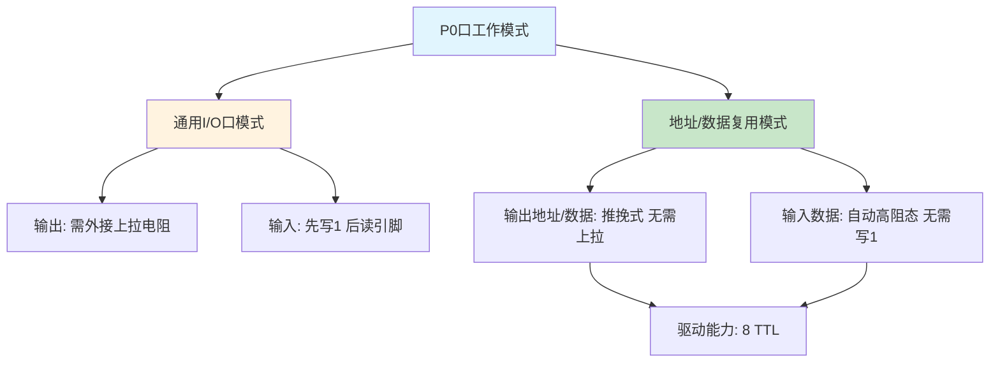
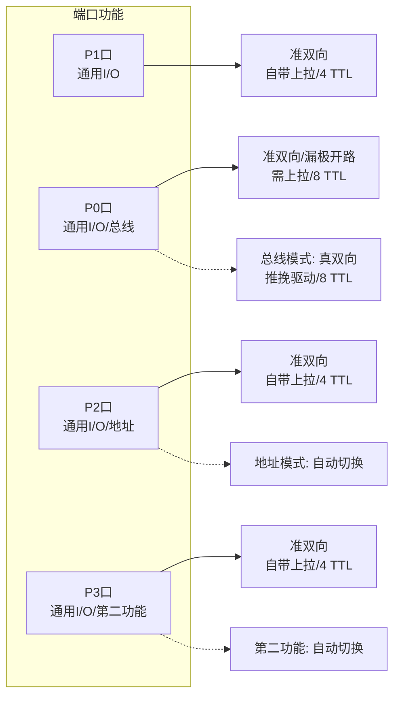
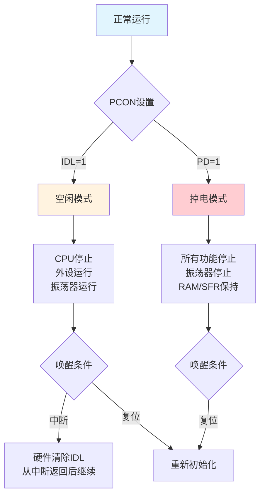

## 1. I/O端口整体概述

![[Pasted image 20260823213144.webp]]

AT89S51单片机提供4个8位并行I/O端口，共32根引脚，分别记为P0、P1、P2和P3，是单片机与外部设备进行数据交换的核心通道。每个端口都对应一个特殊功能寄存器（P0～P3，地址分别为80H、90H、A0H和B0H），CPU通过对这些SFR的读写操作控制端口的输入输出行为。四个端口在结构上存在差异，功能各有侧重：P0口用于地址/数据总线复用，P2口用于高8位地址输出，P3口支持丰富的第二功能，P1口功能最为单纯。本章按照**先易后难**的次序（P1 → P0 → P2 → P3）逐一分析各端口的结构特点和工作原理。

> [!NOTE] 硬件自动控制
> 端口内部的所有控制信号均由CPU根据用户指令自动产生，无需程序员通过单独指令进行端口模式的切换配置。

## 2. P1端口结构与应用

P1端口是四个并行口中结构最简单的，其某一位的电路结构如图5-1所示（参考教材图5.21）。每个P1口位由以下部件构成：一个D触发器作为输出锁存器、两个三态缓冲器（B1用于读锁存器，B2用于读引脚）、一个内部上拉电阻和一个场效应管（VT）。

![[Pasted image 20260823213215.webp]]

### 2.1 作为输出口

当执行输出指令（如 `MOV P1, #data`）时，数据被写入P1口的输出锁存器。若写入的数据位为1，锁存器Q端输出高电平，场效应管VT截止，引脚电平通过内部上拉电阻被拉至高电平（VCC）。若写入的数据位为0，Q端输出低电平，VT导通，引脚被直接连接到地（GND），输出低电平。

**注意**：P1口输出高电平时，其驱动能力有限。高电平是由内部上拉电阻（通常几十千欧级别）提供的，只能输出微弱电流（拉电流）。若外部连接低阻抗负载，该高电平可能被“拉低”，导致输出高电平失效。

![[Pasted image 20260823213226.webp]]

### 2.2 作为输入口

![[Pasted image 20260823213242.webp]]

P1口作为输入口使用时涉及两种读取方式：

**（1）读引脚（外部输入）**

执行 `MOV A, P1` 指令时，CPU通过缓冲器B2读取引脚上的外部电平状态。**关键约束**：在执行读引脚操作之前，必须先用软件将对应的输出锁存器置1（如 `MOV P1, #0FFH`），使VT截止。若锁存器原值为0，VT导通将引脚直接短路到地，外部输入的高电平信号无法进入，读出的数据永远是0。这一“先写1再读”的操作是准双向口的典型特征。

**（2）读锁存器（内部值）**

当外部负载较重导致引脚电平被拉低时，读引脚可能获得错误的低电平。此时可通过执行读锁存器指令（如 `ANL P1, A`）获取端口锁存器中保存的真实输出值。此类指令执行“读-修改-写”操作，CPU通过缓冲器B1读取锁存器Q端的状态，而非引脚上的实际电平，从而避免外部负载的干扰。

CPU根据不同的指令类型自动切换读锁存器或读引脚操作：以端口为目的操作数的“读-修改-写”指令（如 `ANL P1, A`、`ORL P1, A`、`XRL P1, A`、`CPL P1` 等）执行读锁存器操作；而 `MOV A, P1` 等数据传送指令执行读引脚操作。

**P1口作为输入口使用示例**：
```assembly
MOV P1, #0FFH    ; 先写1，使VT截止
MOV A, P1        ; 读引脚，将外部信号状态读入累加器A
```

![[Pasted image 20260823213255.webp]]

**P1口小结**：
- P1口主要作为通用I/O口使用，实现输出、读引脚和读锁存器三种功能；
- 作为输出口无需外接上拉电阻；作为输入口需先写1；
- P1口为准双向通用口，可驱动**4个LS型TTL负载**。

## 3. P0端口结构与应用

![[Pasted image 20260823213309.webp]]

P0端口的结构比P1口复杂，增加了输出控制电路和推挽式输出驱动级，但**内部不含上拉电阻**。这一差异使得P0口具有双功能特性：通用I/O口和地址/数据复用总线口。

### 3.1 功能一：通用I/O口

![[Pasted image 20260823213319.webp]]

当P0口作为通用I/O口使用时，内部的控制信号使多路选择器MUX接通锁存器的Q端，此时P0口在逻辑上与P1口相似。但由于P0口内部无上拉电阻，**作为输出口时必须外接上拉电阻**（典型值为10kΩ或4.7kΩ），将漏极开路输出的VT2与电源连通，才能输出高电平。

作为输入口使用时，同样需要先向锁存器写1，使VT2截止，引脚处于高阻态，外部信号方可正常读入。此时P0口为准双向通用口，驱动能力为**8个LS型TTL负载**。

### 3.2 功能二：地址/数据分时复用

![[Pasted image 20260823213337.webp]]
![[Pasted image 20260823213400.webp]]

当系统外扩存储器或I/O接口芯片时，P0口作为低8位地址总线和8位数据总线的分时复用端口。

**（1）地址/数据输出**

当控制端置1时（由CPU自动控制），多路选择器MUX切换到地址/数据输出端。内部V1和V2两个场效应管构成**推挽式输出电路**：输出高电平时V1导通、V2截止，直接由V1提供强上拉驱动；输出低电平时V1截止、V2导通。这种推挽结构的驱动能力强，**无需外接上拉电阻**即可正常输出高、低电平。

**（2）数据输入**

当P0口作为地址/数据复用口进行数据输入时，CPU自动向锁存器写入1，使V2截止，控制端置0，引脚处于高阻态。外部输入信号通过缓冲器直接进入内部数据总线。此过程中无需程序员手动写1操作，硬件自动完成配置。

**P0口小结**：
- P0口为双功能口，可作通用I/O口或地址/数据复用口；
- 作为通用输出口时需外接上拉电阻，作为输入口需先写1；
- 作为地址/数据复用口时为**真双向口**，无需上拉电阻，推挽驱动可带**8个LS型TTL负载**；
- 作地址/数据复用时，不能再作通用I/O口使用。



## 4. P2端口结构与应用

![[Pasted image 20260823213412.webp]]

P2端口的结构与P1口相似，主要差别在于输出控制部分增加了多路选择器MUX，使锁存器Q端信号与地址输出信号可以切换接入驱动级。P2口同样为双功能口，提供通用I/O和地址输出两种工作模式。

### 4.1 通用I/O口方式

当控制端为0时，MUX接通锁存器Q端，P2口的工作方式与P1口完全相同。作为输出口时无需外接上拉电阻（内部集成上拉电阻）；作为输入口时需先写1使场效应管截止；驱动能力为**4个LS型TTL负载**。

![[Pasted image 20260823213423.webp]]

### 4.2 地址输出口方式

![[Pasted image 20260823213433.webp]]

当控制端为1时，MUX切换至地址输出端。在执行访问片外数据存储器的指令时，P2口自动输出16位地址中的高8位地址。例如：

```assembly
MOVX A, @DPTR   ; 访问片外RAM，DPTR中的16位地址：
                ; 高8位（DPH）由P2口输出
                ; 低8位（DPL）由P0口输出（分时复用）
```

当使用寄存器间接寻址方式（`MOVX A, @Ri`）访问片外RAM低256字节时，只需P0口输出8位地址，P2口不受影响，此时仍可作通用I/O口使用。

**P2口小结**：
- P2口为双功能口，通用I/O口和地址输出口；
- 作为通用I/O口无需外接上拉电阻，输入前需先写1；
- 作地址输出时自动切换，不能再作通用I/O口使用；
- 驱动能力：**4个LS型TTL负载**。

## 5. P3端口结构与应用

![[Pasted image 20260823213451.webp]]

P3口在P1口基本结构的基础上增加了第二功能控制逻辑，使每个引脚除通用I/O功能外，还具备独立的第二功能。P3口同样为准双向口，内部集成上拉电阻，驱动能力为4个LS型TTL负载。

### 5.1 通用I/O口方式

![[Pasted image 20260823213459.webp]]

当第二功能输出控制无效（保持高电平）时，P3口与P1口功能完全一致，可进行输出、读引脚和读锁存器操作。作为输入口使用时同样需先写1。

### 5.2 第二功能方式

![[Pasted image 20260823213514.webp]]

P3口各位的第二功能列于表5-1。当对应功能被启用时（如串行口、外部中断或定时器外部输入），相关控制信号自动接管引脚的控制权，无需用户通过指令进行模式切换。第二功能的输入/输出完全由硬件自动管理。

**表5-1 P3口各位的第二功能**

| P3引脚 | 第二功能信号 | 功能说明 |
| :---: | :---: | :--- |
| P3.0 | RXD | 串行口接收数据输入端 |
| P3.1 | TXD | 串行口发送数据输出端 |
| P3.2 | INT0 | 外部中断0请求输入 |
| P3.3 | INT1 | 外部中断1请求输入 |
| P3.4 | T0 | 定时器/计数器0外部计数脉冲输入 |
| P3.5 | T1 | 定时器/计数器1外部计数脉冲输入 |
| P3.6 | WR | 片外数据存储器写选通信号（低有效） |
| P3.7 | RD | 片外数据存储器读选通信号（低有效） |

**P3口小结**：
- P3口为双功能口，提供通用I/O和第二功能；
- 第二功能的输入/输出无需额外配置，自动生效；
- 未用作第二功能的位仍可独立作通用I/O使用；
- 作为通用输出口无需外接上拉电阻，作为输入口需先写1；
- 驱动能力：**4个LS型TTL负载**。

> [!TIP] 端口第二功能自动切换
> 初学者常误以为P0口、P2口和P3口的第二功能需要指令切换。事实上，各端口的第二功能完全由硬件自动控制，无需专门指令进行模式转换。例如，当执行 `MOVX A, @DPTR` 时，P0口和P2口自动进入地址/数据复用模式；当串行口被使能发送数据时，P3.1自动输出TXD信号。硬件在后台完成这一切，对程序员透明。

## 6. 四个I/O端口对比总结

**表5-2 四个并行I/O端口对比**

| 特性 | P0口 | P1口 | P2口 | P3口 |
| :--- | :---: | :---: | :---: | :---: |
| 内部上拉电阻 | 无 | 有 | 有 | 有 |
| 通用I/O输出 | 需外接上拉 | 无需 | 无需 | 无需 |
| 通用I/O输入 | 先写1 | 先写1 | 先写1 | 先写1 |
| 第二功能 | 地址/数据总线 | 无 | 高8位地址总线 | 串口/中断/定时器/读写控制 |
| 真双向口模式 | 总线模式 | 无 | 无 | 无 |
| 驱动能力 | 8 TTL | 4 TTL | 4 TTL | 4 TTL |



## 7. 复位与复位电路

复位是单片机的初始化操作。在RST引脚上施加持续时间大于**2个机器周期**（即24个时钟振荡周期）的高电平，即可使AT89S51复位。复位后，程序计数器PC初始化为0000H，程序从该地址开始执行。

复位的双重作用：一是系统正常启动时的初始化；二是在程序因干扰跑飞或陷入死锁时，通过手动复位使系统重启。

### 7.1 内部复位信号产生与施密特触发器

外部复位信号经由施密特触发器整形后送入内部复位逻辑。施密特触发器具有滞回特性，可将外部缓慢变化的电容充电信号（指数曲线上升）整形为内部数字电路所需的边沿陡峭的矩形脉冲，有效抑制噪声干扰，保证复位动作的可靠性。

### 7.2 复位后的寄存器状态

复位操作将各SFR初始化为确定状态（见表5-3），其中几个关键寄存器的初始值需特别注意：
- **PC = 0000H**：程序从起始地址执行；
- **SP = 07H**：堆栈从08H单元开始，但该区域属于工作寄存器区，建议初始化时修改SP值；
- **P0～P3 = FFH**：所有I/O端口输出高电平，场效应管截止，为输入做准备；
- **PSW = 00H**：选择第0组工作寄存器，所有标志位清零；
- **TMOD、TCON、IE、IP**：所有定时器和中断功能处于关闭状态。

**表5-3 复位后主要特殊功能寄存器状态**

| 寄存器 | 内容 | 寄存器 | 内容 |
| :--- | :---: | :--- | :---: |
| PC | 0000H | TMOD | 00H |
| ACC | 00H | TCON | 00H |
| B | 00H | TH0/TH1 | 00H |
| PSW | 00H | TL0/TL1 | 00H |
| SP | 07H | IE | 0X000000B |
| DPTR0/1 | 0000H | IP | XX000000B |
| P0～P3 | FFH | SCON | 00H |
| PCON | 0XXX0000B | SBUF | 不定 |

![[Pasted image 20260823213538.webp]]

### 7.3 复位电路设计

常见的复位电路有三种形式：

![[Pasted image 20260823213548.webp]]

**（1）上电自动复位**
通过RC充电电路实现，电容C串联在VCC与RST之间，电阻R连接RST与GND。上电瞬间，VCC通过电容对RST引脚施加高电平，随着电容充电完成，RST电平逐渐回落至低电平。高电平持续的时间由RC时间常数决定，需保证大于2个机器周期。

**（2）按键脉冲复位**
利用RC微分电路产生正脉冲，按键按下时在RST端产生一个窄的正脉冲信号。

**（3）按键电平复位**
按键直接连接VCC与RST，按下时RST获得VCC高电平，松开后通过电阻放电恢复低电平。这种形式最为常用，操作直观可靠。

## 8. 时钟电路与时序

时钟电路产生单片机工作所必需的控制信号，CPU在时钟信号的严格时序控制下执行指令。时序信号分为两类：一类用于片内功能部件控制（用户无需了解）；另一类用于片外存储器或I/O口的控制（对硬件接口设计至关重要）。

### 8.1 时钟周期、机器周期与指令周期

![[Pasted image 20260823213602.webp]]

**时钟周期**：时钟控制信号的基本时间单位。若晶振频率为 $f_{osc}$，则时钟周期为：

$$T_{osc} = \frac{1}{f_{osc}} \quad \text{(1)}$$

**机器周期**：CPU完成一个基本操作（如取指、读数据）所需的时间。80C51的1个机器周期由**12个时钟周期**组成，进一步分为6个状态（S1～S6），每个状态包含2个节拍（P1和P2）：

$$T_{mc} = 12 \times T_{osc} = \frac{12}{f_{osc}} \quad \text{(2)}$$

**指令周期**：执行一条指令所需的机器周期数。简单指令为1个机器周期，复杂指令（如乘、除）为4个机器周期。

当外接晶振为12MHz时，三个周期的具体数值为：

- 时钟周期：$T_{osc} = 1/12\text{MHz} = 0.0833\mu s$
- 机器周期：$T_{mc} = 12 \times 0.0833\mu s = 1\mu s$
- 指令周期：1～4个机器周期 = 1～4μs

### 8.2 时钟电路设计

常用的时钟电路有两种方式：

**（1）内部时钟方式（常用）**
AT89S51内部集成了一个高增益反相放大器，输入端为XTAL1（19脚），输出端为XTAL2（18脚）。在这两个引脚之间跨接石英晶体振荡器和两个微调电容，构成稳定的自激振荡器。晶振频率通常为1.2～12MHz（部分高速型号可达33MHz）。电容的典型值为30pF，其大小影响振荡频率的稳定性与起振快速性。晶振和电容应紧靠单片机引脚安装，减小寄生电容，保证振荡稳定。

![[Pasted image 20260823213615.webp]]

**（2）外部时钟方式**
使用外部振荡器产生的时钟信号直接接入XTAL1端，XTAL2悬空。这种方式常用于多片单片机需要同步的场合。

> [!WARNING] 时钟电路布局
> 晶振与电容应尽可能靠近单片机XTAL1和XTAL2引脚放置，走线越短越好，以减少寄生电容和电磁干扰。为获得良好的温度稳定性，应选用温度稳定性能好的NPO电容。

![[Pasted image 20260823213628.webp]]

![[Pasted image 20260823213639.webp]]

## 9. 低功耗工作方式

AT89S51支持两种低功耗节电模式，由电源控制寄存器PCON控制。

![[Pasted image 20260823213651.webp]]

### 9.1 PCON寄存器定义

PCON寄存器格式如表5-4所示。

**表5-4 电源控制寄存器PCON（地址86H）**

| 位 | 7 | 6 | 5 | 4 | 3 | 2 | 1 | 0 |
| :---: | :---: | :---: | :---: | :---: | :---: | :---: | :---: | :---: |
| 名称 | SMOD | — | — | — | GF1 | GF0 | PD | IDL |

- **SMOD**：串行通信波特率倍率选择位；
- **GF1、GF0**：通用标志位，用户可自由使用；
- **PD**：掉电模式控制位（PD=1进入掉电模式）；
- **IDL**：空闲模式控制位（IDL=1进入空闲模式）。

### 9.2 空闲模式

当IDL位置1时，通往CPU内核的时钟信号被封锁，CPU进入空闲状态，但振荡器继续运行，所有外围设备（中断系统、串行口、定时器）仍继续工作。SP、PC、PSW、累加器、I/O端口及所有SFR和RAM的内容均保持不变。

空闲模式的退出方式：
- **中断响应**：任一允许的中断请求被响应时，硬件自动清0 IDL位，退出空闲模式。中断服务程序执行完毕后，从设置空闲模式指令的下一条指令继续执行。
- **硬件复位**：复位信号使系统重新初始化。

### 9.3 掉电模式

当PD位置1时，振荡器被完全封锁，停止工作。芯片内部所有功能部件均停止运行，但片内RAM和SFR内容被保留（由VCC维持），I/O端口输出状态由对应的SFR锁存保持。

退出方式只有**硬件复位**一种。VCC恢复正常工作水平后，保持复位信号至少10ms，即可退出掉电模式。复位操作会重新初始化SFR，但不会改变片内RAM的内容。

> [!TIP] 低功耗模式选择
> 空闲模式适用于CPU暂时无任务、但需要响应外部事件或维持定时器计数的场景，响应速度快（中断即可唤醒）。掉电模式适用于长期无人值守、要求极低功耗的电池供电设备，退出需要复位，启动时间较长。



## 相关笔记

- [[1.单片机概述]]
- [[2.单片机的结构]]
- [[3.单片机的存储器-SFR]]
- [[5.中断系统1]]
- [[7.定时计数器1]]
- [[9.串行通信接口与多机通信]]

> 本章内容基于Atmel AT89S51数据手册及标准8051架构教材编写，时序参数和复位条件以目标器件官方数据手册为准。