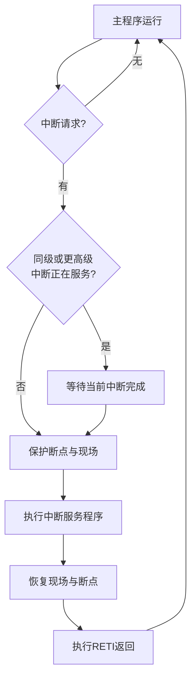
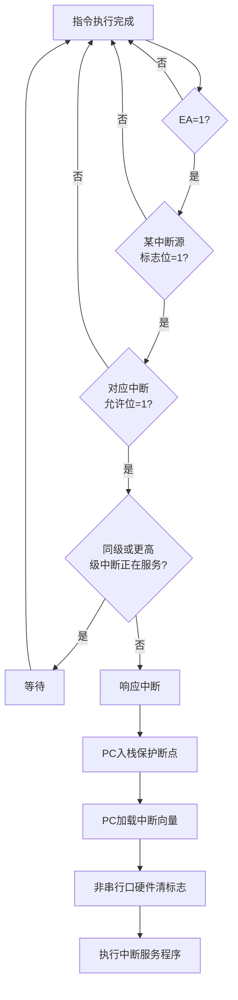
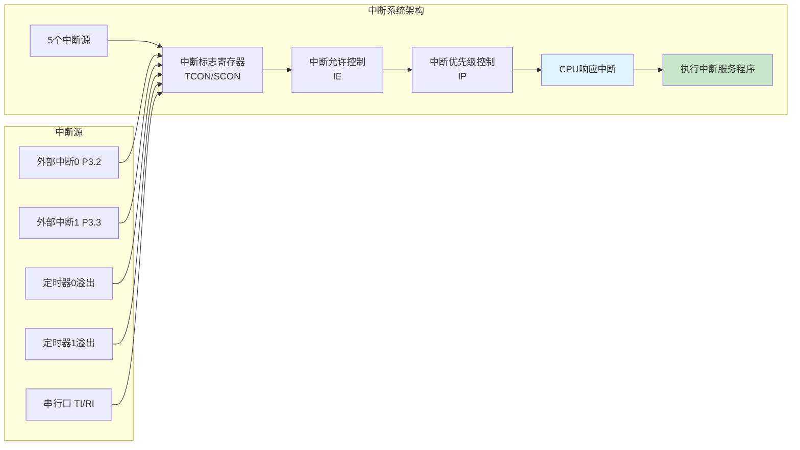

## 1. 中断系统概述

### 1.1 中断的基本概念

![[Pasted image 20260823214251.webp]]

中断是计算机系统中一项重要的实时处理技术。当CPU正在执行主程序时，若出现某些随机事件（如外部设备请求数据交换、定时器溢出或异常故障）需要处理，CPU暂时中止当前正在执行的程序，转去执行处理该事件的中断服务子程序，待服务程序执行完毕后再自动返回原程序继续执行。这一过程称为中断。

中断技术的引入主要解决计算机系统中CPU处理速度与外部设备工作速度不匹配的矛盾，以及应对随机突发事件。在单一CPU系统中，中断机制使得CPU能够在同一时刻“兼顾”多项任务，显著提高了系统的实时性和资源利用率。

![[Pasted image 20260823214312.webp]]

### 1.2 中断与子程序调用的区别

![[Pasted image 20260823214321.webp]]

中断服务子程序与普通子程序调用有本质区别：
- **触发方式**：子程序调用是程序执行过程中的主动行为，由 `CALL` 指令触发；中断是外部或内部随机事件被动触发的。
- **响应时机**：子程序调用在执行到调用指令时立即发生；中断响应取决于CPU当前指令执行周期和中断屏蔽状态，可能有一定延迟。
- **返回方式**：子程序使用 `RET` 返回；中断服务程序必须使用 `RETI` 返回，该指令同时负责清除中断状态标志。

### 1.3 中断与查询方式的区别

查询方式（轮询方式）中，CPU通过程序循环依次检测各设备的状态标志，当检测到请求时转入处理。这种方式实现简单，但CPU需花费大量时间进行查询操作，无法处理突发性事件，实时性较差。中断方式中，CPU仅在事件发生时被动响应，无需持续检测，处理效率更高。

### 1.4 中断优先级与嵌套

当多个中断源同时发出请求时，系统需确定响应次序。AT89S51采用两级优先级方案：每个中断源可被设置为高优先级或低优先级。不同优先级同时申请时，CPU优先响应高优先级中断；低优先级中断不能打断高优先级中断。当CPU正在处理低优先级中断时，若出现高优先级中断请求，CPU将暂停当前低优先级服务程序，转去执行高优先级服务程序，形成中断嵌套，待高优先级中断处理完毕后再返回继续执行低优先级中断服务程序。这一机制使得紧急事件能够得到优先处理。



> [!NOTE] 断点保护与现场保护
> 中断响应时，CPU自动将当前程序计数器PC（断点地址）压入堆栈，这是保证中断返回后程序继续执行的前提。现场保护指在服务程序中通过PUSH指令将累加器A、B寄存器、PSW等关键寄存器的内容保存到堆栈，避免因服务程序修改这些寄存器而破坏主程序的数据。保护现场和恢复现场的顺序必须相反（先PUSH后POP）。

## 2. AT89S51中断系统结构

![[Pasted image 20260823214352.webp]]

AT89S51的中断系统采用“2×5×4”架构：
- **2级**：两级中断优先级（高级和低级）
- **5个**：5个中断源
- **4个**：4个中断控制寄存器（IE、IP、TCON、SCON）

### 2.1 五个中断源

AT89S51提供5个中断源（AT89S52提供6个，增加定时器/计数器T2中断）：

1. **外部中断0（INT0）**：由P3.2引脚输入，可配置为电平触发或下降沿触发。
2. **外部中断1（INT1）**：由P3.3引脚输入，触发方式与INT0相同。
3. **定时器/计数器0溢出中断（T0）**：T0计数器从全1（FFFFH）变为全0时产生溢出中断。
4. **定时器/计数器1溢出中断（T1）**：T1溢出时触发。
5. **串行口中断**：串行口发送完成（TI）或接收完成（RI）时触发，两个标志共用一个中断向量。

### 2.2 自然优先级与中断向量地址

各中断源在同一优先级下遵循固定的自然优先级顺序，如表9-1所示。中断向量地址是CPU响应中断后自动跳转的入口地址，各入口地址之间仅间隔8个字节（0003H、000BH、0013H等），空间不足以容纳完整的中断服务程序。因此，通常在这些入口地址处放置一条无条件跳转指令（`LJMP` 或 `AJMP`），将程序引导至实际服务程序所在位置。

**表9-1 中断源自然优先级与中断向量**

| 中断源 | 中断入口地址 | 自然优先级 | C51中断号 |
| :--- | :---: | :---: | :---: |
| 外部中断0（INT0） | 0003H | 最高（第1） | 0 |
| 定时器/计数器0（T0） | 000BH | 第2 | 1 |
| 外部中断1（INT1） | 0013H | 第3 | 2 |
| 定时器/计数器1（T1） | 001BH | 第4 | 3 |
| 串行口（UART） | 0023H | 最低（第5） | 4 |
| 定时器/计数器2（T2，仅52系列） | 002BH | 第6 | 5 |

## 3. 中断控制相关寄存器

AT89S51通过四个特殊功能寄存器实现对中断系统的全面控制。

### 3.1 定时控制寄存器TCON（地址88H）

TCON寄存器用于控制定时器/计数器的启停，同时锁存外部中断请求标志。其中与中断相关的位如表9-2所示。

**表9-2 TCON寄存器中断相关位**

| 位符号 | 位地址 | 功能说明 |
| :---: | :---: | :--- |
| IE0 | 89H | 外部中断0请求标志。当INT0引脚检测到有效触发信号时硬件置1，响应后硬件自动清0 |
| IT0 | 88H | 外部中断0触发方式选择。IT0=1为下降沿触发；IT0=0为低电平触发 |
| IE1 | 8BH | 外部中断1请求标志，功能同IE0 |
| IT1 | 8AH | 外部中断1触发方式选择，功能同IT0 |
| TR0/TF0等 | — | 定时器控制与溢出标志（详见定时器章节） |

### 3.2 串行口控制寄存器SCON（地址98H）

SCON寄存器控制串行口的工作模式，其中TI和RI位用作串行口中断请求标志。

**表9-3 SCON寄存器中断相关位**

| 位符号 | 位地址 | 功能说明 |
| :---: | :---: | :--- |
| TI | 99H | 发送中断标志。串行口发送完一帧数据后硬件置1，需软件清0 |
| RI | 98H | 接收中断标志。串行口接收完一帧数据后硬件置1，需软件清0 |

> [!IMPORTANT] 串行口中断标志清零
> TCON中的外部中断请求标志（IE0、IE1）在CPU响应中断后由硬件自动清0，但SCON中的TI和RI标志不会自动清零，必须在中断服务程序中通过软件清零（如 `CLR TI`），否则中断服务程序返回后会再次触发中断，造成死循环。

### 3.3 中断允许控制寄存器IE（地址A8H）

IE寄存器控制各中断源的使能与禁止，其各位名称和功能如表9-4所示。

**表9-4 中断允许寄存器IE的各位功能**

| 位符号 | 位地址 | 功能说明 |
| :---: | :---: | :--- |
| EA | AFH | 总中断允许位。EA=1开放所有中断；EA=0禁止所有中断 |
| ET2 | ADH | 定时器/计数器2中断允许（仅52子系列有效） |
| ES | ACH | 串行口中断允许 |
| ET1 | ABH | 定时器/计数器1中断允许 |
| EX1 | AAH | 外部中断1中断允许 |
| ET0 | A9H | 定时器/计数器0中断允许 |
| EX0 | A8H | 外部中断0中断允许 |

> **示例**：若仅允许两个定时器/计数器中断而禁止其他中断，可使用以下两种方式设置IE：

```assembly
; 方法1：位操作指令
CLR ES      ; 禁止串行口中断
CLR EX0     ; 禁止外部中断0
CLR EX1     ; 禁止外部中断1
SETB ET0    ; 允许定时器0中断
SETB ET1    ; 允许定时器1中断
SETB EA     ; 开放总中断
```

```assembly
; 方法2：字节操作指令
MOV IE, #8AH   ; 10001010B → EA=1, ET1=1, ET0=1
```

### 3.4 中断优先级控制寄存器IP（地址D8H）

IP寄存器用于将各中断源配置为高优先级或低优先级。

**表9-5 中断优先级寄存器IP的各位功能**

| 位符号 | 位地址 | 功能说明 |
| :---: | :---: | :--- |
| PT2 | BDH | 定时器/计数器2中断优先级（仅52子系列） |
| PS | BCH | 串行口中断优先级 |
| PT1 | BBH | 定时器/计数器1中断优先级 |
| PX1 | BAH | 外部中断1中断优先级 |
| PT0 | B9H | 定时器/计数器0中断优先级 |
| PX0 | B8H | 外部中断0中断优先级 |

位值为1时对应中断源设置为高优先级，位值为0时设置为低优先级。

> **示例**：将两个外部中断设置为高优先级，其他为低优先级：

```assembly
; 位操作方式
SETB PX0     ; 外部中断0为高优先级
SETB PX1     ; 外部中断1为高优先级
; 其他位保持0（低优先级）
```

```assembly
; 字节操作方式
MOV IP, #03H   ; 00000011B → PX0=1, PX1=1
```

![[Pasted image 20260823214506.webp]]

## 4. 中断优先级的两条基本规则

AT89S51中断系统的优先级仲裁遵循两条核心规则：

1. **低优先级可被高优先级中断，高优先级不能被低优先级中断**。当CPU正在执行低优先级中断服务程序时，若出现高优先级中断请求，CPU会立即响应，形成中断嵌套；反之，若正在执行高优先级中断服务程序，低优先级请求将被忽略，直到高优先级服务程序执行完毕。

2. **同级中断不能互相嵌套**。任何一种中断一旦得到响应，不会再被同级中断源中断。例如，正在执行外部中断0的服务程序时，又出现定时器0中断请求（两者均为低优先级或均为高优先级），定时器0中断必须等待外部中断0服务完成后才能被响应。

> [!TIP] IP寄存器可以不设置吗？
> 可以。复位后IP寄存器各位默认均为0，即所有中断源处于同一低优先级。此时中断响应顺序完全由自然优先级决定（INT0 → T0 → INT1 → T1 → 串行口）。如果应用不需要抢占式优先级嵌套，可省略IP的初始化配置。

## 5. 中断响应的必要条件

一个中断请求能够被CPU响应，必须同时满足以下四个条件：

1. **总中断允许**：IE寄存器的EA位必须为1，总中断开关打开。
2. **中断请求标志有效**：对应中断源的中断请求标志为1（如IE0=1、TF0=1或TI/RI=1）。
3. **该中断源被单独允许**：对应的中断允许位为1（如EX0=1、ET0=1或ES=1）。
4. **无更高优先级中断正在服务**：CPU当前未执行更高优先级的中断服务程序；同优先级或低优先级中断服务程序不阻塞高优先级中断的响应。

当CPU查询到满足上述条件的中断请求时，在当前指令执行完毕后立即进入中断响应流程：硬件自动将PC压栈、将对应中断向量地址装入PC、清除非串行口中断请求标志（TI/RI需软件清除）。



## 6. 中断服务程序设计

中断程序设计包含两个主要部分：主程序中的中断初始化配置和中断服务子程序。

### 6.1 中断初始化程序（位于主程序）

在主程序中对中断系统进行初始化配置，通常包含以下步骤：

1. 设置中断允许寄存器IE，使能需要的中断源；
2. 设置中断优先级寄存器IP（可选，默认全为低优先级）；
3. 对于外部中断源，设置TCON中的触发方式位IT0/IT1（低电平触发或下降沿触发）。

### 6.2 中断服务子程序的流程

中断服务子程序的基本流程如下：

1. **现场保护**：将中断服务程序可能修改的寄存器（A、B、PSW、DPTR等）通过PUSH指令压入堆栈。
2. **中断处理**：执行具体的服务功能代码。
3. **清除中断标志**：对于串行口中断，需软件清除TI/RI标志；外部中断和定时器中断的标志由硬件自动清除。
4. **现场恢复**：通过POP指令按相反顺序恢复寄存器的原始值。
5. **中断返回**：执行 `RETI` 指令，恢复断点并返回主程序。

### 6.3 C51中断服务程序编写规范

在Keil C51环境中，中断服务程序采用 `interrupt` 关键字声明：

```c
void 函数名() interrupt 中断号
{
    // 中断服务程序主体
}
```

中断号与中断源的对应关系见表9-1。例如，外部中断0的中断号为0，其服务函数声明为 `void Int0_ISR() interrupt 0`。

## 7. 完整案例分析：外部中断0控制LED闪烁

### 7.1 硬件连接与功能要求

如参考图所示，8只LED通过限流电阻连接至P1口（共阳极接法），按键K1连接至P3.2（INT0引脚），按下时P3.2接地产生下降沿。功能要求：
- 系统启动后，8只LED全部常亮；
- 每按一次K1，触发外部中断0，在中断服务程序中实现低4位LED和高4位LED交替闪烁一次，然后恢复常亮。

![[Pasted image 20260823214554.webp]]

### 7.2 延时函数定义

```c
#include <reg51.h>

void Delay(unsigned int i)   // 延时函数，i为延时参数
{
    unsigned int j;
    for(; i > 0; i--)        // 外层循环控制ms数
        for(j = 0; j < 333; j++);  // 12MHz晶振下约延时1ms
}
```

在12MHz晶振下，1个机器周期为1μs，内层循环333次约耗时333μs，外层循环每循环一次约1ms。

### 7.3 主程序与中断服务程序

```c
void main()
{
    EA = 1;      // 开启总中断
    EX0 = 1;     // 允许外部中断0
    IT0 = 1;     // 下降沿触发
    
    while(1)
    {
        P1 = 0x00;   // 共阳极接法，输出0点亮全部LED
    }
}

void External_Int0_ISR() interrupt 0
{
    // 高4位亮，低4位灭
    P1 = 0x0F;       // 00001111B
    Delay(800);      // 延时约800ms
    
    // 高4位灭，低4位亮
    P1 = 0xF0;       // 11110000B
    Delay(800);      // 延时约800ms
}
```

> [!WARNING] 代码解析
> `P1 = 0x0F` 使高4位（P1.7～P1.4）输出0（LED导通点亮），低4位（P1.3～P1.0）输出1（LED截止熄灭）。`P1 = 0xF0` 则相反。共阳极接法下，输出0驱动LED导通，输出1使LED截止。

## 8. 本章小结

本章围绕AT89S51中断系统展开论述，重点包括中断的基本概念与工作原理、5个中断源的分类与特征、四个控制寄存器（TCON、SCON、IE、IP）的功能定义与配置方法、两级优先级的两条仲裁规则、中断响应的四个必要条件，以及中断服务程序的设计规范与C51编程语法。中断系统是单片机实现实时处理和多任务响应的核心机制，正确理解并熟练运用中断是嵌入式系统开发的关键技能之一。



## 相关笔记

- [[6.中断系统2]]
- [[4.输入输出接口-复位及时钟电路-低耗电模式]]
- [[7.定时计数器1]]
- [[9.串行通信接口与多机通信]]
- [[3.单片机的存储器-SFR]]

> 本章内容基于Atmel AT89S51数据手册及Keil C51编译器参考手册编写，中断向量地址和特殊功能寄存器定义以目标器件官方数据手册为准。