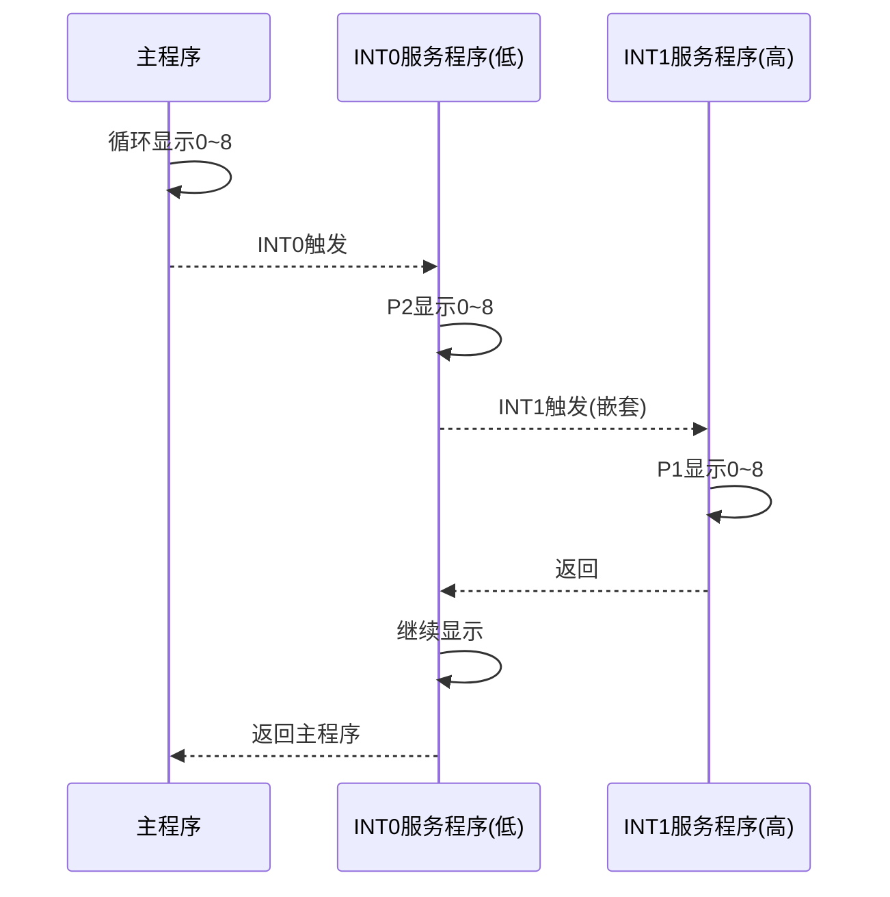
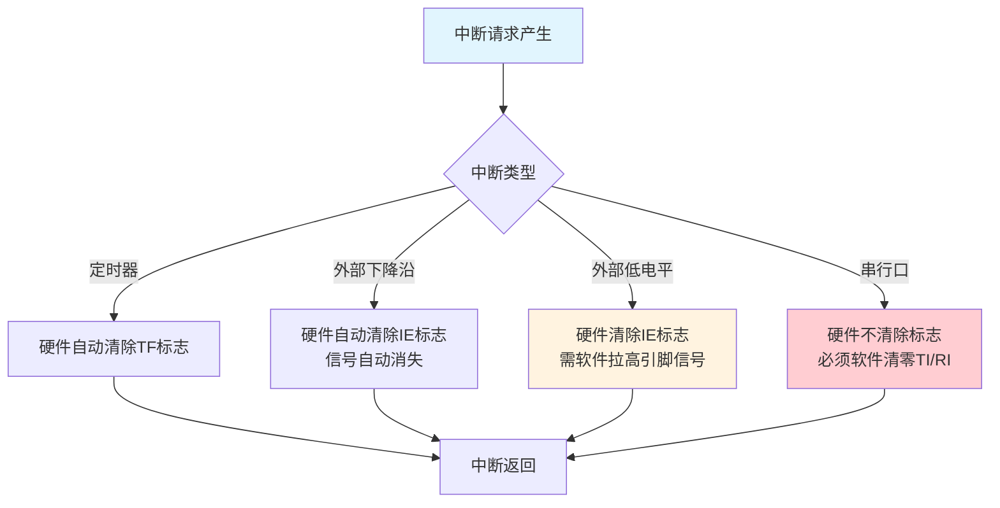

## 1. 中断请求的撤除机制

中断请求被响应后，对应的中断请求标志位必须被清除，否则CPU会误判为又有新的中断请求而重复进入中断服务程序，导致主程序无法正常执行。不同中断源的中断请求撤除方式存在差异，需分别处理。

### 1.1 定时器/计数器中断请求的自动撤除

定时器/计数器溢出中断（TF0、TF1）的请求标志在CPU响应中断后由**硬件自动清零**，无需软件干预。以定时器0为例，当TH0/TL0从FFFFH溢出至0000H时，硬件将TF0置1；CPU响应中断后，在跳转至中断向量地址的同时，内部逻辑将TF0清0。这一过程对程序员完全透明。

![[Pasted image 20260823215129.webp]]

### 1.2 外部中断请求的撤除

外部中断的撤除取决于触发方式的配置。

**（1）下降沿触发方式的撤除**

下降沿触发方式下，中断请求标志IE0（或IE1）由硬件在响应中断后自动清0。同时，由于下降沿信号本身就是电平的短暂跳变，信号在跳变后自动消失，无需额外处理。因此，下降沿触发的外部中断请求可完全由硬件自动撤除。

**（2）低电平触发方式的撤除**

低电平触发方式存在特殊问题：CPU响应中断后，IE0标志虽然由硬件自动清0，但外部引脚上的低电平信号可能仍然持续（例如按键未释放或外部设备保持低电平）。如果低电平继续存在，在中断服务程序返回后，CPU会再次检测到该低电平，从而再次触发中断，形成死循环。

为解决此问题，必须在中断服务程序中通过硬件手段将外部引脚电平强制拉高。典型的解决方案是利用外部D触发器或锁存器锁存中断请求信号，再由单片机的一个I/O引脚在中断服务程序中输出负脉冲，将D触发器置位，撤销低电平请求信号。

参考电路设计中，D触发器的SD（置位端）连接至P1.0引脚。在中断服务程序中，通过以下指令序列在P1.0产生负脉冲，将D触发器置1，从而撤销外部低电平信号：

```assembly
ORL P1, #01H   ; P1.0置1（高电平）
ANL P1, #0FEH  ; P1.0清0（低电平）——产生下降沿，触发D触发器置位
ORL P1, #01H   ; P1.0恢复1（高电平）
```

上述三条指令依次执行后，P1.0输出一个完整的负脉冲（1 → 0 → 1），使D触发器输出端变为高电平，中断请求信号被撤除。

> [!WARNING] 低电平触发的隐患
> 电平触发方式下，若中断服务程序执行完毕后外部低电平仍未撤除，中断会反复触发，导致CPU始终在中断服务程序中循环，主程序完全得不到执行。使用电平触发方式时，必须在外围硬件上确保中断请求信号在响应后被有效撤销，或配合额外的I/O引脚进行控制。

### 1.3 串行口中断请求的软件撤除

串行口中断具有特殊性：发送中断（TI）和接收中断（RI）共用同一个中断向量（0023H）。CPU响应串行口中断后，无法通过硬件判断触发源是发送完成还是接收完成。因此，硬件不会自动清除TI或RI标志，必须由中断服务程序通过软件查询并手动清零。

在中断服务程序中，通常采用以下代码结构：

```c
void UART_ISR() interrupt 4
{
    if (RI)          // 判断是否为接收中断
    {
        RI = 0;      // 软件清除接收标志
        // 处理接收数据...
    }
    if (TI)          // 判断是否为发送中断
    {
        TI = 0;      // 软件清除发送标志
        // 处理发送完成...
    }
}
```

> [!IMPORTANT] 串行口标志必须软件清零
> 若在中断服务程序中遗漏了对TI或RI的清零操作，中断服务程序返回后，标志位仍为1，CPU将立即再次响应同一中断，导致程序陷入无限中断循环。

## 2. 外部中断源的扩充方法

AT89S51仅提供两个外部中断输入引脚（INT0和INT1），当应用系统需要多个外部中断源时，可通过以下两种方式扩充。

### 2.1 利用定时器/计数器扩展外部中断

将未使用的定时器/计数器配置为**计数模式**，利用其对外部脉冲的计数溢出功能产生中断，即可获得额外的外部中断源。

以定时器/计数器0为例：
- 计数输入引脚为T0（P3.4），外部下降沿信号加1计数。
- 将TL0和TH0的初值均设为0FFH（即满量程），则外部输入一个下降沿脉冲后，计数器从FFH溢出至00H，硬件自动将TF0置1，触发定时器0中断。
- 此时T0引脚等效为一个下降沿触发的外部中断输入。

初始化代码示例：

```assembly
MOV TMOD, #06H   ; 设置T0为计数方式，模式2（8位自动重装载）
MOV TL0, #0FFH   ; 计数器初值设为满量程
MOV TH0, #0FFH   ; 重装载值也设为满量程
SETB TR0         ; 启动T0计数
SETB ET0         ; 允许T0溢出中断
SETB EA          ; 开启总中断
```

模式2（8位自动重装载）下，每当TL0溢出时，TH0的值自动重装入TL0，故外部每输入一个下降沿，TL0溢出一次，TF0即被置位。此方法简单实用，可获得额外的外部中断资源。

### 2.2 硬件逻辑组合扩展

通过外部逻辑门（如与门、或门）将多个中断请求信号合并至同一个INTx引脚，同时通过I/O口查询具体中断源。此方法成本较低，但需软件配合查询判断，响应速度较单一中断源略慢。

## 3. 中断应用示例一：单外部中断触发数码管显示

### 3.1 功能要求

![[Pasted image 20260823215220.webp]]

- 主程序：P0口连接的数码管循环显示0～8，循环间隔由延时函数控制。
- 外部中断0（INT0，P3.2）配置为**下降沿触发**。
- 每次按下按键触发外部中断后，P2口连接的另一个数码管独立显示0～8后熄灭，然后返回主程序继续执行。

### 3.2 段码表定义

共阳极数码管段码表（低电平点亮）：

| 数字 | 0 | 1 | 2 | 3 | 4 | 5 | 6 | 7 | 8 |
| :---: | :---: | :---: | :---: | :---: | :---: | :---: | :---: | :---: | :---: |
| 段码 | C0H | F9H | A4H | B0H | 99H | 92H | 82H | F8H | 80H |

### 3.3 主程序与中断服务程序

```c
#include <reg51.h>

char seg7[] = {0xc0, 0xf9, 0xa4, 0xb0, 0x99, 0x92, 0x82, 0xf8, 0x80};
char i, j;

void delay(unsigned int a)
{
    unsigned int c;
    for(; a > 0; a--)
        for(c = 0; c < 333; c++);
}

void main(void)
{
    EX0 = 1;       // 允许外部中断0
    EA = 1;        // 开启总中断
    IT0 = 1;       // 下降沿触发
    
    while(1)
    {
        for(i = 0; i < 9; i++)
        {
            P0 = seg7[i];   // 主数码管显示0~8
            delay(200);
        }
    }
}

void TINT0S(void) interrupt 0
{
    for(j = 0; j < 9; j++)
    {
        P2 = seg7[j];       // 中断数码管显示0~8
        delay(200);
    }
    P2 = 0xff;              // 熄灭中断数码管（共阳极高电平熄灭）
}
```

> [!NOTE] 程序设计要点
> 主程序中的`while(1)`无限循环使P0口数码管持续刷新数字。外部中断触发时，CPU暂停主循环，执行中断服务程序，完成P2口数码管的显示后返回。中断服务程序结束后，主程序从被中断的位置继续执行，不影响主循环的显示过程。

## 4. 中断应用示例二：两级中断嵌套

### 4.1 功能要求

![[Pasted image 20260823215256.webp]]

- 主程序：P0口数码管循环显示0～8。
- 外部中断0（INT0）：低优先级，下降沿触发，中断服务程序在P2口数码管显示0～8。
- 外部中断1（INT1）：**高优先级**，下降沿触发，中断服务程序在P1口数码管显示0～8。
- 因INT1优先级高于INT0，当INT0中断正在执行时若触发INT1，将产生**中断嵌套**，INT1服务程序打断INT0服务程序。

### 4.2 初始化配置

```c
#include <reg51.h>

unsigned char seg7[] = {0xc0, 0xf9, 0xa4, 0xb0, 0x99, 0x92, 0x82, 0xf8, 0x80};
unsigned char i, j, k;

void delay(unsigned int a)
{
    unsigned int c;
    for(; a > 0; a--)
        for(c = 0; c < 333; c++);
}

void main(void)
{
    IE = 0x85;      // 1000 0101B → EA=1, EX1=1, EX0=1
    TCON = 0x05;    // 0000 0101B → IT1=1, IT0=1（下降沿触发）
    P3 = 0xff;      // P3输入前写1
    PX1 = 1;        // 外部中断1设为高优先级（INT0保持低优先级）
    
    while(1)
    {
        for(i = 0; i < 9; i++)
        {
            P0 = seg7[i];
            delay(200);
        }
    }
}

void TINT0S(void) interrupt 0    // 低优先级
{
    for(j = 0; j < 9; j++)
    {
        P2 = seg7[j];
        delay(200);
    }
    P2 = 0xff;
}

void TINT1S(void) interrupt 2    // 高优先级，可嵌套
{
    for(k = 0; k < 9; k++)
    {
        P1 = seg7[k];
        delay(200);
    }
    P1 = 0xff;
}
```

### 4.3 中断嵌套过程分析

当INT0中断正在执行（P2口数码管显示数字），此时若按下INT1按键（P3.3接地），由于INT1优先级高于INT0，CPU将：
1. 暂停INT0服务程序的执行；
2. 保存INT0服务程序的断点和现场；
3. 响应INT1中断，执行INT1服务程序（P1口数码管显示0～8）；
4. INT1服务程序执行完毕后，恢复INT0服务程序的现场和断点；
5. 继续执行INT0服务程序剩余的循环；
6. INT0服务程序全部完成后返回主程序。

此过程体现了高优先级中断可打断低优先级中断的嵌套规则。



## 5. 中断应用示例三：单中断源下区分多个外部输入

### 5.1 功能要求

![[Pasted image 20260823215319.webp]]

当外部中断源数量多于中断引脚时，可通过硬件组合将多个输入信号连接至同一个INT引脚，并在中断服务程序中通过查询I/O口状态识别具体触发源。

本例中：
- 两个按键分别连接至P3.4和P3.5（非中断专用引脚），但通过外部逻辑合并后接入INT0（P3.2）。
- 实际电路设计中，可将两个按键的输出经与门或非门合并后接至INT0。
- 中断服务程序中通过读取P3.4和P3.5的当前电平判断具体是哪个按键按下，分别执行不同的显示任务。

### 5.2 代码实现

```c
#include <reg51.h>

sbit K1 = P3^4;   // 按键1接P3.4
sbit K2 = P3^5;   // 按键2接P3.5

char seg7[] = {0xc0, 0xf9, 0xa4, 0xb0, 0x99, 0x92, 0x82, 0xf8, 0x80};
char i, j, k;

void delay(unsigned int a)
{
    unsigned int c;
    for(; a > 0; a--)
        for(c = 0; c < 333; c++);
}

void main(void)
{
    IE = 0x81;      // 1000 0001B → EA=1, EX0=1
    TCON = 0x01;    // 0000 0001B → IT0=1（下降沿触发）
    
    while(1)
    {
        for(i = 0; i < 9; i++)
        {
            P0 = seg7[i];   // 主数码管显示
            delay(200);
        }
    }
}

void TINT0S(void) interrupt 0
{
    if(K1 == 0)          // 检查按键1是否按下（低电平有效）
    {
        for(j = 0; j < 9; j++)
        {
            P2 = seg7[j];
            delay(200);
        }
        P2 = 0xff;
    }
    else if(K2 == 0)     // 检查按键2是否按下
    {
        for(k = 0; k < 9; k++)
        {
            P1 = seg7[k];
            delay(200);
        }
        P1 = 0xff;
    }
}
```

### 5.3 设计要点

此方法通过软件查询区分多个外部触发源，代价是中断响应后需要额外的查询时间，但硬件成本低。适用于中断源数量不多且响应速度要求不高的场合。若需要快速响应，可优先考虑使用定时器计数方式扩展独立中断。

> [!TIP] 多中断源扩展选择
> - 若需扩展的额外中断源数量为1～2个，利用定时器计数方式最为简洁，可获得独立的中断向量，无需查询。
> - 若需扩展3个以上中断源，可采用硬件组合+软件查询方式，但需注意查询顺序应按照触发频率由高到低排列，以提高平均响应速度。

## 6. 本章小结

本部分作为中断系统的进阶内容，重点阐述三个核心实践问题：
1. **中断请求撤除**：定时器中断由硬件自动撤除；下降沿触发的外部中断自动撤除；电平触发的外部中断需配合I/O引脚强制撤除低电平信号；串行口中断必须由软件清除TI/RI标志。
2. **外部中断源扩充**：通过将定时器配置为计数模式（初值FFH）可利用T0/T1引脚获得额外的下降沿触发中断；也可采用硬件逻辑组合加软件查询的方法。
3. **中断程序设计实践**：通过三个递进示例，展示了单中断响应、两级中断嵌套和单中断源下多输入区分的设计方法，涵盖了中断初始化、服务程序编写和优先级配置等核心技能。



## 相关笔记

- [[5.中断系统1]]
- [[7.定时计数器1]]
- [[9.串行通信接口与多机通信]]
- [[4.输入输出接口-复位及时钟电路-低耗电模式]]

> 本章内容基于Atmel AT89S51数据手册及Keil C51编译器参考手册编写，具体中断响应时序和控制寄存器定义以目标器件官方数据手册为准。