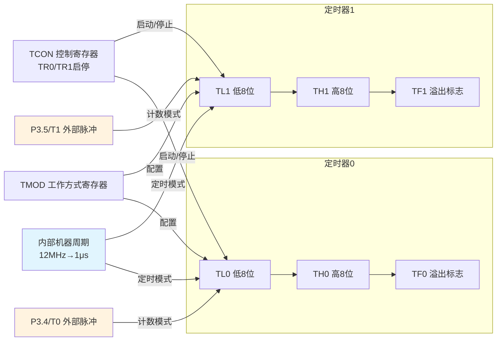
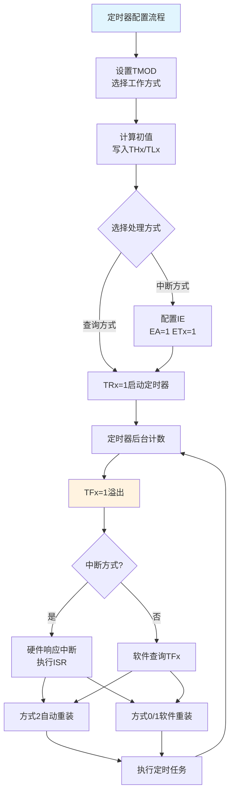

## 1. 定时器/计数器概述

在工业控制和嵌入式系统中，精确定时与外部事件计数是最常见的需求之一。例如，要求信号灯以精确的1秒周期闪烁，或统计生产线上传送带通过的产品数量。实现定时功能主要有三种技术途径。

### 1.1 三种定时实现方式对比

**（1）硬件定时——以555定时器为例**

![[Pasted image 20260824213224.webp]]

利用555定时器构成的单稳态电路可实现触摸延时控制：人体触摸产生负脉冲触发555输出高电平点亮灯泡，随后电源通过电阻R对电容C充电，当电容电压上升至2/3 VCC时电路复位，灯泡熄灭。定时时间由RC参数决定（t = 1.1RC），但存在明显局限：定时精度受电容温度特性和电阻精度影响，参数调整不灵活，一旦电路固定，定时值难以修改。

**（2）软件定时——循环延时**

![[Pasted image 20260824213311.webp]]

软件定时通过执行循环程序消耗CPU时间来实现延时，无需额外硬件开销，在简单应用中便捷有效。以12MHz晶振为例，一段双重循环的延时函数可产生约毫秒级的延时。其本质缺陷在于：CPU在执行空循环期间无法执行任何其他任务，CPU利用率极低，不适用于需要同时处理多任务的实时系统。

**（3）硬件定时器/计数器——专用定时单元**

80C51系列单片机内部集成2个16位可编程定时器/计数器T0和T1，是前述三种方案中性能最优解。定时器配置并启动后，在后台独立运行，不占用CPU时间，仅在计满溢出时通过中断请求通知CPU。这种“硬件计时+中断通知”的机制既保证了定时精度，又最大限度释放了CPU资源。

### 1.2 定时器/计数器的基本概念

定时器/计数器本质上是一个**加1计数器**，其核心是一个16位寄存器（由两个8位寄存器THx和TLx组成），每个机器周期或外部脉冲到来时自动加1，计满溢出时置位溢出标志TFx。

定时器与计数器的区别在于**计数脉冲的来源**：

- **定时模式（C/T = 0）**：计数脉冲来自单片机内部的时钟信号，每经过1个机器周期（12个时钟周期）计数器加1。由于机器周期是已知的固定时间，可通过计数个数精确计算时间。
- **计数模式（C/T = 1）**：计数脉冲来自外部引脚T0（P3.4）或T1（P3.5），每检测到一个**负跳变（下降沿）**，计数器加1，用于统计外部事件发生的次数。

### 1.3 定时器/计数器的结构组成

![[Pasted image 20260824213358.webp]]

AT89S51的定时器系统由以下部件构成：

- **2个16位加1计数器**：T0由TH0（高8位）和TL0（低8位）组成，T1由TH1和TL1组成。
- **2个8位控制寄存器**：TMOD（工作方式寄存器）和TCON（控制寄存器），用于配置定时器的工作模式和启停。
- **2个外部输入引脚**：T0（P3.4）和T1（P3.5），用于计数模式下接入外部脉冲。



## 2. 定时器/计数器的实现原理

![[Pasted image 20260824213420.webp]]
### 2.1 初值设定的基本思想

16位计数器从初值X开始，每收到一个计数脉冲加1，直至计满溢出（从FFFFH变为0000H）。因此，从初值到溢出的**计数值N**为：

$$N = 2^{16} - X = 65536 - X \quad \text{(1)}$$

类比说明：假设一个碗最多装100粒豆子（相当于计数器容量65536），要在碗中剥出90粒豆子才溢出（相当于计数90次），则需先在碗中放入10粒豆子（初值X = 10），剥入90粒后正好装满溢出。

**设定初值X**的本质是调整溢出所需的脉冲个数。通过配置不同的初值，可以实现任意小于计数器容量的计数值。

### 2.2 定时时间的计算

在定时模式下，计数脉冲的周期等于机器周期T_cy。若晶振频率为f_osc，则：

$$T_{cy} = \frac{12}{f_{osc}} \quad \text{(2)}$$

当外接12MHz晶振时，T_cy = 1μs。设初值为X，则定时时间t为：

$$t = (65536 - X) \times T_{cy} \quad \text{(3)}$$

对于给定的目标定时时间t，所需初值X的计算公式为：

$$X = 65536 - \frac{t}{T_{cy}} \quad \text{(4)}$$

### 2.3 计数个数的计算

在计数模式下，从初值X到溢出可记录的外部脉冲个数N为：

$$N = 65536 - X \quad \text{(5)}$$

若需要计数N个外部脉冲，则初值应设为X = 65536 - N。

## 3. 定时器/计数器的控制方法

定时器/计数器的工作需按以下四个步骤进行配置。

### 3.1 第一步：设置工作方式寄存器TMOD

![[Pasted image 20260824213455.webp]]

TMOD（地址89H）是一个8位寄存器，高4位控制T1，低4位控制T0，不可位寻址，必须整体赋值。

**表9-1 TMOD寄存器格式**

| 位序 | 位7 | 位6 | 位5 | 位4 | 位3 | 位2 | 位1 | 位0 |
| :---: | :---: | :---: | :---: | :---: | :---: | :---: | :---: | :---: |
| 位名称 | GATE | C/T | M1 | M0 | GATE | C/T | M1 | M0 |
| 控制对象 | \multicolumn{4}{c|}{定时器1（T1）} | \multicolumn{4}{c}{定时器0（T0）} |

各位功能说明：

- **GATE**：门控信号。GATE=0时，仅由TRx（启停控制位）控制定时器运行；GATE=1时，需TRx=1且对应外部中断引脚（INT0/INT1）为高电平时定时器才运行，常用于测量INTx引脚的正脉冲宽度。
- **C/T**：计数/定时选择。C/T=0为定时模式（计数内部时钟）；C/T=1为计数模式（计数外部引脚脉冲）。
- **M1、M0**：工作方式选择位，如表9-2所示。

**表9-2 定时器/计数器工作方式**

| M1 | M0 | 方式 | 说明 | 最大计数值 |
| :---: | :---: | :---: | :--- | :---: |
| 0 | 0 | 方式0 | 13位定时器/计数器（THx的8位 + TLx的低5位） | 8192（2^13） |
| 0 | 1 | 方式1 | 16位定时器/计数器（THx和TLx全8位） | 65536（2^16） |
| 1 | 0 | 方式2 | 8位自动重装载定时器/计数器 | 256（2^8） |
| 1 | 1 | 方式3 | T0分为两个独立8位定时器；T1在方式3时停止 | 256（2^8） |

四种工作方式的差异主要体现在计数器位宽和重装载机制上。**方式1（16位）** 是最常用模式，定时范围最宽；**方式2（8位自动重载）** 适用于需要周期性精确定时且不需要软件重装初值的场景，如固定频率的PWM或波特率发生器；**方式0** 为兼容MCS-48遗留设计，实际已很少使用；**方式3** 仅T0支持，可将T0拆分为两个8位定时器，增加了一个定时资源。

### 3.2 第二步：计算并设置初值THx和TLx

![[Pasted image 20260824213557.webp]]

根据所需的定时时间或计数个数，利用公式（4）计算初值X，然后将X的高8位赋给THx，低8位赋给TLx：

- 方法一：THx = X / 256，TLx = X % 256
- 方法二：将X转换为16位十六进制数，高字节送THx，低字节送TLx

**示例**：定时50ms，晶振12MHz，方式1（16位模式）
- 机器周期T_cy = 1μs
- 需计数个数N = 50ms / 1μs = 50000
- 初值X = 65536 - 50000 = 15536
- 十六进制：15536 = 3CB0H
- TH0 = 3CH，TL0 = B0H

### 3.3 第三步：设置控制寄存器TCON

![[Pasted image 20260824213629.webp]]

TCON（地址88H）用于控制定时器的启动/停止和读取溢出状态，各位定义见表9-3。TCON可位寻址。

**表9-3 TCON寄存器各位功能**

| 位符号 | 位地址 | 功能说明 |
| :---: | :---: | :--- |
| TF1 | 8FH | 定时器1溢出标志。溢出时硬件置1，需软件清零 |
| TR1 | 8EH | 定时器1运行控制位。TR1=1启动，TR1=0停止 |
| TF0 | 8DH | 定时器0溢出标志。功能同TF1 |
| TR0 | 8CH | 定时器0运行控制位。功能同TR1 |
| IE1 | 8BH | 外部中断1请求标志 |
| IT1 | 8AH | 外部中断1触发方式选择 |
| IE0 | 89H | 外部中断0请求标志 |
| IT0 | 88H | 外部中断0触发方式选择 |

### 3.4 第四步：编写定时时间到后的处理程序

定时到后的处理有两种方式：

**（1）中断方式**

在启动定时器之前完成中断系统初始化：设置IE寄存器中的ET0/ET1位和EA位。定时器溢出后，硬件自动将TFx置1，CPU响应中断，跳转至对应的中断向量，执行中断服务程序。**方式0和方式1**需要在中断服务程序中**软件重装初值**；**方式2**由硬件自动完成重载，无需软件干预。

**（2）查询方式**

在主程序中循环检测TFx标志位。当TFx=1时，软件清除该标志，执行定时任务，并重装初值（方式0/1）。查询方式不占用中断资源，但需要CPU不断轮询，效率低于中断方式。

## 4. 工作方式1的典型应用

### 4.1 功能要求：LED每50ms翻转一次

![[Pasted image 20260824213649.webp]]

已知系统晶振频率f_osc = 12MHz，机器周期T_cy = 1μs。采用定时器T0、工作方式1（16位定时器），产生50ms定时。每溢出一次，P1口输出电平翻转，控制LED按50ms周期闪烁。

### 4.2 中断方式实现

```c
#include <reg51.h>

void main()
{
    // 1. 配置工作方式：T0方式1
    TMOD = 0x01;
    
    // 2. 设置50ms定时初值（50000个计数脉冲）
    TH0 = (65536 - 50000) / 256;   // 高8位
    TL0 = (65536 - 50000) % 256;   // 低8位
    
    // 3. 端口初始化
    P1 = 0x00;
    
    // 4. 中断系统配置
    EA = 1;    // 开放总中断
    ET0 = 1;   // 允许T0中断
    
    // 5. 启动定时器
    TR0 = 1;
    
    // 6. 主程序死循环，定时任务在中断中完成
    while(1);
}

// 定时器0中断服务程序（中断号1）
void Timer0_ISR() interrupt 1
{
    // 方式1需软件重装初值
    TH0 = (65536 - 50000) / 256;
    TL0 = (65536 - 50000) % 256;
    
    // 执行定时任务：翻转P1口
    P1 = ~P1;
}
```

### 4.3 查询方式实现

```c
#include <reg51.h>

void main()
{
    // 配置工作方式和初值
    TMOD = 0x01;
    TH0 = (65536 - 50000) / 256;
    TL0 = (65536 - 50000) % 256;
    
    // 启动定时器
    TR0 = 1;
    
    // 主循环：查询溢出标志
    while(1)
    {
        if(TF0 == 1)          // 检测到溢出
        {
            TF0 = 0;          // 软件清标志
            // 重装初值
            TH0 = (65536 - 50000) / 256;
            TL0 = (65536 - 50000) % 256;
            P1 = ~P1;         // 执行定时任务
        }
    }
}
```

### 4.4 扩展：LED每1秒翻转一次

若需要更长的定时时间（如1秒），而16位定时器单次最大定时仅为65.536ms（65536μs），无法直接产生1秒定时。解决方案是引入**软件计数器**，记录溢出次数，达到指定次数后再执行翻转操作。

**中断方式实现1秒定时**：

```c
#include <reg51.h>

unsigned char cnt = 20;   // 软件计数器：20次 × 50ms = 1000ms

void main()
{
    TMOD = 0x01;
    TH0 = (65536 - 50000) / 256;
    TL0 = (65536 - 50000) % 256;
    P1 = 0x00;
    
    EA = 1;
    ET0 = 1;
    TR0 = 1;
    
    while(1);
}

void Timer0_ISR() interrupt 1
{
    TH0 = (65536 - 50000) / 256;
    TL0 = (65536 - 50000) % 256;
    
    cnt--;                    // 每次中断减1
    if(cnt == 0)              // 达到20次（1秒）
    {
        P1 = ~P1;
        cnt = 20;             // 重置计数器
    }
}
```

**查询方式实现1秒定时**：

```c
#include <reg51.h>

unsigned char n = 0;

void main()
{
    TMOD = 0x01;
    TH0 = (65536 - 50000) / 256;
    TL0 = (65536 - 50000) % 256;
    TR0 = 1;
    
    while(1)
    {
        if(TF0 == 1)
        {
            TF0 = 0;
            TH0 = (65536 - 50000) / 256;
            TL0 = (65536 - 50000) % 256;
            n++;
            if(n == 20)        // 20次 × 50ms = 1s
            {
                P1 = ~P1;
                n = 0;
            }
        }
    }
}
```

## 5. 定时器应用设计要点

### 5.1 初值计算的一般步骤

1. 确定系统晶振频率，计算机器周期T_cy；
2. 确定所需定时时间t或计数值N；
3. 确定工作方式，获取计数器最大容量M（方式1为65536，方式2为256）；
4. 计算初值：X = M - t/T_cy 或 X = M - N；
5. 将X的高/低字节分别写入THx和TLx。

### 5.2 中断方式与查询方式的选择

| 比较项 | 中断方式 | 查询方式 |
| :--- | :--- | :--- |
| CPU利用率 | 高（定时器后台运行，CPU可执行其他任务） | 低（需持续轮询TFx标志） |
| 实时性 | 高（中断响应由硬件触发） | 较低（取决于轮询频率） |
| 程序复杂度 | 较高（需配置中断系统、编写ISR） | 较低（仅需循环查询） |
| 适用场景 | 多任务系统、需要同时处理多事件 | 简单顺序程序、定时精度要求不高 |

> [!TIP] 方式2的特殊优势
> 方式2（8位自动重装载）最大的优势在于定时器溢出后THx的值自动装入TLx，无需软件重装。这不仅简化了程序，还避免了软件重装过程中的时间误差累积，特别适用于需要连续精确定时的应用，如串行通信的波特率发生器。



## 相关笔记

- [[8.定时计数器2]]
- [[5.中断系统1]]
- [[6.中断系统2]]
- [[4.输入输出接口-复位及时钟电路-低耗电模式]]
- [[3.单片机的存储器-SFR]]
- [[单片机小计算题]]

> 本章内容基于Atmel AT89S51数据手册及Keil C51编译器参考手册编写，定时器初值计算和寄存器定义以目标器件官方数据手册为准。