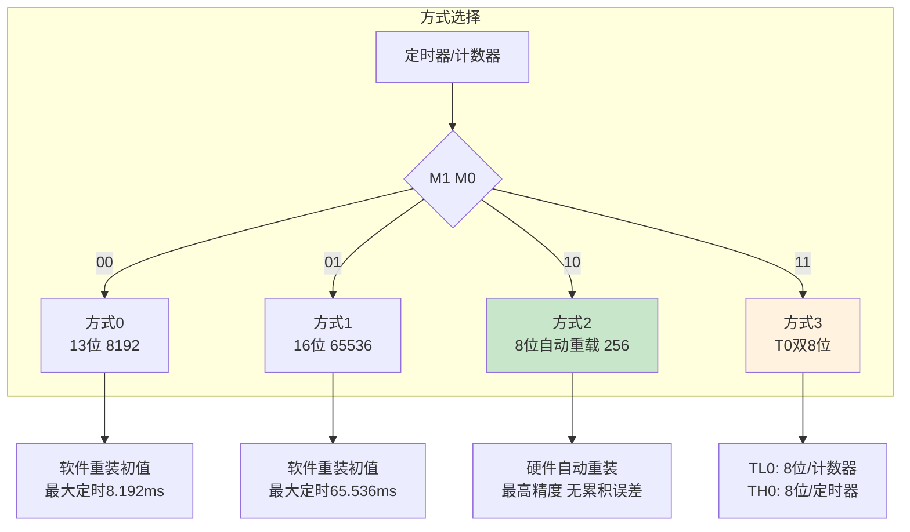
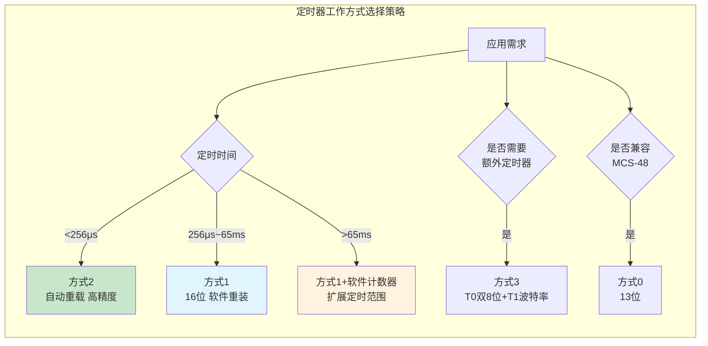

## 1. 工作方式2：8位自动重装载模式

![[Pasted image 20260824214203.webp]]

方式2是定时器/计数器四种工作方式中应用最广泛的模式之一，其核心优势在于**自动重装载初值**功能，无需软件干预即可在每次溢出后恢复初始计数值，既简化了程序设计，又消除了软件重装带来的时间误差。

### 1.1 方式2的结构特点

方式2将16位计数器拆分为两个8位寄存器：TLx作为**当前计数器**，THx作为**重装载备份寄存器**。计数器启动后，TLx从初值开始加1计数，溢出时硬件自动完成两项操作：置位TFx溢出标志，并将THx中的值自动装入TLx，然后继续计数。在整个过程中，THx的值保持不变，持续作为重装载值使用。

这种结构尤其适用于需要产生**固定频率**周期性信号或**精确连续计数**的场合。

### 1.2 初值计算与配置

方式2为8位计数器，最大计数值为256（2^8）。若需要计数值为N（1 ≤ N ≤ 256），则初值X为：

$$X = 256 - N \quad \text{(1)}$$

在定时模式下，若晶振频率为f_osc，机器周期T_cy = 12/f_osc，定时时间t为：

$$t = (256 - X) \times T_{cy} \quad \text{(2)}$$

当f_osc = 12MHz时，T_cy = 1μs，方式2的单次定时范围为**1μs ~ 256μs**（计数1 ~ 256次）。方式2的定时范围虽比方式1窄，但在需要短时间精确定时的场景中，因无需软件重装，其定时精度优于方式1。

### 1.3 方式2的典型应用：外部计数触发LED闪烁

**功能要求**：使用定时器T1的方式2（计数模式），计数输入引脚T1（P3.5）外接按键K1。初始状态8只LED全部点亮，每按4次K1后，LED闪烁一次。

**（1）TMOD寄存器配置**

![[Pasted image 20260824214402.webp]]

T1工作在计数模式、方式2：C/T = 1，M1 = 1，M0 = 0，GATE = 0。高4位（控制T1）应设置为0110B（即6），低4位保持0：

```assembly
TMOD = 0x60   ; 0110 0000B
```

**（2）初值计算**

方式2为8位计数器，需要计数4次后溢出。计数个数N = 4，初值为：

$$X = 256 - 4 = 252 = 0xFC$$

TH1 = 0xFC，TL1 = 0xFC（初始值和重装载值相同）。

**（3）中断配置**

![[Pasted image 20260824214508.webp]]

若采用中断方式，需设置IE寄存器：EA = 1（总中断允许），ET1 = 1（T1中断允许）。

```c
EA = 1;    // 开放总中断
ET1 = 1;   // 允许T1中断
```

**（4）中断方式完整程序**

```c
#include <reg51.h>

void delay(unsigned int i)
{
    unsigned int j;
    for(; i > 0; i--)
        for(j = 0; j < 125; j++);
}

void main()
{
    TMOD = 0x60;      // T1方式2，计数模式
    TH1 = 0xFC;       // 重装载值：252
    TL1 = 0xFC;       // 初始计数值：252
    P1 = 0x00;        // LED全亮（共阳极接法，低电平点亮）
    EA = 1;
    ET1 = 1;
    TR1 = 1;          // 启动T1
    
    while(1);         // 等待中断
}

// T1中断服务程序（中断号3）
void Timer1_ISR() interrupt 3
{
    // 方式2无需重装初值，硬件自动完成
    P1 = 0xFF;        // LED全灭
    delay(500);       // 延时约500ms
    P1 = 0x00;        // LED全亮
    delay(500);
}
```

**（5）查询方式完整程序**

```c
#include <reg51.h>

void delay(unsigned int i)
{
    unsigned int j;
    for(; i > 0; i--)
        for(j = 0; j < 125; j++);
}

void main()
{
    TMOD = 0x60;
    TH1 = 0xFC;
    TL1 = 0xFC;
    P1 = 0x00;
    TR1 = 1;
    
    while(1)
    {
        if(TF1 == 1)
        {
            P1 = 0xFF;
            delay(500);
            P1 = 0x00;
            delay(500);
            TF1 = 0;      // 查询方式需软件清除标志位
        }
    }
}
```

> [!WARNING] 查询方式标志位清零
> 在查询方式下，TF1标志位不会自动清零，必须在查询到TF1=1后由软件将其置0，否则程序将反复执行溢出处理代码，导致逻辑混乱。

## 2. 外部计数脉冲的采样要求

定时器/计数器在计数模式下，其外部输入引脚（T0/P3.4或T1/P3.5）在每个机器周期的S5P2阶段被采样一次。系统通过比较相邻两个机器周期的采样值判断是否出现下降沿：若上一个周期采样为1、当前周期采样为0，则确认一个有效的下降沿信号，在再下一个周期的S5P2期间计数器加1。

由于确认一次下降沿需要花费**2个机器周期**（24个时钟周期），因此外部输入计数脉冲的**最高频率**为：

$$f_{max} = \frac{f_{osc}}{24} \quad \text{(3)}$$

- 当f_osc = 6MHz时，f_max = 250kHz；
- 当f_osc = 12MHz时，f_max = 500kHz。

> [!NOTE] 设计约束
> 外部计数脉冲的频率不能超过f_osc/24，否则将出现漏计现象。同时，输入脉冲的高电平和低电平持续时间均不得小于1个机器周期，以确保可靠的边沿检测。

## 3. 工作方式0：13位定时器/计数器

方式0是兼容MCS-48系列单片机的遗留模式，在现代应用中已较少使用。方式0采用13位计数器结构，由THx的8位和TLx的低5位组成，TLx的高3位未使用。

![[Pasted image 20260824214534.webp]]

### 3.1 13位结构的计数值与初值计算

13位计数器的最大计数值为：

$$M_{13} = 2^{13} = 8192 \quad \text{(4)}$$

当f_osc = 12MHz时，方式0的最大定时时间为：

$$t_{max} = 8192 \times 1\mu s = 8.192ms \quad \text{(5)}$$

设所需计数值为N，则初值为：

$$X = 8192 - N \quad \text{(6)}$$

初值的装载方式与方式1不同：13位数据需拆分为高8位和低5位分别存入THx和TLx。装载方法为：

```c
TH1 = N / 32;      // 高8位（13位数据右移5位）
TL1 = N % 32;      // 低5位（13位数据的低5位）
```

例如，若需计数2000次，初值X = 8192 - 2000 = 6192 = 0x1830H。由于13位计数器中TH1存放高8位、TL1存放低5位，实际装载为：
- TH1 = 0x18（高8位）
- TL1 = 0x30 & 0x1F = 0x10（取低5位，高3位清零）

### 3.2 方式0的配置示例

```c
TMOD &= 0x0F;      // 清除T1原有配置
TMOD |= 0x00;      // T1方式0（M1=0, M0=0）
TH1 = 0xE0;        // 装载初值高8位
TL1 = 0x18;        // 装载初值低5位
TR1 = 1;           // 启动定时器
```

## 4. 工作方式3：T0拆分双8位模式

方式3是定时器/计数器中最特殊的工作模式，仅适用于定时器0（T1不支持方式3）。该模式将T0拆分为两个独立的8位定时器/计数器，为系统增加了一个额外的定时资源。

### 4.1 T0方式3的双通道结构

![[Pasted image 20260824214624.webp]]

![[Pasted image 20260824214651.webp]]

当TMOD低2位为11时，T0进入方式3：
- **TL0**：占用T0原有的所有控制位（TR0、TF0、GATE、INT0等），作为8位定时器/计数器，功能与方式0/1/2的TL0类似。
- **TH0**：占用T1的TR1和TF1控制位，作为独立的8位定时器，仅支持定时模式（不能作为计数器），且无中断功能（可查询TF1判断溢出）。

### 4.2 方式3下T1的工作状态

当T0工作在方式3时，T1由于TR1和TF1被TH0占用，不能使用中断方式，但仍可工作在方式0、方式1或方式2，**仅作为不需中断的定时器**使用。典型应用是将T1配置为串行口的波特率发生器。

若将T0设为方式3后将T1也设为方式3，则T1停止计数。

![[Pasted image 20260824214707.webp]]

**表9-1 T0方式3的资源分配**

| 控制位/标志位 | T0/T1非方式3时 | T0工作方式3时 |
| :--- | :--- | :--- |
| TR0 / TF0 | 归T0使用 | 归TL0使用（8位定时/计数器） |
| TR1 / TF1 | 归T1使用 | 归TH0使用（仅作8位定时器） |
| T1的状态 | 正常中断/定时 | 无TR1/TF1，仅作波特率发生器 |

### 4.3 方式3的应用场景

方式3的设计初衷是在需要多个定时器资源时，将T0扩展为两个8位定时器，同时将T1用于串行通信的波特率生成。这种配置在不增加外部硬件的情况下，使系统获得**3个定时器**（TL0、TH0、T1）的效果。

## 5. 四种工作方式对比总结

**表9-2 定时器/计数器四种工作方式对比**

| 特性 | 方式0 | 方式1 | 方式2 | 方式3 |
| :--- | :---: | :---: | :---: | :---: |
| 计数器位数 | 13位 | 16位 | 8位 | 8位×2（仅T0） |
| 最大计数值 | 8192 | 65536 | 256 | 256 |
| 最大定时（12MHz） | 8.192ms | 65.536ms | 256μs | 256μs |
| 自动重装载 | 否 | 否 | 是 | TL0：否，TH0：否 |
| 软件重装初值 | 需要 | 需要 | 无需 | 需要 |
| T0支持 | 是 | 是 | 是 | 是 |
| T1支持 | 是 | 是 | 是 | **否** |



## 6. 综合应用示例

### 6.1 示例一：LED以1秒周期闪烁（查询方式，方式2）

采用定时器T1方式2实现精确定时，单次定时250μs，通过软件计数器累计至1秒后翻转LED状态。

```c
#include <reg51.h>

#define COUNT 250          // 单次定时250μs
sbit led = P1^4;           // LED连接P1.4

void main()
{
    unsigned int temp = 0;
    
    TMOD = 0x20;           // T1方式2（8位自动重装载）
    TH1 = 256 - COUNT;     // 重装载值
    TL1 = 256 - COUNT;     // 当前计数值
    TR1 = 1;               // 启动T1
    
    while(1)
    {
        while(TF1)         // 查询溢出标志
        {
            TF1 = 0;       // 清标志
            temp++;
            if(temp == 4000)   // 4000 × 250μs = 1s
            {
                led = ~led;
                temp = 0;
            }
        }
    }
}
```

### 6.2 示例二：P1.1输出周期2ms方波

**功能要求**：在P1.1端口输出周期为2ms的方波（频率500Hz），晶振频率f_osc = 6MHz。

**参数计算**：
- 机器周期：T_cy = 12 / f_osc = 12 / 6MHz = 2μs
- 目标半周期（高电平或低电平持续时间）：1ms
- 所需计数值：N = 1ms / 2μs = 500
- 方式1初值：X = 65536 - 500 = 65036 = 0xFE0C
- TH0 = 0xFE，TL0 = 0x0C

**程序实现**：

```c
#include <reg51.h>

sbit P1_1 = P1^1;

void main()
{
    TMOD = 0x01;           // T0方式1（16位定时器）
    TH0 = 0xFE;            // 装载初值高8位
    TL0 = 0x0C;            // 装载初值低8位
    EA = 1;
    ET0 = 1;
    TR0 = 1;
    
    while(1);
}

void Timer0_ISR() interrupt 1
{
    TH0 = 0xFE;            // 方式1需软件重装
    TL0 = 0x0C;
    P1_1 = ~P1_1;          // 翻转输出，形成方波
}
```

该程序在P1.1端口产生周期为2ms（频率500Hz）的方波，可用于驱动蜂鸣器或作为其他电路的时钟信号。

## 7. 本章小结

本章深入讨论了定时器/计数器的四种工作方式：
- **方式0（13位）**：兼容性模式，需软件重装，现已较少使用。
- **方式1（16位）**：最常用模式，定时范围宽（最大65.5ms），需软件重装初值。
- **方式2（8位自动重载）**：硬件自动重装，精度高，适用于短时间精确周期信号和串行波特率发生器。
- **方式3（双8位，仅T0）**：将T0拆分为两个8位定时器，TL0可作计数器，TH0仅作定时器，T1通常用于波特率发生器。

在实际工程应用中，方式1和方式2的使用频率最高：方式1适用于需要较长定时时间的场合；方式2适用于需要精确定时且无需软件干预的周期性任务。



## 相关笔记

- [[7.定时计数器1]]
- [[5.中断系统1]]
- [[9.串行通信接口与多机通信]]
- [[3.单片机的存储器-SFR]]
- [[单片机小计算题]]

> 本章内容基于Atmel AT89S51数据手册及Keil C51编译器参考手册编写，具体工作方式定义和初值计算方法以目标器件官方数据手册为准。