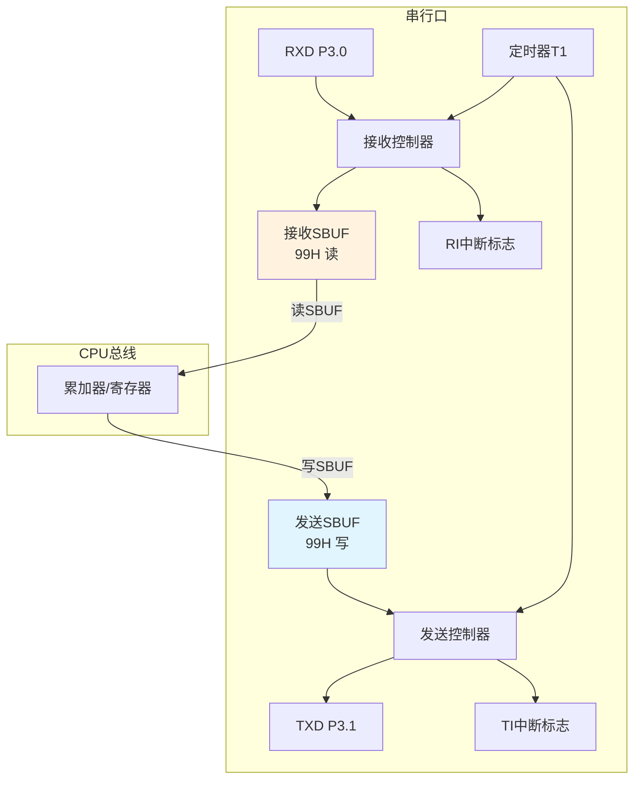
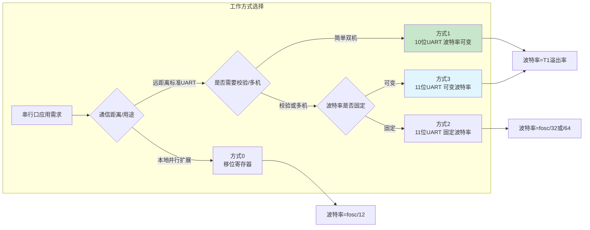

## 1. 串行通信基础

### 1.1 并行通信与串行通信

![[Pasted image 20260824215536.webp]]

微控制器与外部设备之间的数据交换有两种基本方式：并行通信和串行通信。

- **并行通信**：数据的各位同时传送。优点是传输速度快，缺点是占用引脚数量多，长距离传输时线路成本高且易受干扰。适用于短距离、高速数据传输场景，如单片机与并行存储器或并行LCD的接口。
- **串行通信**：数据一位一位地顺序传送。优点是需要的数据线少（最少仅需两根），适合长距离传输，成本低；缺点是传输速度相对较慢。在大多数嵌入式系统和物联网设备中，串行通信因其简洁性和远距离传输能力而广泛应用。

### 1.2 通信制式

![[Pasted image 20260824215553.webp]]

根据数据传输方向，串行通信分为三种制式：

- **单工（Simplex）**：数据只能沿一个方向传输，发送端和接收端固定。例如，广播系统、传感器向单片机单向发送数据。
- **半双工（Half-duplex）**：数据可双向传输，但同一时刻只能沿一个方向进行。例如，对讲机系统、RS-485多机通信。
- **全双工（Full-duplex）**：数据可同时双向传输。例如，电话系统、标准UART串口通信。AT89S51的串行口支持全双工通信。

### 1.3 同步通信与异步通信

串行通信根据是否需要同步时钟信号分为两种方式。

**同步通信（Synchronous）**：发送端和接收端使用同一时钟信号进行同步，数据以数据块（帧）为单位连续传输，字符间无间隔。特点是传输效率高，但控制复杂，硬件成本较高，常用于高速通信（如SPI、I²C）。

![[Pasted image 20260824215617.webp]]

**异步通信（Asynchronous）**：不需要严格的同步时钟，通信双方通过事先约定的波特率各自产生时钟，以字符为单位传输。每个字符帧包含起始位、数据位、校验位和停止位。异步通信的特点是控制简单、成本低，但每个字符需附加起始/停止位，效率略低。AT89S51的串行口采用异步通信方式。

![[Pasted image 20260824215630.webp]]

> [!NOTE] 异步通信帧格式
> 典型的异步串行帧以低电平起始位开始，随后是5～8位数据（低位在先），可选校验位（奇偶校验），最后是1～2位高电平停止位。空闲状态时线路保持高电平。这种帧结构使接收端能够通过起始位同步，无需独立时钟线。

### 1.4 字符编码与波特率

串行异步通信中，通信双方必须事先约定以下参数：

**（1）字符格式**：包括数据位位数、校验方式（奇校验、偶校验或无校验）、停止位位数。常用格式如8位数据位、1位停止位、无校验（8N1）。

**（2）波特率（Baud Rate）**：单位时间内传送的二进制位数，单位为bit/s。常见的标准波特率有：110、300、600、1200、2400、4800、9600、19200、38400等。通信双方的波特率必须保持一致，否则会出现数据错乱。

**波特率与字符传输速率的关系**：若采用方式3（每字符11位，含起始位、8位数据、校验位、停止位），每分钟传输3600字符，则波特率为：

$$\text{波特率} = \frac{11 \times 3600}{60} = 660 \text{ bit/s} \quad \text{(1)}$$

## 2. AT89S51串行口结构

### 2.1 总体结构

AT89S51的串行口是一个全双工异步通信接口，主要由以下部分构成：

- **数据缓冲器SBUF**：在物理上包含两个独立的寄存器——发送SBUF和接收SBUF，但共用地址99H。CPU执行写操作时数据进入发送SBUF，执行读操作时从接收SBUF读取数据，通过指令类型自动区分。
- **发送控制器**：将发送SBUF中的并行数据转换为串行数据，并自动添加起始位、可选校验位（TB8）和停止位，然后通过TXD（P3.1）引脚逐位输出。发送完成后硬件置位发送中断标志TI。
- **接收控制器**：对RXD（P3.0）引脚上的串行数据进行采样、移位，并自动过滤起始位、校验位和停止位，将有效数据存入接收SBUF。接收完成后硬件置位接收中断标志RI。
- **定时器T1**：作为波特率发生器，产生通信所需的移位时钟信号。发送时时钟下降沿控制数据移位输出，接收时时钟上升沿控制数据位采样。

![[Pasted image 20260824215703.webp]]



### 2.2 串行口控制寄存器SCON（地址98H）

![[Pasted image 20260824215828.webp]]

SCON是8位寄存器，用于配置串行口的工作方式和状态监控，各位定义如表9-1所示。

**表9-1 SCON寄存器各位功能**

| 位 | 符号 | 功能说明 |
| :---: | :---: | :--- |
| 7 | SM0 | 工作方式选择位（与SM1组合） |
| 6 | SM1 | 工作方式选择位（与SM0组合） |
| 5 | SM2 | 多机通信控制位（方式2/3中用于地址识别） |
| 4 | REN | 接收允许控制位（REN=1允许接收） |
| 3 | TB8 | 方式2/3中发送的第9位数据（通常作校验位或地址/数据标志） |
| 2 | RB8 | 方式2/3中接收到的第9位数据 |
| 1 | TI | 发送中断标志（发送完成后硬件置1，需软件清0） |
| 0 | RI | 接收中断标志（接收完成后硬件置1，需软件清0） |

> [!WARNING] TI和RI标志处理
> TI和RI由硬件置1，但必须由软件清零。若采用中断方式，在中断服务程序中用 `TI = 0` 和 `RI = 0` 清除标志。若采用查询方式，同样需在检测到标志后手动清零，否则将导致重复中断或逻辑错误。

**工作方式选择**：SM0、SM1组合定义四种工作方式，如表9-2所示。

**表9-2 串行口四种工作方式**

| SM0 | SM1 | 工作方式 | 功能说明 | 波特率 |
| :---: | :---: | :---: | :--- | :--- |
| 0 | 0 | 方式0 | 移位寄存器方式，用于并行I/O扩展 | f_osc/12 |
| 0 | 1 | 方式1 | 10位UART（1起始位+8数据+1停止位） | 可变（T1溢出率） |
| 1 | 0 | 方式2 | 11位UART（1起始+8数据+1校验+1停止） | f_osc/32 或 f_osc/64 |
| 1 | 1 | 方式3 | 11位UART（同方式2，波特率可变） | 可变（T1溢出率） |

### 2.3 电源控制寄存器PCON（地址87H）

PCON寄存器的最高位SMOD（串行口波特率倍增位）影响方式1、2、3的波特率。SMOD=1时波特率加倍。

**表9-3 PCON寄存器格式**

| 位 | 7 | 6 | 5 | 4 | 3 | 2 | 1 | 0 |
| :---: | :---: | :---: | :---: | :---: | :---: | :---: | :---: | :---: |
| 符号 | SMOD | — | — | — | GF1 | GF0 | PD | IDL |

## 3. 波特率计算与设置

### 3.1 四种工作方式的波特率公式

- **方式0**：波特率固定为 f_osc / 12。
- **方式2**：波特率仅由SMOD决定，公式为：

$$\text{方式2波特率} = \frac{2^{\text{SMOD}}}{64} \times f_{\text{osc}} \quad \text{(2)}$$

- **方式1和方式3**：波特率由T1溢出率和SMOD共同决定。常用T1工作于方式2（8位自动重装载）作为波特率发生器，公式为：

$$\text{波特率} = \frac{2^{\text{SMOD}}}{32} \times \text{定时器T1溢出率} \quad \text{(3)}$$

定时器T1溢出率 = 1 / 定时时间，而定时时间由初值X决定：

$$\text{定时时间} = \frac{(256 - X) \times 12}{f_{\text{osc}}} \quad \text{(4)}$$

故综合公式为：

$$\text{波特率} = \frac{2^{\text{SMOD}}}{32} \times \frac{f_{\text{osc}}}{12(256 - X)} \quad \text{(5)}$$

### 3.2 波特率初值计算实例

**需求**：晶振频率11.0592MHz，要求波特率2400bit/s，SMOD=0，T1工作于方式2。

将已知条件代入公式（5）：

$$2400 = \frac{2^0}{32} \times \frac{11.0592 \times 10^6}{12(256 - X)}$$

化简：

$$2400 = \frac{11.0592 \times 10^6}{384(256 - X)}$$

$$256 - X = \frac{11.0592 \times 10^6}{384 \times 2400} = \frac{11.0592 \times 10^6}{921600} \approx 12$$

$$X = 244 = 0xF4$$

故TH1 = TL1 = 0xF4。常用波特率与初值对照见表9-4。

**表9-4 常用波特率与定时器初值（T1方式2）**

| 晶振频率(MHz) | 波特率(bit/s) | SMOD | 定时器初值 | 实际波特率 | 误差(%) |
| :---: | :---: | :---: | :---: | :---: | :---: |
| 12.00 | 9600 | 1 | F9H | 8923 | 7.0 |
| 12.00 | 4800 | 0 | F9H | 4461 | 7.0 |
| 12.00 | 2400 | 0 | F3H | 2404 | 0.16 |
| 12.00 | 1200 | 0 | E6H | 1202 | 0.16 |
| 11.0592 | 19200 | 1 | FDH | 19200 | 0 |
| 11.0592 | 9600 | 0 | FDH | 9600 | 0 |
| 11.0592 | 4800 | 0 | FAH | 4800 | 0 |
| 11.0592 | 2400 | 0 | F4H | 2400 | 0 |
| 11.0592 | 1200 | 0 | E8H | 1200 | 0 |

> [!TIP] 晶振频率选择
> 表格显示，使用12MHz晶振时，高波特率（如9600）存在较大误差，而使用11.0592MHz晶振可精确产生标准波特率。因此，在需要串行通信的应用中，推荐使用11.0592MHz晶振以获得无误差的波特率。

## 4. 串行口四种工作方式详解

### 4.1 方式0：移位寄存器方式

方式0用于通过外接移位寄存器（如74LS164或74LS165）扩展并行I/O口，数据通过RXD引脚逐位传输，TXD引脚输出移位时钟。

**发送**：CPU执行 `SBUF = data` 指令启动发送，数据从RXD输出，TXD输出8个移位时钟脉冲。发送完成后TI置1。适合将串行口扩展为并行输出口，驱动LED数码管或继电器阵列。

**接收**：需将SCON的REN置1，并执行 `RI = 0` 启动接收。RXD输入数据，TXD输出移位时钟，8位数据接收完成后RI置1，CPU执行 `temp = SBUF` 读取数据。适合读取并行输入设备（如拨码开关、键盘矩阵）。

**波特率**：固定为 f_osc / 12。若晶振12MHz，波特率 = 1Mbit/s。

![[Pasted image 20260824215911.webp]]

### 4.2 方式1：10位UART

方式1是标准的异步串行通信模式，帧格式为：1位起始位（低电平）+ 8位数据位（低位在先）+ 1位停止位（高电平）。

**发送**：执行 `SBUF = data` 后，发送控制器自动添加起始位和停止位，从TXD引脚输出。发送完成TI置1。

**接收**：REN=1时，接收器检测起始位（RXD从高到低跳变），采样数据位并存入SBUF，停止位进入RB8，接收完成RI置1。方式1不支持多机通信，SM2通常置0。

**波特率**：由T1溢出率和SMOD决定，见公式（5）。

### 4.3 方式2和方式3：11位UART

方式2和方式3的帧格式相同：1位起始位 + 8位数据位 + 1位可编程位（TB8/RB8）+ 1位停止位。两者区别仅在于波特率来源：方式2波特率固定为 f_osc/32 或 f_osc/64（由SMOD决定），方式3波特率可变，与方式1相同。

这两种方式常用于带校验位的通信或多机通信。TB8可由用户设置为校验位或地址/数据标志位（0表示数据，1表示地址）。接收时第9位存入RB8，供程序判断。

## 5. 多机通信原理

AT89S51的方式2和方式3支持多机通信，通过SM2位和第9位数据（TB8/RB8）实现地址识别。

### 5.1 多机通信配置

- **从机初始化**：所有从机的SM2和REN均置1。从机处于“地址接收”状态，只接收第9位为1的地址帧，忽略第9位为0的数据帧（不会产生RI中断）。
- **主机寻址**：主机发送一帧数据，第9位（TB8）设为1，表示地址帧。所有从机接收到该帧后，硬件比较接收到的地址字节与本机地址。若匹配，该从机将SM2清0，进入“数据接收”状态；若不匹配，该从机保持SM2=1，继续忽略后续数据帧。
- **数据传输**：主机发送数据帧，第9位（TB8）设为0。只有被寻址到的从机（SM2=0）能够接收到数据并产生RI中断，其他从机因SM2=1而忽略。通信结束后，该从机可将SM2重新置1，恢复地址监听模式。

多机通信机制使一个主机能通过串行总线与多个从机进行点对点通信，广泛用于分布式控制系统和传感器网络。

## 6. 串行口应用实例

### 6.1 方式0发送：驱动LED扩展

**功能**：定时器T0产生50ms中断，每次中断将SBUF取反发送，通过74LS164扩展的8位LED显示取反后的数据。

```c
#include <reg51.h>

void main(void)
{
    SCON = 0x00;          // 方式0
    EA = 1;
    ES = 1;
    ET0 = 1;
    TMOD = 0x01;
    TH0 = (65536 - 50000) / 256;
    TL0 = (65536 - 50000) % 256;
    TR0 = 1;
    SBUF = 0x00;          // 启动发送
    while(1);
}

void T0_ISR(void) interrupt 1
{
    TH0 = (65536 - 50000) / 256;
    TL0 = (65536 - 50000) % 256;
    SBUF = ~SBUF;         // 取反后发送
}

void UART_ISR(void) interrupt 4
{
    if(TI == 1)
        TI = 0;           // 清除发送中断标志
}
```

### 6.2 方式0接收：读取74LS165并行输入

**功能**：通过74LS165读取8位并行数据（如拨码开关状态），并在P0口LED显示。

```c
#include <reg51.h>

sbit SL = P2^0;           // 74LS165移位控制

void main(void)
{
    SCON = 0x10;          // 方式0，REN=1
    while(1)
    {
        SL = 0;           // 并行置数
        SL = 1;           // 禁止并行输入，开始移位
        while(RI == 0);   // 等待接收完成
        RI = 0;           // 清标志
        P0 = SBUF;        // 显示读取的数据
    }
}
```

### 6.3 方式1双机通信

**A机（发送）**：每按一次按键K1（P1.7），向B机发送0x01，触发B机LED翻转。

```c
#include <reg51.h>

sbit key = P1^7;

void delay(unsigned int a)
{
    unsigned int i, j;
    for(i=0; i<a; i++)
        for(j=0; j<333; j++);
}

void main(void)
{
    SCON = 0x40;          // 方式1，不接收
    TMOD = 0x20;          // T1方式2
    TH1 = 0xFD;           // 波特率9600（11.0592MHz）
    TL1 = TH1;
    TR1 = 1;
    
    while(1)
    {
        if(key == 0)
        {
            delay(10);    // 消抖
            if(key == 0)
            {
                SBUF = 0x01;
                while(TI == 0);   // 等待发送完成
                TI = 0;
                while(key == 0);  // 等待按键松开
            }
        }
    }
}
```

**B机（接收）**：接收到数据后翻转LED状态。

```c
#include <reg51.h>

sbit LED = P1^7;

void main(void)
{
    SCON = 0x50;          // 方式1，允许接收
    TMOD = 0x20;
    TH1 = 0xFD;
    TL1 = TH1;
    TR1 = 1;
    LED = 0;
    
    while(1)
    {
        if(RI == 1)
        {
            RI = 0;
            if(SBUF != 0)
                LED = ~LED;
        }
    }
}
```

## 7. 本章小结

本章系统介绍了AT89S51串行通信接口的基本原理与应用：
- 串行通信的基本概念（并行/串行、单工/半双工/全双工、同步/异步、波特率、字符帧格式）。
- 串行口的结构组成（SBUF、发送/接收控制器、T1波特率发生器）。
- 串行口控制寄存器SCON和PCON的功能定义。
- 四种工作方式的帧结构、波特率计算公式及典型应用场景。
- 多机通信的实现原理和配置流程。
- 完整的应用实例（方式0扩展I/O、方式1双机通信）。

串行通信是单片机与外部设备交互的核心手段，掌握其工作原理和编程方法对于嵌入式系统开发具有重要意义。



## 相关笔记

- [[7.定时计数器1]]
- [[8.定时计数器2]]
- [[5.中断系统1]]
- [[4.输入输出接口-复位及时钟电路-低耗电模式]]
- [[单片机小计算题]]

> 本章内容基于Atmel AT89S51数据手册及Keil C51编译器参考手册编写，波特率计算和寄存器定义以目标器件官方数据手册为准。