# 城域网 - 电信的基础设施


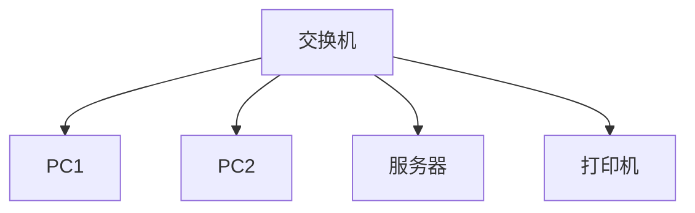

局域网是在**有限地理范围**（如一栋建筑或园区）内构建的高速网络：
- 典型拓扑：星型、环型、总线型
- 核心技术：
- **以太网**（IEEE 802.3）：主导技术，速率从10Mbps到100Gbps
- **Wi-Fi**（IEEE 802.11）：无线局域网标准
- 设备：交换机、AP、路由器（边界）
- 特点：高带宽、低延迟、私有管理

>📌 **经典案例**：大学校园网通常采用三层架构（接入层-汇聚层-核心层），通过万兆以太网互联教学楼、实验室和行政中心。

### 广域网（WAN）技术
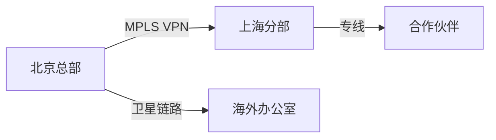

广域网覆盖**广阔地理区域**（城市间/国家间）：
- 连接方式：
- **专线连接**：T1/E1、T3/E3、SDH
- **分组交换**：MPLS、Frame Relay（遗留）
- **互联网VPN**：IPSec、SSL VPN
- 核心设备：高端路由器、光传输设备
- 特点：中低带宽、较高延迟、运营商管理

---------

## 城域网（MAN）的定义与定位

城域网是覆盖**城市范围**（通常50-100公里）的中等规模网络：

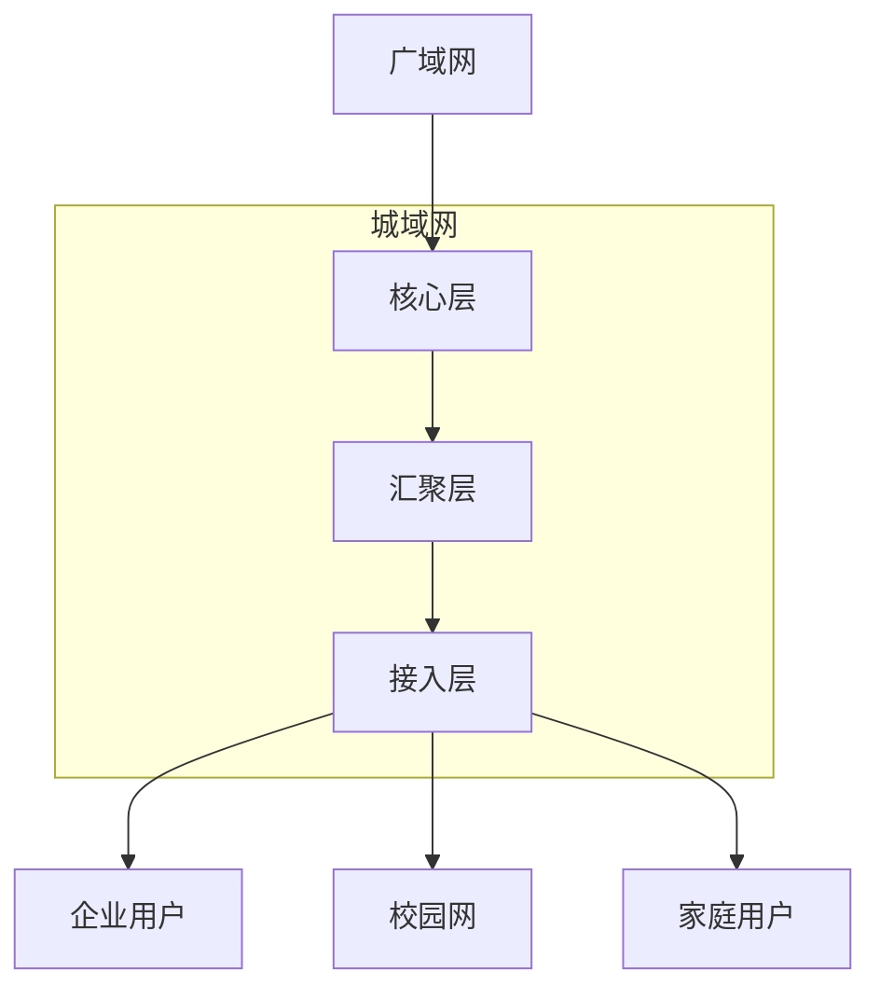

- **黄金定位**：连接局域网与广域网的**区域骨干网**
- **典型应用场景**：
- 城市级教育网（如大学城互联）
- 智慧城市基础设施
- 区域ISP服务
- **技术特点**：
- 传输距离：≤100公里
- 带宽：1Gbps~100Gbps
- 支持多业务融合（数据、语音、视频）

>🌐 **业界动态**：现代城域网正向SDN/NFV架构演进，实现网络虚拟化和灵活业务编排

----------

## 城域网结构深度解析

### 分层架构模型（三级）
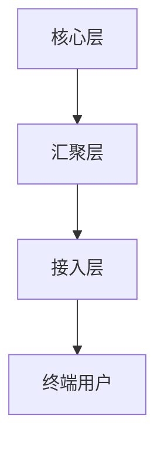

1. **核心层**
- 功能：高速数据交换、城域出口
- 技术：DWDM、100G以太网
- 设备：核心路由器（如Cisco CRS、Juniper MX系列）

2. **汇聚层**
- 功能：流量聚合、策略实施
- 技术：10G/40G以太网、MPLS
- 设备：高端三层交换机

3. **接入层**
- 功能：用户接入、边缘服务
- 技术：GPON、以太网、WiMAX
- 设备：DSLAM、OLT、无线AP

### 城域网组件设计原则

1. **可扩展性原则**
- 纵向扩展：设备端口密度提升
- 横向扩展：新增汇聚节点

2. **高可用性设计**

- 关键技术：链路聚合（LACP）、环网保护（RPR）、VRRP

3. **QoS保障机制**
- 优先级队列（PQ/CQ/WFQ）
- 流量整形（GTS）
- 拥塞避免（WRED）

4. **安全架构**
- 层次化防护：核心层ACL → 汇聚层防火墙 → 接入层端口安全
- 安全协议：IPSec、802.1X认证

## 管理与运营关键技术


## 构建宽带城域网的三大技术方案

>💎 宽带城域网的核心技术方案主要包括基于10GE的纯IP架构、基于SDH的多业务平台、以及基于RPR的弹性分组环。每种技术有其特定的应用场景和演进路径。

```mermaid
mindmap
root((技术方案))
10GE方案
纯IP架构
MPLS支持
成本优势
SDH方案
MSTP演进
硬管道保障
时钟同步
RPR方案
空间复用
公平算法
环网保护
```

### 1. 基于10GE技术的宽带城域网

### 技术原理与架构
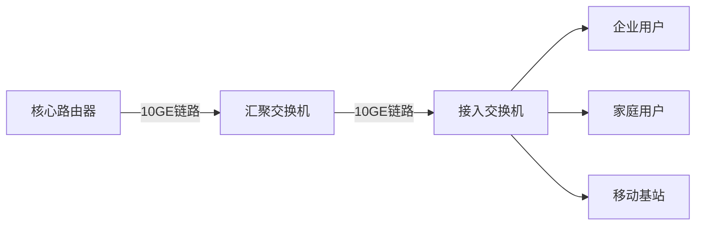

**核心特征**：
- **纯IP架构**：端到端以太网技术，简化网络层次
- **大带宽基础**：单链路10Gbps，支持向40G/100G平滑演进
- **多层次QoS**：通过DiffServ模型提供业务分级保障

#### 关键实现技术
1. **链路聚合技术**（LACP）
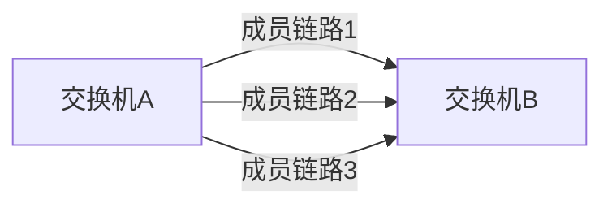
- 捆绑多个物理链路形成逻辑大管道
- 提供链路冗余和负载均衡

2. **MPLS流量工程**
- 在核心层部署MPLS实现：
- 显式路径控制
- 流量均衡
- VPN业务隔离

3. **智能弹性架构**（IRF）
- 多台设备虚拟化为单一逻辑设备
- 简化管理，提高可靠性

>**部署优势**：建设成本比传统SDH低40%，运维复杂度降低60%，适合新兴ISP和智慧城市建设

---

### 2. 基于SDH技术的宽带城域网

#### MSTP技术演进
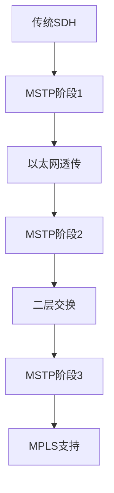

**多业务传输平台（MSTP）核心能力**：
| 功能层| 支持业务| 关键技术|
|---------------|------------------------------|------------------------|
| TDM层| E1/STM-1专线| VC12/VC4交叉|
| ATM层| 传统ATM业务| VP/VC交换|
| 以太网层| 10/100/1000M以太网| GFP封装，LCAS|
| MPLS层| VPLS业务| Martini封装|

#### 典型组网拓扑
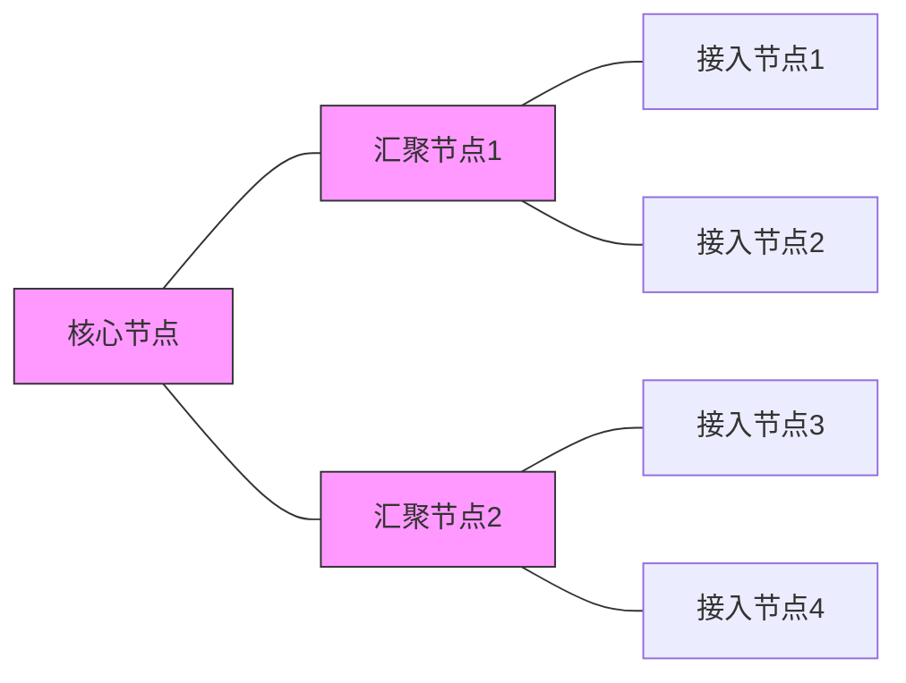

**环网保护机制**：
- 二纤双向复用段保护环（2F-BLSR）
- 保护倒换时间 < 50ms
- 带宽利用率：50%（工作+保护）

>🛡️ **适用场景**：金融、政务等需要高可靠性和严格SLA保障的专线业务，完美兼容传统TDM业务

---

### 3. 基于RPR技术的宽带城域网

#### RPR体系结构
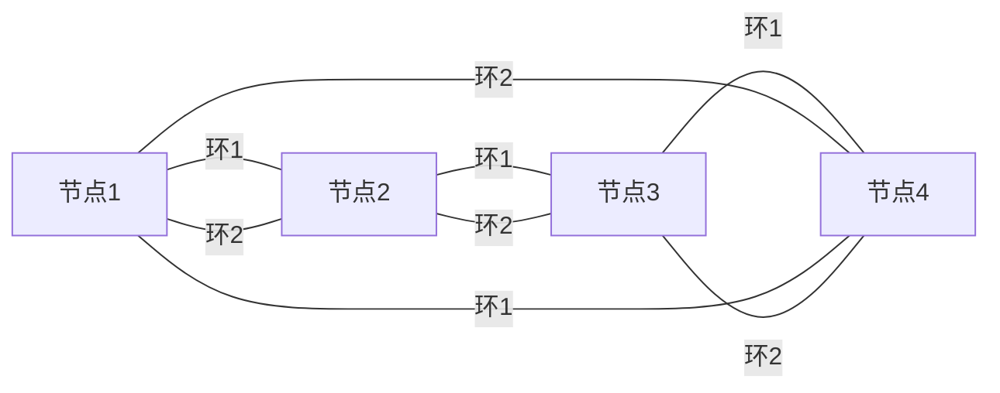

**核心技术创新**：
1. **空间复用协议**（Spatial Reuse Protocol）
- 允许多段链路同时传输数据
- 带宽利用率提升300% vs 传统SDH环

2. **公平算法**（Fairness Algorithm）

- 分布式计算各节点公平带宽份额
- 防止边缘节点"饥饿"

3. **多级QoS体系**
| 等级 | 业务类型| 延迟要求| 典型应用|
|---------|----------------|-------------|------------------|
| A级| 硬实时业务| < 2ms| 语音、金融交易|
| B级| 软实时业务| 2-10ms| 视频会议、监控|
| C级| 尽力而为业务| 无要求| 互联网浏览|

#### 保护机制对比
| 保护方式  | 倒换时间   | 带宽损失 | 故障影响范围 |
| ----- | ------ | ---- | ------ |
| 源路由保护 | <50ms  | 无    | 局部修复   |
| 回绕保护  | <50ms  | 高    | 全环受影响  |
| 多拓扑保护 | <200ms | 中    | 分段修复   |

>🔄 **演进现状**：RPR已被电信级以太网技术（如PBT、MPLS-TP）吸收融合，其理念在5G前传网络中仍有应用

---

### 三大技术方案对比分析

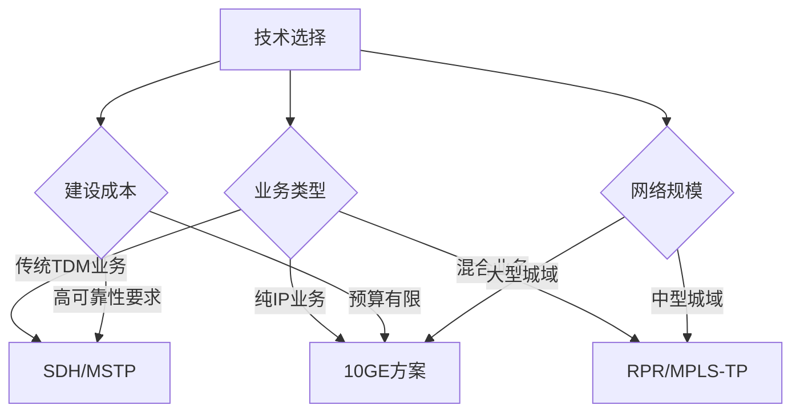

**详细参数对比**：
| 指标| 10GE方案| SDH/MSTP方案| RPR方案|
|---------------------|---------------|-----------------|---------------|
| 单环最大节点数| 无理论限制| 16（SDH环）| 255|
| 典型带宽利用率| 85%-95%| 50%（保护带宽） | 70%-80%|
| 多业务支持能力| IP优化| 全能选手| 数据业务优化|
| 保护倒换时间| 200ms-2s| 50ms| 50ms|
| 新建网络成本/Mbps| $0.08| $0.25| $0.15|
| 运维复杂度| ★★☆☆☆| ★★★★☆| ★★★☆☆|

>**部署建议**：
> - 新兴运营商：首选10GE+MPLS方案
> - 传统运营商：SDH向MSTP演进，逐步融合IP
> - 专网用户：考虑RPR简化架构，或直接采用PTN

---

### 技术融合趋势：IP/光协同时代

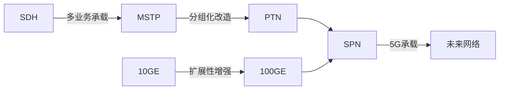

**新一代城域承载网SPN特征**：
1. **切片分组网**（Slicing Packet Network）
2. 三层融合架构：
- **切片通道层**（FlexE绑定）
- **切片分组层**（SR-TP）
- **切片光层**（DWDM）
3. 关键性能指标：
- 端到端时延 < 1ms
- 同步精度 ±100ns
- 99.9999%可靠性

> 🌈 城域网技术将持续向"泛在、扁平、极简、云化"方向演进，SRv6、AI运维、400G光传输将成为下一代城域网的基石技术。

---------

# 接入技术深度解析

>🌐 接入网是城域网的"最后一公里"，直接决定用户体验。当前主流技术呈现"光进铜退、无线升级"的演进趋势，四类技术各有适用场景。

```mermaid
mindmap
root)接入技术(
xDSL
HFC
光纤接入
无线接入
)
```

## xDSL技术家族

### 技术演进路线


**技术参数对比**：
| 类型| 下行速率 | 上行速率 | 传输距离 | 关键技术|
|-----------|----------|----------|----------|----------------|
| ADSL| 8Mbps| 1Mbps| 5km| DMT调制|
| ADSL2+| 24Mbps| 3.3Mbps| 3km| 频谱扩展|
| VDSL| 55Mbps| 15Mbps| 1.5km| QAM调制|
| VDSL2| 100Mbps| 50Mbps| 800m| 矢量消除噪声|
| G.fast| 1Gbps| 500Mbps| 250m| 时域绑定|

### 典型部署架构
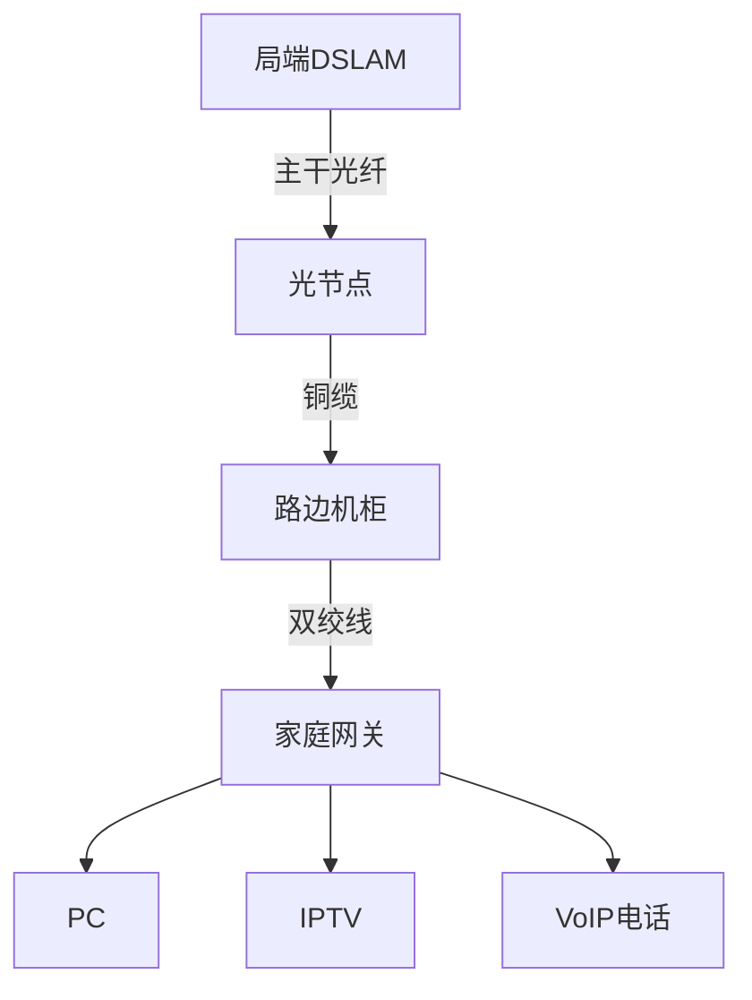

>💡 **运营商实践**：
> 中国电信采用FTTN+VDSL2方案覆盖老旧小区：
> - 光纤到节点(200m范围内)
> - VDSL2提供百兆接入
> - 成本比FTTH低40%

**技术局限性**：


## 光纤同轴电缆混合网(HFC)

### 网络架构


### DOCSIS标准演进
| 版本| 下行速率 | 上行速率 | 核心改进|
|------------|----------|----------|------------------------|
| DOCSIS 1.0 | 40Mbps| 10Mbps| 基础标准|
| DOCSIS 2.0 | 50Mbps| 30Mbps| 增强上行|
| DOCSIS 3.0 | 160Mbps| 120Mbps| 信道绑定|
| DOCSIS 3.1 | 10Gbps| 1Gbps| OFDM，低延迟|
| DOCSIS 4.0 | 10Gbps| 6Gbps| 全双工，扩展频谱|

### 频谱分配


>⚠️ **关键挑战**：
> 1. 噪声汇聚效应：用户端噪声在头端叠加
> 2. 树形拓扑脆弱性：单点故障影响整片用户
> 3. 上行带宽受限：传统架构仅42MHz上行带宽

**优化方案**：
```mermaid
graph LR
A[传统HFC] --> B[节点分裂]
A --> C[减少每节点用户数]
A --> D[DAA分布式架构]
```

## 光纤接入技术

### FTTx分类体系
```mermaid
flowchart TD
A[光纤接入] --> B[FTTH 光纤到户]
A --> C[FTTB 光纤到楼]
A --> D[FTTC 光纤到路边]
A --> E[FTTN 光纤到节点]
```

### PON技术对比
| 类型| 标准| 速率(下行/上行) | 分路比 | 优势|
|------------|-------------|------------------|--------|--------------------|
| GPON| ITU-T G.984 | 2.5G/1.25G| 1:64| 电信主流，成熟稳定 |
| EPON| IEEE 802.3ah| 1G/1G| 1:32| 成本低，易于部署|
| XG-PON| ITU-T G.987 | 10G/2.5G| 1:128| GPON平滑升级|
| XGS-PON| ITU-T G.9807| 10G/10G| 1:128| 对称带宽|
| 25G PON| IEEE 802.3ca| 25G/25G| 1:64| 下一代技术|

### 波分复用方案
```mermaid
graph LR
A[OLT] --1490nm--> B[GPON ONU]
A --1577nm--> C[XG-PON ONU]
A --1590nm--> D[XGS-PON ONU]
```

>🏗️ **部署策略**：
> 中国移动创新方案：
> - 二级分光(1:8+1:8)
> - 城中村深度覆盖
> - 每端口成本降低35%

**全球应用现状**：
```mermaid
pie
title 全球FTTH技术占比
“GPON” ： 68
“EPON” ： 25
“其他” ： 7
```

## 宽带无线接入技术

### 技术体系
```mermaid
graph TD
A[无线接入] --> B[固定无线]
A --> C[移动宽带]
A --> D[卫星接入]
B --> E[5G FWA]
B --> F[WiMAX]
C --> G[4G LTE]
C --> H[5G NR]
D --> I[GEO卫星]
D --> J[LEO星座]
```

### 5G FWA性能
| 频段| 带宽| 峰值速率 | 覆盖半径 | 适用场景|
|------------|---------|----------|----------|----------------|
| 700MHz| 20-30MHz| 150Mbps| 5km| 农村覆盖|
| 3.5GHz| 100MHz| 1Gbps| 2km| 城区覆盖|
| 26GHz| 400MHz| 4Gbps| 500m| 热点区域|
| 60GHz| 2.16GHz | 10Gbps| 200m| 视距传输|

### 移动技术演进
```mermaid
gantt
title 移动宽带代际演进
dateFormatYYYY
section 3G时代
UMTS：2001, 2010
section 4G时代
LTE：2010, 2020
section 5G时代
5G NSA：2019, 2023
5G SA：2023, 2025
5.5G：2025, 2028
```

**关键技术突破**：
```mermaid
graph LR
A[速率提升] --> B[Massive MIMO]
A --> C[毫米波]
A --> D[载波聚合]
E[时延降低] --> F[边缘计算]
E --> G[URLLC]
```

>🚀 **华为AirPON方案**：
> - 5G基站与OLT融合
> - "一杆双网"基础设施
> - 部署效率提升60%

### 新兴技术前瞻

```mermaid
journey
title 接入技术演进路线
section 铜缆时代
1995-2005： 56K Modem到ADSL
section 混合期
2005-2015： HFC与VDSL并存
section 光主导期
2015-2025： FTTH全面普及
section 无线革命
2025-2035： 空天地一体接入
```

**未来技术矩阵**：
| 技术| 峰值速率 | 时延| 商用时间 | 应用场景|
|----------------|----------|---------|----------|------------------|
| 太赫兹通信| 1Tbps| <1ms| 2030+| 全息通信|
| FSO光通信| 100Gbps| 亚毫秒| 2025| 岛屿接入|
| LEO卫星| 500Mbps| 20ms| 已商用| 偏远地区|
| 可见光通信| 10Gbps| 纳秒级| 实验室| 室内高密场景|

>💎 终极趋势：光无线融合(OWC)打破介质界限，实现"媒介无感"的泛在千兆接入