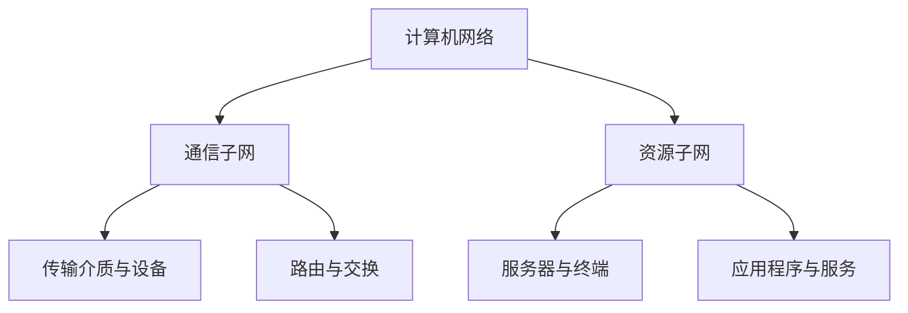
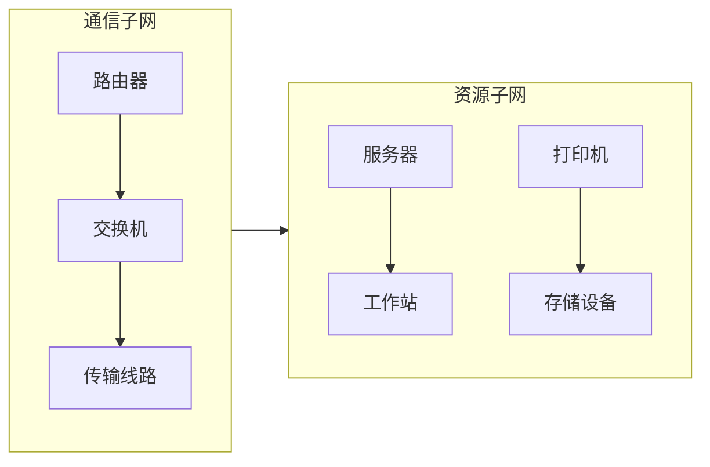
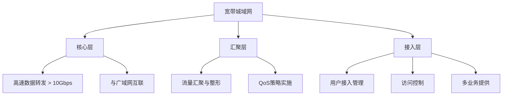
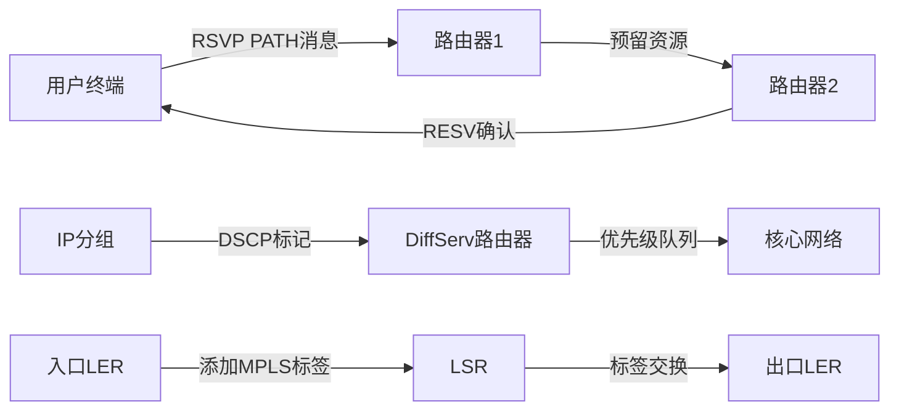
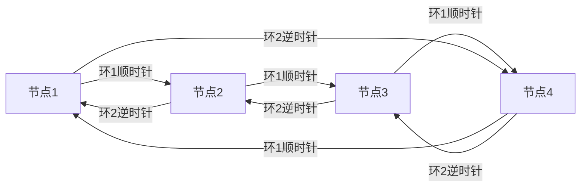
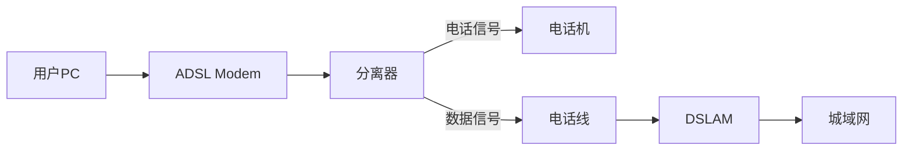
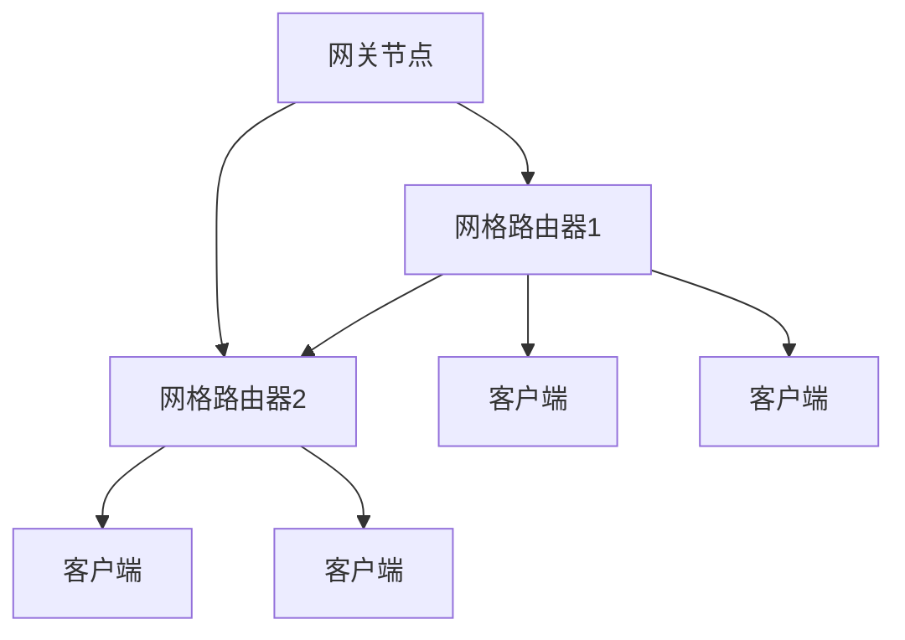
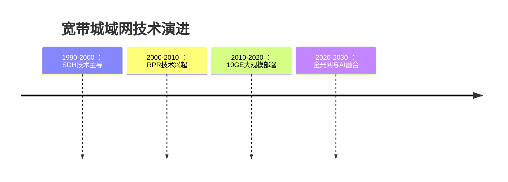

> **计算机网络技术是信息时代的基石**，而城域网作为连接局域网和广域网的关键环节，其设计与实现至关重要。本文将系统梳理计算机三级网络技术核心知识，重点剖析宽带城域网的构建与管理，帮助读者构建完整的网络技术知识体系。

## 一、计算机网络基本结构：通信子网与资源子网

计算机网络的核心是由**通信子网**和**资源子网**组成的有机整体。理解二者的功能划分是掌握网络技术的基础：

### 1. 通信子网 - 网络的神经系统
通信子网构成网络的数据传输基础设施，主要负责节点间的数据通信。其核心组件包括：
- **传输介质**：双绞线、同轴电缆、光纤、无线信道等物理通道
- **网络设备**：路由器、交换机、集线器、调制解调器等连接设备
- **通信协议**：TCP/IP、ATM、帧中继等数据传输规范

> 💡 **核心功能**：实现数据包的**路由选择**、**分组交换**和**差错控制**，确保信息从源节点准确高效地传输到目的节点。通信子网如同城市的道路系统，负责物资运输的通道建设。

### 2. 资源子网 - 网络的服务主体
资源子网是计算机网络中的资源提供者和使用者，包含各类终端设备和应用服务：
- **主机系统**：服务器、工作站、个人计算机等计算设备
- **共享资源**：网络打印机、存储设备、数据库系统等共享设施
- **应用软件**：Web服务、邮件系统、文件传输等网络应用

>💡 **核心功能**：提供**数据处理能力**和**资源共享服务**，实现用户需求的具体应用。资源子网如同城市的建筑设施，提供居住、商业、娱乐等功能服务。

> [!NOTE] 关键认知
> 通信子网与资源子网的关系如同**交通系统**与**城市功能**的关系：
> - 通信子网确保数据高效流动（物流系统）
> - 资源子网提供数据处理服务（商业服务）
> 二者协同工作，缺一不可。

## 二、局域网、城域网与广域网技术全景

### 1. 局域网（LAN）核心技术
局域网覆盖有限地理范围（通常<2km），具有高带宽、低延迟的特点：

#### 经典局域网技术对比
| 技术类型 | 工作机制 | 传输速率 | 拓扑结构 | 现状 |
|---------|---------|---------|---------|------|
| **以太网** | CSMA/CD | 10Mbps-100Gbps | 星型 | 主流技术 |
| **令牌环** | 令牌传递 | 4-16Mbps | 环型 | 基本淘汰 |
| **令牌总线** | 令牌传递 | 1-10Mbps | 总线型 | 已被淘汰 |

>🔥 以太网凭借**简单性**和**可扩展性**成为绝对主流，现代演进包括：
> - 快速以太网（100Mbps）
> - 千兆以太网（1Gbps）
> - 万兆以太网（10Gbps）

### 2. 广域网（WAN）关键技术
广域网覆盖广阔地理区域（>100km），核心在于**宽带交换技术**：

- **ATM异步传输模式**：采用53字节固定信元，支持QoS保证
- **帧中继**：简化X.25协议，提高传输效率
- **MPLS多协议标签交换**：结合IP路由和标签交换优势

#### 典型广域网技术比较
| 类型 | 速率范围 | 技术特点 | 应用场景 |
|------|---------|---------|---------|
| PSTN | ≤56Kbps | 电路交换，电话网络 | 拨号接入 |
| ISDN | 128Kbps | 数字传输，支持语音数据 | 小型企业接入 |
| xDSL | 1-100Mbps | 非对称传输，电话线复用 | 家庭宽带 |
| 帧中继 | 1.5-45Mbps | 统计复用，PVC连接 | 企业专线 |
| ATM | 155Mbps-2.4Gbps | 固定信元，QoS保障 | 核心骨干网 |

### 3. 城域网（MAN）的桥梁作用
城域网覆盖城市范围（通常10-100km），是LAN和WAN的关键连接层：

#### 三网核心差异对比
| 特性 | 局域网(LAN) | 城域网(MAN) | 广域网(WAN) |
|------|------------|------------|------------|
| 覆盖范围 | < 2km | 10-100km | >100km |
| 传输速率 | 100Mbps-100Gbps | 10Mbps-10Gbps | 1Mbps-10Gbps |
| 所有权 | 单一机构 | 运营商/大型企业 | 电信运营商 |
| 延迟特性 | 极低延迟(μs级) | 中等延迟(ms级) | 较高延迟(10ms+级) |
| 典型技术 | 以太网，WiFi | RPR，DWDM | MPLS，ATM |

> [!TIP] 关键认知
> 现代网络架构中，城域网不仅是地理桥梁，更是**业务融合平台**，承载数据、语音、视频等多业务融合传输。

## 三、宽带城域网深度解析

### 1. 分层架构设计
宽带城域网采用分层模型，各层功能明确：

- **核心层**：高速交换骨干，实现数据包的高速转发和不同区域间的连接
- **汇聚层**：连接核心层和接入层，实施网络策略（如QoS、安全策略）
- **接入层**：用户接入点，提供多种接入方式（如DSL、光纤、无线）

### 2. 构建四大原则
构建宽带城域网需遵循以下关键原则：

> [!IMPORTANT] 可管理性原则
> 网络应支持远程监控、配置和故障诊断：
> - 完善的SNMP网络管理系统
> - 设备支持远程登录和配置
> - 详细的日志记录和告警功能

> [!IMPORTANT] 可运营性原则
> 保证网络持续稳定运行：
> - 99.999%高可用性（年中断时间<5分钟）
> - 冗余设计和快速自愈能力
> - 完善的运维流程和人员培训

> [!IMPORTANT] 可盈利性原则
> 支持灵活的业务模式和计费系统：
> - 多业务承载能力（数据、语音、视频）
> - 差异化服务等级（SLA）
> - 灵活的计费策略（按时长、流量、带宽等）

> [!IMPORTANT] 可扩展性原则
> 适应未来业务增长：
> - 模块化设计
> - 硬件容量预留（端口、处理能力）
> - 软件支持平滑升级

## 四、管理与运营关键技术

宽带城域网的运营管理涉及多项关键技术：

### 1. 网络管理
采用基于SNMP（简单网络管理协议）的综合网管系统：
- **管理功能**：配置管理、性能监控、故障管理、计费管理、安全管理
- **管理架构**：管理者-代理模型
- **管理工具**：网络监控系统（如Zabbix、Nagios）、配置管理系统

### 2. 服务质量（QoS）
QoS保障关键业务的网络资源：

| QoS技术 | 工作机制 | 优点 | 适用场景 |
|--------|---------|------|---------|
| **RSVP** | 端到端资源预留 | 保证带宽和延迟 | 视频会议、VoIP |
| **DiffServ** | 基于IP分组优先级 | 扩展性好，简单高效 | 企业VPN、在线游戏 |
| **MPLS** | 标签交换路径 | 结合IP和ATM优势 | 核心网络、流量工程 |

### 3. 其他关键技术
- **用户管理**：基于AAA框架（认证、授权、计费），如RADIUS协议
- **IP地址分配**：DHCP动态分配与静态分配结合，NAT解决地址短缺
- **网络安全**：防火墙、入侵检测系统（IDS）、VPN等多层防御
- **多业务接入**：支持数据、语音、视频融合接入
- **统计与计费**：基于流量、时长、内容等多维度计费

## 五、宽带城域网构建方案

### 1. 基于10GE技术
- **优势**：兼容现有以太网，成本低，带宽高（10Gbps）
- **劣势**：原生以太网缺乏QoS保障，故障恢复慢
- **适用场景**：对带宽要求高但对实时性要求不严格的场景

### 2. 基于SDH技术
- **优势**：高可靠性（<50ms保护切换），精确时钟同步
- **劣势**：带宽利用率低，业务开通不灵活
- **演进方向**：MSTP（多业务传送平台）支持以太网和ATM

### 3. 基于弹性分组环（RPR）技术【重点】
RPR（IEEE 802.17标准）结合以太网经济性和SDH可靠性：

#### RPR核心特性
1. **双环结构**：同时使用顺时针和逆时针双光纤环
2. **空间复用**：不同网段可同时传输数据，带宽利用率达90%以上
3. **公平算法**：动态调整节点带宽分配，防止个别节点独占带宽
4. **50ms自愈**：通过拓扑发现和自动保护切换实现快速恢复
5. **业务分级**：支持A/B/C三级业务，提供不同QoS保障

>🌟 **技术优势**：
> - 比SDH带宽利用率提高40%以上
> - 比传统以太网可靠性提高一个数量级
> - 即插即用，简化网络部署
> - 支持TDM业务和IP业务的融合传输

## 六、网络接入技术全景

### 1. 接入技术分类
| 类型 | 代表技术 | 传输介质 | 典型速率 | 特点 |
|------|---------|---------|---------|------|
| **有线** | xDSL | 电话线 | 1-100Mbps | 利用现有电话网络 |
| **有线** | HFC | 同轴电缆 | 10-1000Mbps | 电视网络改造 |
| **有线** | FTTx | 光纤 | 100Mbps-10Gbps | 高带宽，未来方向 |
| **无线** | Wi-Fi | 无线电波 | 10Mbps-10Gbps | 灵活部署，移动接入 |
| **无线** | WiMAX | 无线电波 | 10-100Mbps | 城域范围覆盖 |
| **无线** | 蜂窝网络 | 无线电波 | 10Mbps-1Gbps | 广域移动接入 |

### 2. 重点接入技术详解

#### (1) xDSL技术（重点ADSL）
ADSL（非对称数字用户线）是最广泛应用的DSL技术：
- **技术标准**：ITU G.992.1（G.dmt）
- **频谱分配**：
- 0-4kHz：传统电话（POTS）
- 25-138kHz：上行通道
- 138kHz-1.1MHz：下行通道
- **调制技术**：DMT（离散多音调制），将频带分为256个子信道
- **典型速率**：
- 下行：最高8Mbps（实际约1-6Mbps）
- 上行：最高1Mbps（实际约0.5Mbps）

#### (2) 光纤接入技术（FTTx）
光纤到户的演进路径：

- **PON技术**（无源光网络）：
- 架构：OLT（光线路终端）- 分光器 - ONU（光网络单元）
- 标准：
- EPON（IEEE 802.3ah）：以太网架构
- GPON（ITU-T G.984）：更高带宽，支持TDM

#### (3) 宽带无线接入技术
- **IEEE 802.11（Wi-Fi）**：
- 最新标准802.11ax（Wi-Fi 6）
- 关键技术：OFDMA、MU-MIMO、1024-QAM
- 频段：2.4GHz和5GHz，新增6GHz频段（Wi-Fi 6E）

- **IEEE 802.16（WiMAX）**：
- 固定版本：802.16d（2004）
- 移动版本：802.16e（2005）
- 特性：非视距传输、QoS支持、移动性（最高120km/h）

#### (4) 无线网格网技术（WMN）
自组织多跳无线网络：

- **核心优势**：
- 自配置：节点自动发现邻居
- 自修复：动态路由调整绕过故障节点
- 多路径传输：提高可靠性
- **应用场景**：城市无线覆盖、应急通信、物联网

## 总结思考：技术演进与未来趋势

>🔮 **未来发展方向**：
> 1. **全光网络演进**：从光纤到户向光联万物发展
> 2. **5G深度融合**：固定移动融合（FMC）成为趋势
> 3. **智能自治网络**：AI驱动的网络自愈与优化
> 4. **云网协同架构**：基于SDN/NFV的网络虚拟化

> [!TIP] 网络工程师能力升级
> 未来网络工程师需掌握：
> 1. 传统网络技术与SDN/NFV的融合应用
> 2. 云计算与边缘计算的协同管理
> 3. 人工智能在网络运维中的应用
> 4. 网络安全纵深防御体系构建
